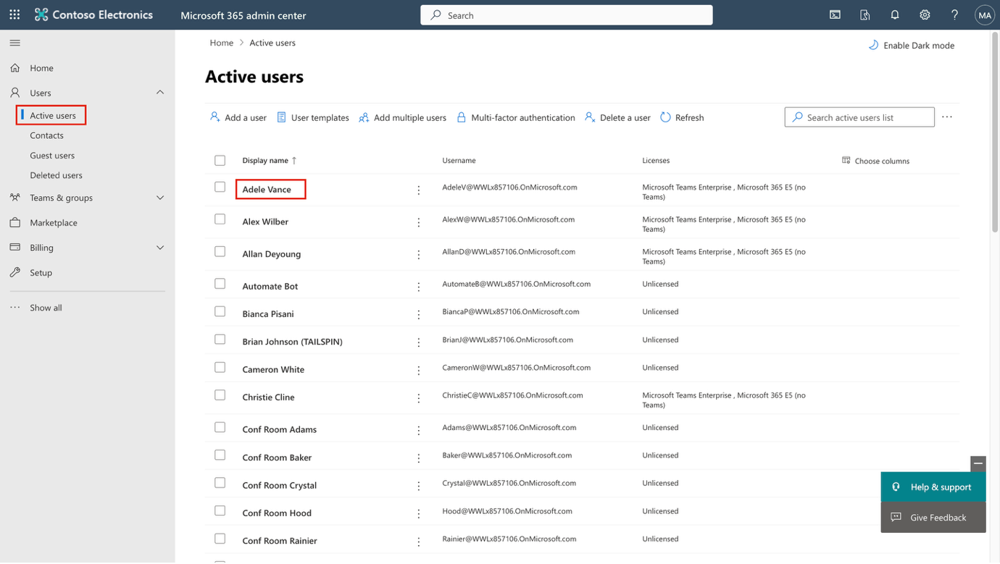
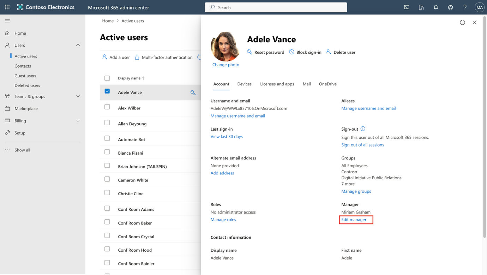
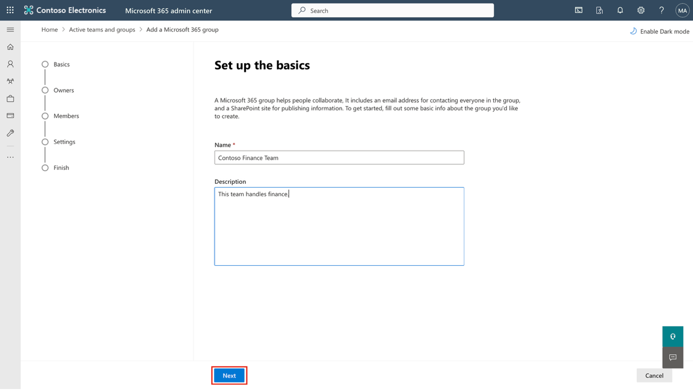
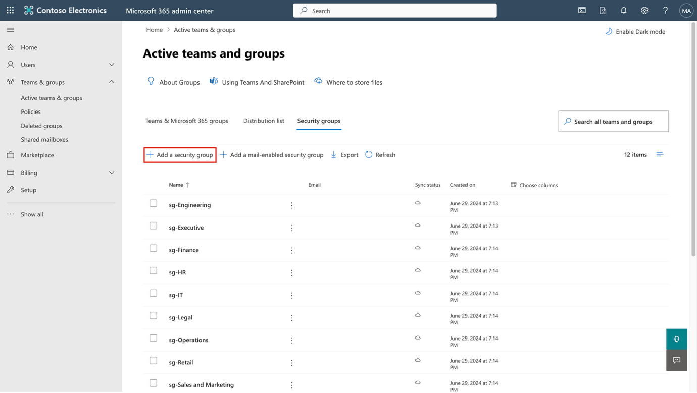
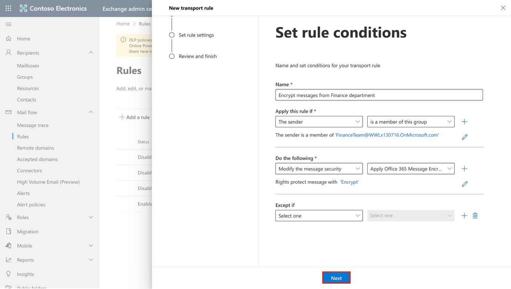
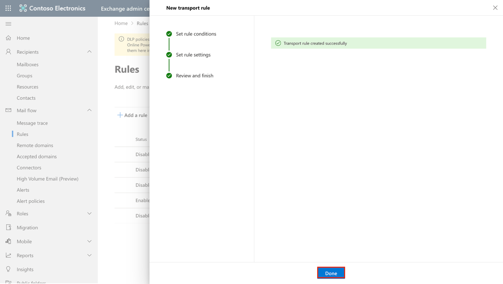
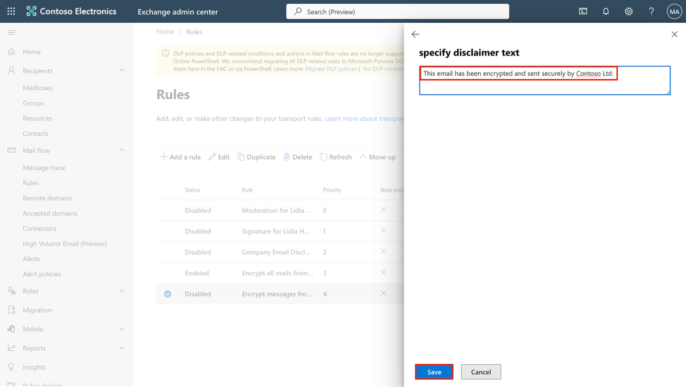
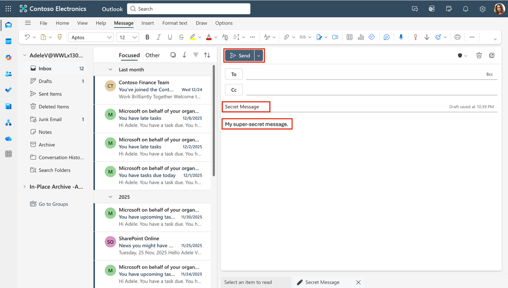

**Laboratório 1 – Atribuição de Funções de Conformidade e Gerenciamento do Office 365 Message Encryption**

**Introdução:**

O portal do Microsoft Purview oferece suporte ao gerenciamento direto de permissões para usuários que executam tarefas dentro do Microsoft Purview.

Usando a área Roles and scopes em Settings do portal, você pode gerenciar permissões para usuários em soluções de segurança de dados, governança de dados e risco e conformidade do Purview.

É possível limitar os usuários para que executem apenas tarefas específicas às quais você conceder acesso explicitamente.

**Objetivo:**

- Atribuir funções de gerenciamento e conformidade aos usuários no Microsoft 365.

- Criar grupos do Microsoft 365 e de segurança para colaboração em equipe.

- Habilitar a avaliação de conformidade do Microsoft Purview.

- Verificar e configurar o Azure RMS para o Office 365 Message Encryption.

- Modificar o modelo padrão do OME para desativar o acesso por identificação social.

- Testar a entrega de e-mails criptografados sem login social.

- Criar e aplicar um modelo de marca OME personalizado para a equipe financeira.

- Criar uma regra de fluxo de e-mail para criptografar mensagens do departamento financeiro.

- Adicionar um aviso legal às mensagens criptografadas.

- Habilitar a regra de fluxo de e-mail.

- Validar a criptografia de mensagens.

**Exercício 1 - Gerenciamento de funções de conformidade**

Neste exercício, ativaremos todas as licenças de avaliação necessárias para implementar a segurança com o Microsoft Purview.

**Tarefa 1 – Adicionar a função de gerente a um usuário existente.**

1.  Faça login na VM com os detalhes da conta fornecidos com seu laboratório.

2.  Abra o **Microsoft Edge** e navegue até o centro de administração do Microsoft 365, https://admin.microsoft.com, e faça login como **MOD Administrator**, usando as credenciais de administrador.

> \[!Observação\] **Observação: ignore a MFA para o centro de administração do Microsoft 365.**
>
> Em alguns locatários, você poderá ver um prompt de aplicação da MFA do portal ao fazer login. Se esse prompt aparecer:

- Selecione **Skip for now** para adiar temporariamente a configuração da MFA.

- Na caixa de diálogo **Informe-nos por que você está ignorando a MFA**, selecione qualquer justificativa e, em seguida, selecione **Send and skip**.

> Isso adia a aplicação da MFA no Centro de administração do Microsoft 365 para o locatário e permite que você prossiga com o laboratório.

3.  No painel esquerdo, selecione **Users \> Active users** e clique no primeiro usuário, **Adele Vance**.

> 

4.  Em **Manager**, clique em **Edit manager**.

> 

5.  Remova o gerente atual e digite Patti na caixa de pesquisa. Selecione **Patti Fernandez**. Clique em **Save Changes**.

> 

6.  Altere o gerente para **Patti Fernandez** para todos os usuários a seguir.

    - Adele Vance

    - Christie Cline

    - Megan Bowen

7.  For **Patti Fernandez**, add **MOD Administrator** as the manager.

**Tarefa 2 – Atribuir funções administrativas**

1.  Selecione o usuário **Patti Fernandez** e, em **Account**, role a página até **Roles** e clique em **Manage roles**.

> 

2.  Quando o painel **Roles** for aberto, marque o botão de opção ao lado de **Admin center access** e expanda **Show all by category.**

> 

3.  Na categoria **Security & Compliance**, marque as caixas de seleção **Compliance Administrator**, **Security Administrator** e **Application Administrator**.\
    Em seguida, selecione **Save changes** na parte inferior do painel lateral. Clique em **Save changes**.

> 

4.  Feche o painel, permaneça na mesma página e continue com a próxima tarefa.

**Tarefa 3 – Criação de equipes e grupos no centro de administração da Microsoft**

1.  Agora, expanda **Teams & groups**, selecione **Active teams & groups** e clique em **Add a Microsoft 365 group** em **Teams & Microsoft 365 groups**.

> 

2.  No campo **Name**, insira Contoso Finance Team, e, no campo **Description**, insira This team handles finance., e, em seguida, clique em **Next**.

> 

3.  Na página **Assign Owners**, clique em **Assign owners**, marque a caixa ao lado de **Adele Vance** e clique em **Add (1)**. Clique em **Next**.

> 

4.  Na página **Add members**, adicione **Adele Vance** e **Christie Cline** como membros e clique em **Next**. Na página **Add members**, selecione **Next**.

5.  Para o endereço de e-mail do grupo, use contosofinance e clique em **Next**.

> 

6.  Clique em **Create group**.

> 

7.  Após a conclusão, clique em**Close**.

> 

8.  Na página **Active teams & groups**, selecione a guia **Security groups**. Selecione **Add a security group.**

> 

9.  Repita as etapas para criar outro grupo com as seguintes informações.

    - Em **Set up the basics**, insira o seguinte no campo **Name**: EDM_DataUploaders.

    - No campo **Description**, insira People who will upload data for EDM.

    - Select **Next**.

    - Em **Settings**, selecione **Next**.

    - Em **Review and finish adding group**, revise as configurações e selecione **Create group**.

    - Quando **New group created** for exibido, selecione o botão Close.

    - Agora, selecione o grupo **EDM_DataUploaders** recém-criado na lista.

    - Na guia **Members**, selecione **View all and manage owners** e adicione **Patti Fernandez** e **Christie Cline**.

    - Da mesma forma, adicione **Patti Fernandez** e **Christie Cline** como membros.

> 

**Exercício 2 – Gerenciar o Office 365 Message Encryption**

**Tarefa 1 – Criar uma regra de fluxo de email para criptografar mensagens do departamento Financeiro**

Nesta tarefa, você usará o centro de administração do Exchange para criar uma regra de fluxo de e-mail que aplique o Microsoft Purview Message Encryption a todas as mensagens enviadas pelos membros do grupo Equipe Financeira.

1.  No **Microsoft Edge**, acesse https://admin.exchange.microsoft.com e faça login como PattiF@TenantName.

2.  No painel de navegação à esquerda, expanda **Mail flow** e selecione **Rules**.

> 

3.  Na página **Rules**, selecione **+ Add a rule** \> **Apply Office 365 Message Encryption and rights protection to messages**.

> 

4.  Na página **Set rule conditions**, configure:

    - **Name:** Encrypt messages from Finance department

    - Na seção **Apply this rule if**, configure:

      - Para menu suspenso 1: **The sender**

> 

- Para menu suspenso 2: **is a member of this group**, em seguida, selecione **Finance Team** e clique em **Save** no painel suspenso **Select members**.

> 
>
> 
>
> 

- Na seção **Do the following**:

  - Mantenha selecionadas as opções padrão **Modify the message security** e **Apply Office 365 Message Encryption and rights protection**.

> 

- Selecione o link **Select one** na seção **Do the following**.

> 

- No painel **Select RMS template**, selecione **Encrypt** e, em seguida, selecione **Save**.

> 

- Selecione **Next** novamente em **Set rule conditions**.

> 

5.  Em **Set rule settings**, mantenha as opções padrão selecionadas e, em seguida, selecione **Next**.

> 

6.  Em **Review and finish**, revise a regra de fluxo de email e, em seguida, selecione **Finish**.

> 

7.  Selecione **Done** após a criação da regra de fluxo de email.

> 

Você criou com sucesso uma regra de fluxo de email que criptografa as mensagens enviadas pelo departamento de Financeiro usando o Microsoft Purview Message Encryption. Isso garante que comunicações financeiras sensíveis sejam protegidas antes de saírem da organização.

**Tarefa 2 – Adicionar um aviso legal às mensagens criptografadas**

Em seguida, você modificará a regra de criptografia existente para adicionar um aviso legal. Esse aviso legal atua como uma forma simples de branding da mensagem, informando aos destinatários que a mensagem foi enviada de forma segura pela Contoso Ltd.

1.  Na página **Rules**, selecione a regra recém-criada **Encrypt messages from Finance department**.

> 

2.  No painel **Encrypt messages from Finance department**, selecione **Edit rule conditions**.

> 

3.  Selecione o **+** à direita da seção **Do the following** para adicionar outra ação.

> 

4.  Na seção **And** recém-criada:

    - Para menu suspenso 1: **Apply a disclaimer to the message**

> 

- Para menu suspenso 2: **append a disclaimer**.

> 

- Abaixo dos menus suspensos, selecione **Enter text**.

> 

- Em seguida, insira This email has been encrypted and sent securely by Contoso Ltd. no painel **specify disclaimer text**.

- Selecione **Save** na parte inferior do painel.

> 

- Selecione o link 'Select one' para adicionar uma ação de fallback.

- No painel **specify fallback action**, selecione **Wrap** e, em seguida, selecione **Save** na parte inferior do painel.

> 

5.  Selecione **Save** na parte inferior do painel **Encrypt messages from Finance department**.

> 

6.  Após a alteração da regra, você verá uma mensagem informando **Transport rule updated successfully**.

> 

7.  Feche o painel selecionando **Done**.

> 

Você atualizou a regra de criptografia para anexar um aviso legal a cada mensagem protegida. Isso deixa claro para os destinatários que o email foi criptografado e transmitido de forma segura pela Contoso Ltd.

**Tarefa 3 – Habilitar a regra de fluxo de email**

Por padrão, novas regras de fluxo de email são criadas em estado desabilitado. Nesta tarefa, você habilitará a regra de criptografia para que ela comece a proteger as mensagens do departamento de Financeiro.

1.  Na página **Rules**, selecione **Disabled** para a regra recém-criada **Encrypt messages from Finance department**.

> 

2.  No painel **Encrypt messages from Finance department**, defina o **botão de alternância** em **Enable or disable rule** como **Enabled**.

> 

3.  A regra de fluxo de email será habilitada automaticamente. Você verá uma mensagem informando **Updating the rule status, please wait...**.\
    Após a habilitação da regra, você verá a mensagem **Rule status updated successfully**.

> 

4.  Feche o painel selecionando o **X** no canto superior direito do painel.

> 

**Observação**: As alterações de propagação da regra podem levar vários minutos para serem aplicadas. Se a validação falhar, aguarde alguns minutos e envie o teste novamente.

A regra de criptografia agora está ativa e aplicando o Microsoft Purview Message Encryption às mensagens enviadas pelo departamento de Financeiro. Quaisquer mensagens futuras enviadas por usuários do Financeiro serão criptografadas automaticamente e incluirão o aviso legal da Contoso Ltd.

**Tarefa 4 – Validar a criptografia de mensagens**

Nesta tarefa, você enviará um email de teste a partir de um membro do departamento Financeiro para confirmar que o Microsoft Purview Message Encryption é aplicado automaticamente e que o destinatário visualiza o aviso de mensagem segura.

1.  Abra o **Microsoft Edge** em uma janela de navegação privada clicando com o botão direito do mouse no Microsoft Edge na barra de tarefas e selecionando **New InPrivate window**.

2.  Navegue até https://outlook.office.com e faça login no Outlook na web como AdeleV@TenantName.

3.  Na caixa de diálogo **Stay signed in?**, marque a caixa **Don't show this again** e selecione **No**.

4.  No Outlook na web, selecione **New mail**.

> 

5.  Na linha **To**, insira seu endereço de email pessoal ou de um terceiro que **não** pertença ao domínio do locatário. No campo Subject, Secret Message e, no corpo do email, digite My super-secret message.

6.  Selecione **Send** para enviar a mensagem. Mantenha a janela do Outlook aberta.

> 
>
> Entre na sua conta de email pessoal em uma nova janela e abra a mensagem enviada por Adele Vance. Se você enviou a mensagem para uma conta Microsoft (como @outlook.com), ela pode ser aberta automaticamente. Se você enviou o email para outro serviço de email (como @gmail.com), talvez seja necessário executar as próximas etapas para processar a criptografia e ler a mensagem.

7.  Selecione **Read the message**.

> 

8.  Selecione **Sign in with a One-time passcode** para receber um código de acesso temporário.

9.  Acesse o seu portal de email pessoal e abra a mensagem com o assunto **Your one-time passcode** para visualizar o código.

10. Copie o código, cole-o no portal e selecione **Continue**.

11. Revise a mensagem criptografada. Você deverá ver a mensagem **This email has been encrypted and sent securely by Contoso Ltd.** na parte inferior do email.

Você validou com sucesso que as mensagens enviadas pelo departamento Financeiro são criptografadas automaticamente e incluem o aviso legal da Contoso, confirmando que o Microsoft Purview Message Encryption está funcionando conforme o esperado.

**Resumo:**

Neste laboratório, replicamos com sucesso uma organização em nosso centro administrativo, atribuímos as licenças apropriadas e aprendemos a utilizar o Office 365 Message Encryption (OME) integrado ao Microsoft 365.
