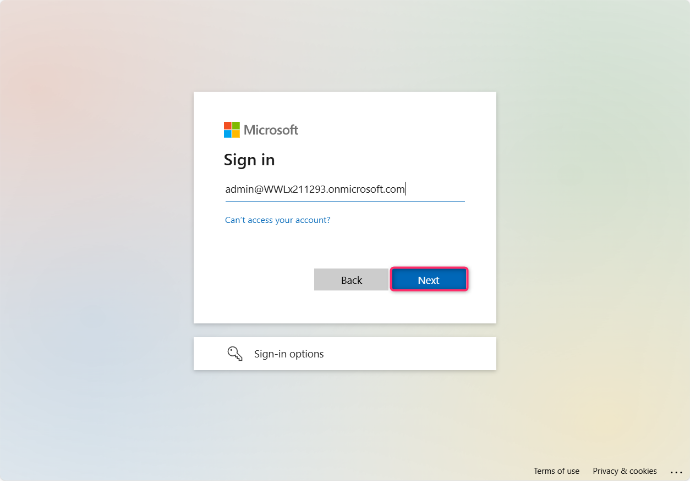
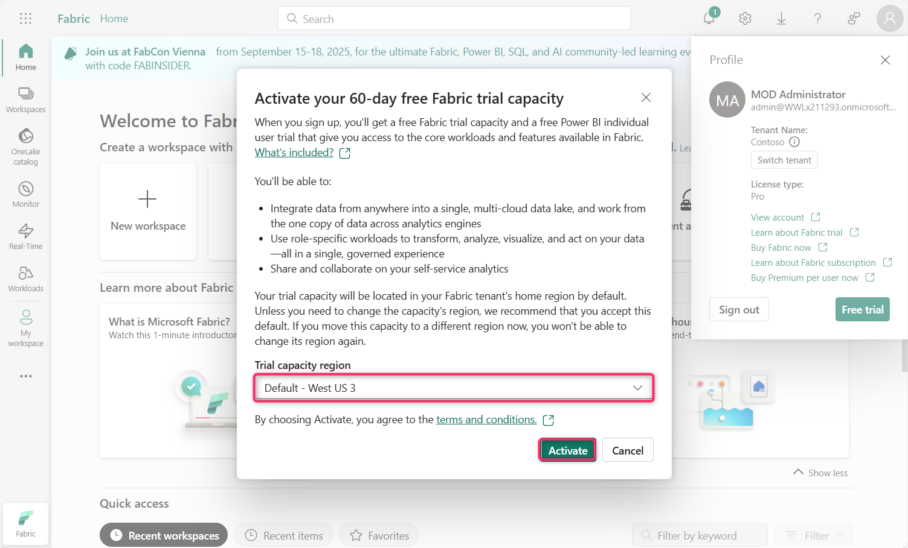
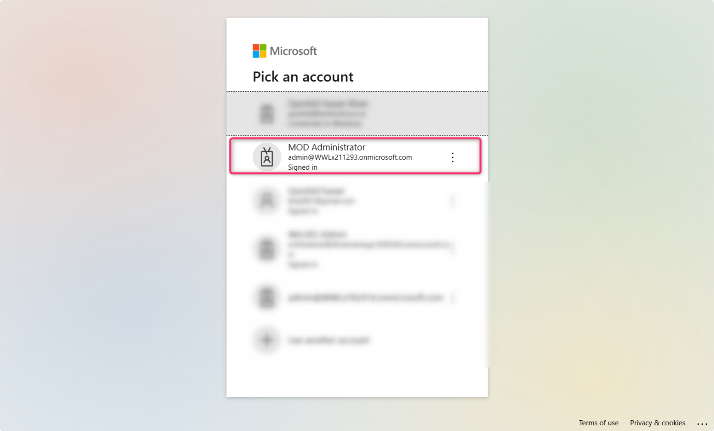
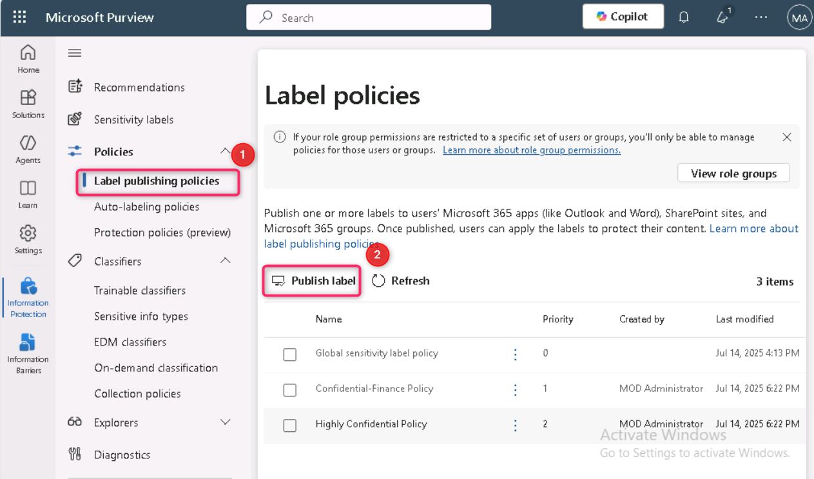
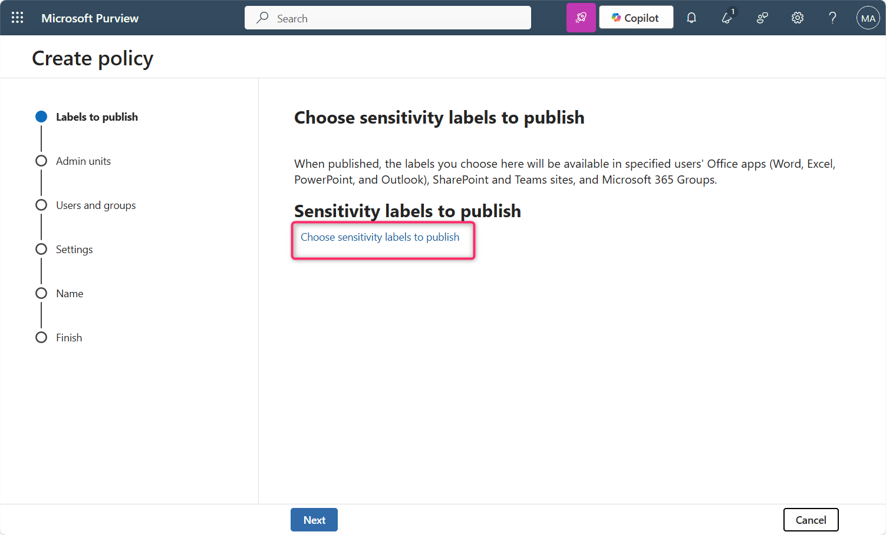
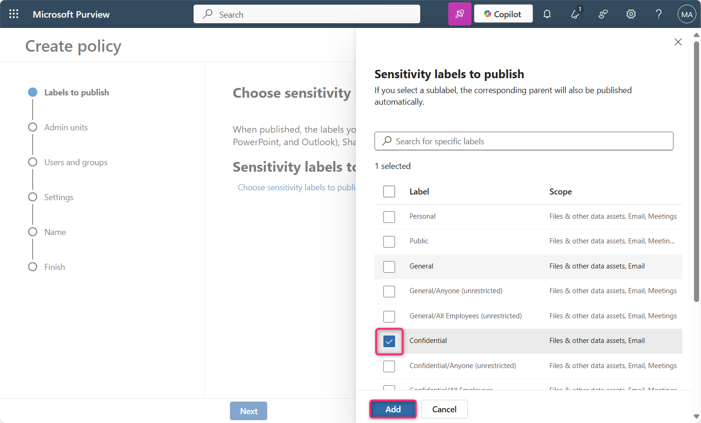
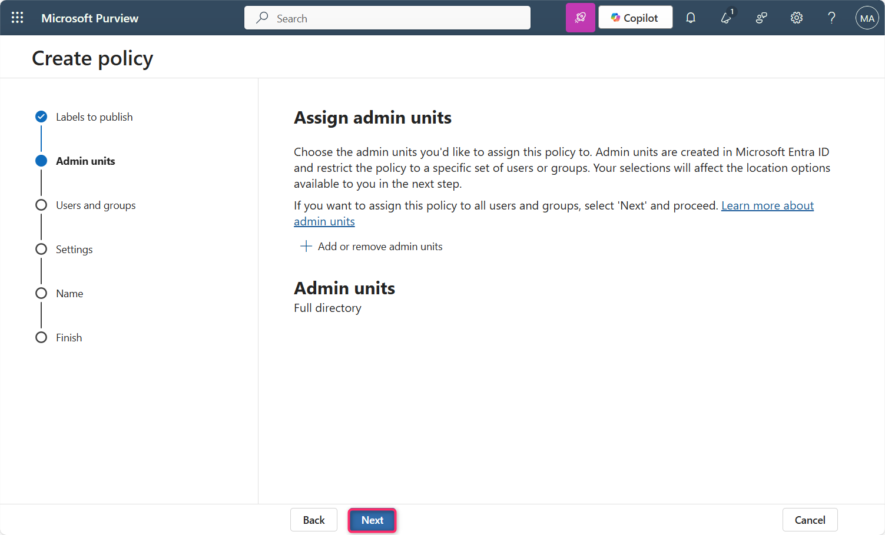
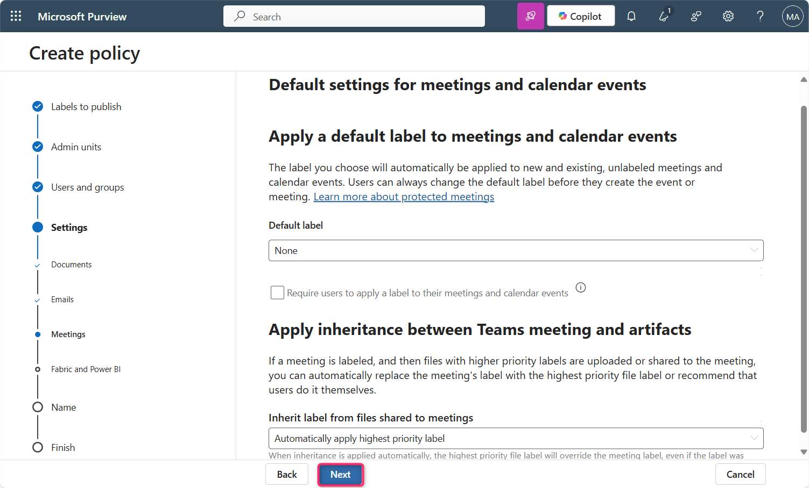

**Laboratório 10 – Implementar rótulos de confidencialidade no Fabric e no Power BI usando o Microsoft Purview**

**Introdução**

Os rótulos de confidencialidade do Microsoft Purview Information Protection no Fabric e no Power BI (incluindo o Power BI Desktop) devem estar habilitados no locatário. Quando os rótulos de confidencialidade estão habilitados:

- Usuários e grupos de segurança especificados na organização podem aplicar rótulos de confidencialidade ao conteúdo do Fabric. No serviço do Fabric, isso significa qualquer item do Fabric. No Power BI Desktop, isso se refere aos arquivos .pbix.

- No serviço, todos os membros da organização conseguem visualizar esses rótulos. No Desktop, apenas os membros da organização para os quais os rótulos foram publicados conseguem visualizá-los.

**Objetivo**

- Habilitar e priorizar uma política de rótulo de confidencialidade manual no Microsoft Fabric usando o Microsoft Purview.

**Exercício 1 – Ativar a Avaliação do Microsoft Fabric e Acessar o Purview Hub**

1.  Abra o navegador Edge e, na barra de endereços, insira a seguinte URL para acessar o portal do Fabric - https://app.fabric.microsoft.com

**Observação**: caso você seja direcionado diretamente para o portal do Fabric, ignore as etapas \#2 e 3.

2.  Insira as credenciais do seu locatário.

3.  No campo de senha, insira a senha do locatário e clique no botão **Sign in**.

4.  Na caixa de diálogo **Welcome to the Fabric view**, clique no botão **Cancel**.

5.  Clique no ícone de perfil na barra de comandos.

6.  Navegue e clique no botão **Free trial**.

7.  Na tela **Activate your 60-day free Fabric trial capacity**, na região **Trial capacity**, certifique-se de que a região **Default – West US 3** esteja selecionada e clique no botão **Activate**.

8.  Na caixa de diálogo **Successfully upgraded to a free Microsoft Fabric trial**, clique no botão **Got it**.

9.  Clique no ícone de engrenagem **Settings** na barra de comandos.

10. Navegue até a seção Governance and insights e clique no link **Microsoft Purview hub (preview)**. Em seguida, na página **Microsoft Purview hub (preview)**, navegue e clique no bloco **Information Protection**.

11. Caso a caixa de diálogo **Pick an account** seja exibida, selecione o ID do seu locatário.

12. Na caixa de diálogo **Welcome to Information Protection in the new Microsoft Purview portal**, clique no botão **Get started**.

**Exercício 2 – Criar e Configurar uma Política de Rótulo de Confidencialidade para Fabric e Power BI**

1.  No painel Information Protection, navegue e clique no menu suspenso ao lado de **Policies**.

2.  Clique em **Label publishing policies**. Na página **Label publishing policies**, navegue e clique em **Publish label**.

3.  Na página **Create policy**, navegue e clique no link **Choose sensitivity label to publish**.

4.  O painel **Sensitivity label to publish** será exibido no lado direito. Navegue, marque a caixa de seleção ao lado de **Confidential** e clique no botão **Add**.

5.  Clique no botão **Next**.

6.  Na página **Assign admin units**, clique no botão **Next**.

7.  Na página **Publish to users and groups**, certifique-se de que a caixa de seleção **Users and groups** esteja marcada e clique no botão **Next**.

8.  Na página **Policy settings**, marque a caixa de seleção **Require users to apply a label to their Fabric and Power BI content** e clique no botão **Next**.

9.  Na página **Default settings for documents – Apply a default label to documents**, clique no botão **Next**.

10. Na página **Default settings for documents – Apply a default label to emails**, clique no botão **Next**.

11. Na página **Default settings for meetings and calendar events**, clique no botão **Next**.

12. Na página **Default settings for Fabric and Power BI content**, clique no botão **Next**.

13. Na página **Name your policy**, no campo **Name**, insira: Manual Labeling – HR Confidential Docs. Em seguida, clique no botão **Next**..

14. Na página **Review and finish**, clique no botão **Submit**.

15. A política foi criada com sucesso. Agora, clique no botão **Done**.

16. Na página **Label policies**, você verá que a política **Manual Labeling – HR Confidential Docs** foi criada com sucesso.

17. Selecione **Manual Labeling – HR Confidential Docs**, clique no menu de reticências horizontais e selecione **Move up** para alterar a prioridade.

18. Selecione novamente **Manual Labeling – HR Confidential Docs**, clique no menu de reticências horizontais ao lado da política e selecione **Move up**.

19. Você observará que a prioridade da política **Manual Labeling – HR Confidential Docs** foi alterada para 1.

**Resumo**

Neste laboratório, você ativou uma avaliação do Microsoft Fabric, acessou o portal do Microsoft Purview e criou uma política obrigatória de rótulo de confidencialidade que exige que os usuários apliquem o rótulo “Confidential” ao conteúdo do Fabric e do Power BI. Em seguida, a política foi priorizada para implementação.
