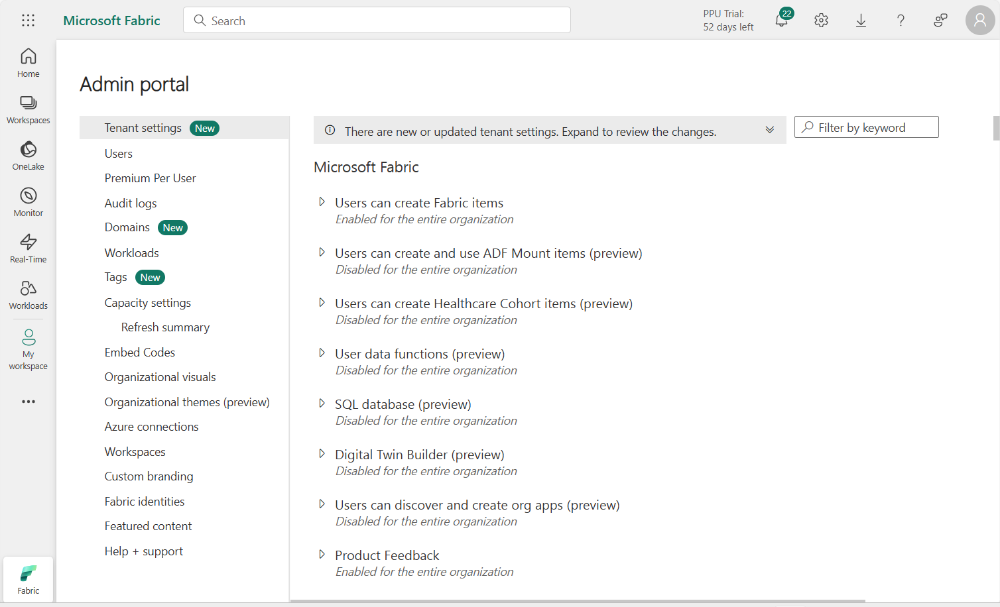
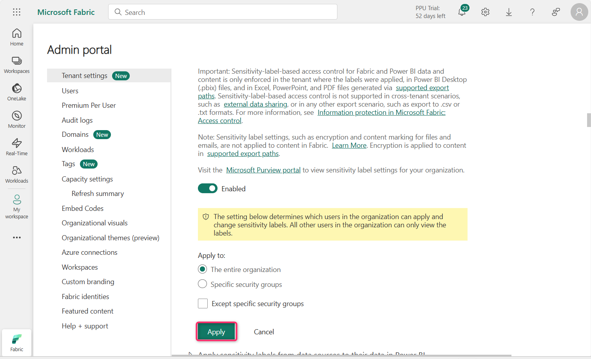
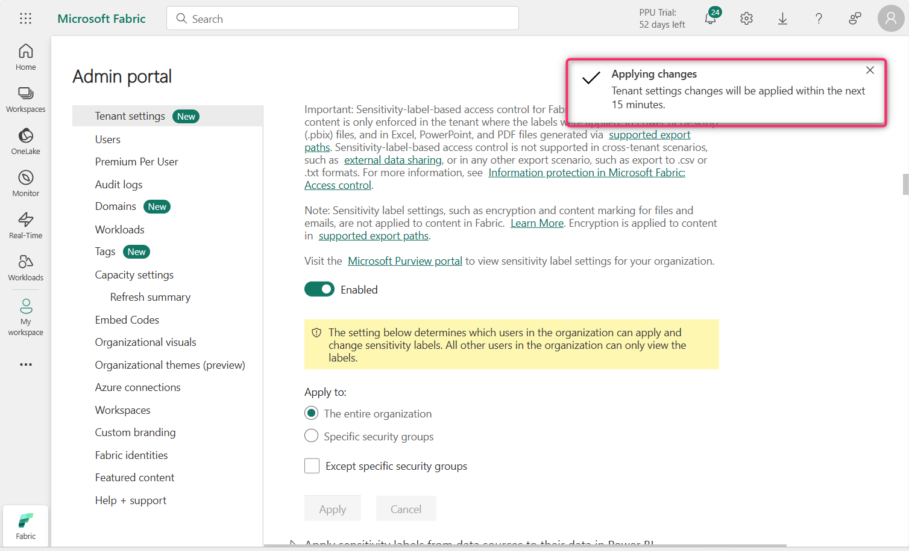
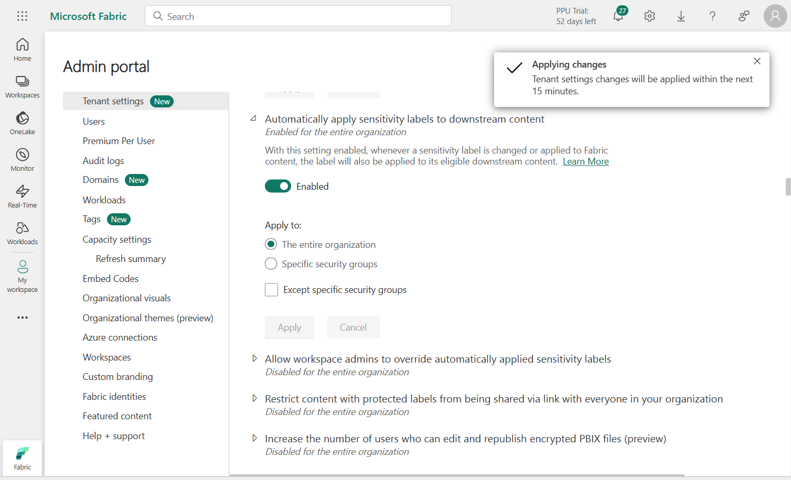
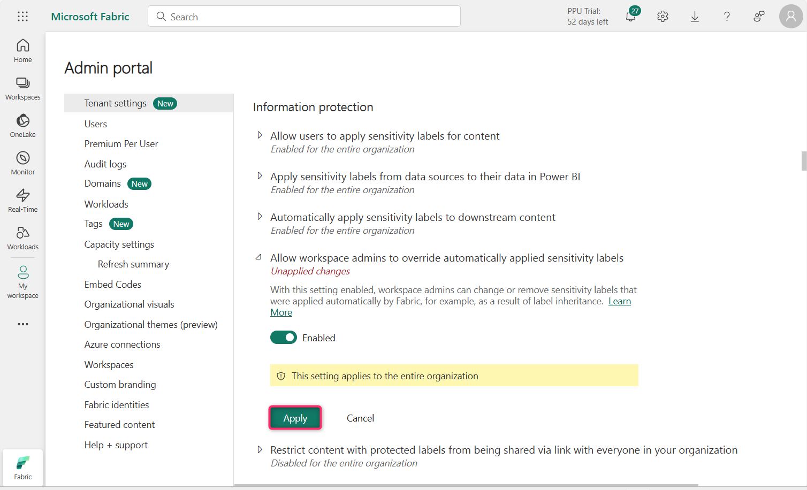
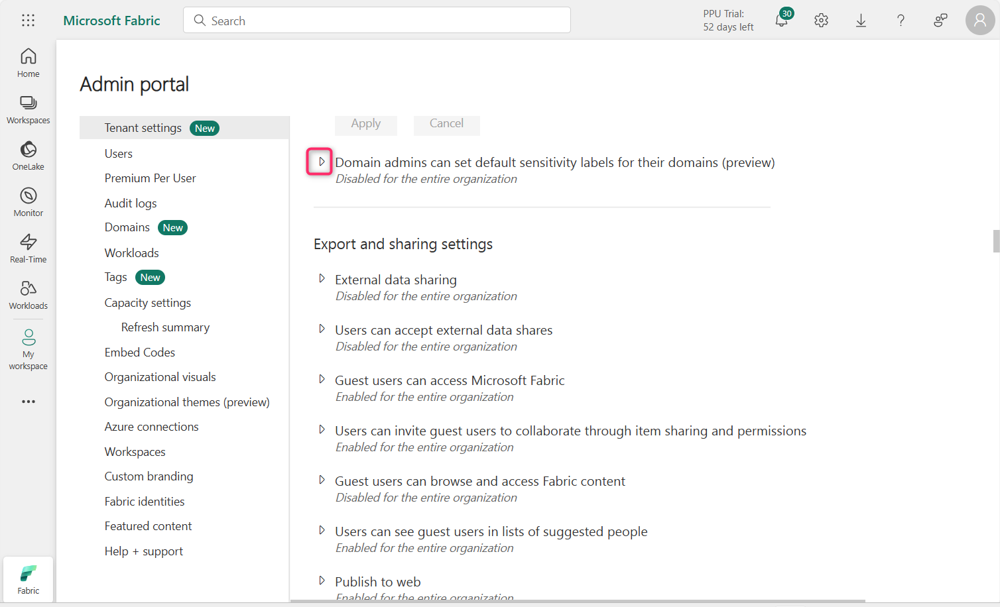

**Laboratório 11 – Configurar política de Information Protection no Fabric**

**Introdução**

As configurações de Information Protection no locatário ajudam a proteger informações confidenciais no seu locatário do Power BI. Permitir e aplicar rótulos de confidencialidade ao conteúdo garante que as informações sejam visualizadas e acessadas apenas pelos usuários apropriados. 

**Objetivo**

- Habilitar os recursos de Information Protection no Microsoft Fabric por meio do Portal de Administração para se preparar para a aplicação de rótulos de confidencialidade.

**Exercício 1 – Configurar as configurações de Information Protection no Portal de Administração do Fabric**

1.  Na página inicial do **Fabric portal**, clique no ícone **Settings** na barra de comandos, navegue até a seção **Governance and insights** e clique no link **Admin portal**.

> 

2.  No Admin portal – Tenant settings, role a página até a seção **Information Protection**.

> 

3.  Clique no botão de reprodução ao lado de **Allow users to apply sensitivity labels for content.**

> 

4.  Clique no botão de alternância para habilitar a configuração. Com essa configuração habilitada, os usuários especificados poderão aplicar rótulos de confidencialidade do Microsoft Purview Information Protection.

> 

5.  Agora, clique no botão **Apply**.

> 
>
> **Observação**: caso o botão **Apply** não esteja habilitado, selecione o botão de opção **Specific security groups** e, em seguida, selecione novamente o botão de opção **The entire organization**.

6.  Você receberá uma notificação informando – **Tenant settings will be applied within the next 15 minutes**.

> 

7.  Clique no ícone de reprodução ao lado de **Apply sensitivity labels from data sources to their data in Power BI**.

> 

8.  Clique no botão de alternância para habilitar a configuração.

> 

9.  Com essa configuração habilitada, os modelos semânticos do Power BI que se conectam a dados com rótulos de confidencialidade em fontes compatíveis podem herdar esses rótulos, garantindo que os dados permaneçam classificados e protegidos ao serem trazidos para o Power BI.

> Clique no botão **Apply**.
>
> 

10. Você receberá uma notificação informando – **Tenant settings will be applied within the next 15 minutes.**

> 

11. Clique no ícone de reprodução ao lado de **Automatically apply sensitivity labels to downstream content**.

> 

12. Clique no botão de alternância para habilitar a configuração.

> 

13. Com essa configuração habilitada, sempre que um rótulo de confidencialidade for alterado ou aplicado a conteúdo do Fabric, o rótulo também será aplicado ao conteúdo downstream elegível.

> Clique no botão **Apply**.
>
> 

14. Você receberá uma notificação informando – Tenant settings will be applied within the next 15 minutes.

> 

15. Clique no ícone de reprodução ao lado - **Allow workspace admins to override automatically applied sensitivity labels**

> 

16. Clique no botão de alternância para habilitar a configuração.

> 

17. Essa configuração permite que administradores de espaço de trabalho substituam rótulos de confidencialidade aplicados automaticamente, independentemente das regras de imposição de alteração de rótulos.

> Clique no botão **Apply**.
>
> 

18. Você receberá uma notificação informando - Tenant settings will be applied within the next 15 minutes.

> 

19. Clique no ícone de reprodução ao lado **Restrict content with protected labels from being shared via link with everyone in your organization**

> 

20. Clique no botão de alternância para habilitar a configuração.

> 

21. Com essa configuração habilitada, o compartilhamento por link para Pessoas da sua organização será bloqueado para conteúdos protegidos por rótulos de confidencialidade.

> Clique no botão **Apply**.
>
> 

22. Você receberá uma notificação informando - Tenant settings will be applied within the next 15 minutes.

> 

23. Clique no ícone de reprodução ao lado **Domain admins can set default sensitivity labels for their domains (preview)**

> 

24. Clique no botão de alternância para habilitar a configuração.

> 

25. Clique no botão **Apply**.

> 

26. Você receberá uma notificação informando - Tenant settings will be applied within the next 15 minutes.

> 

**Sumário**

Neste laboratório, você habilitou diversas configurações de Information Protection no Portal de Administração do Microsoft Fabric para dar suporte à aplicação de rótulos de confidencialidade, herança de rótulos, rotulagem automática e substituições administrativas.
