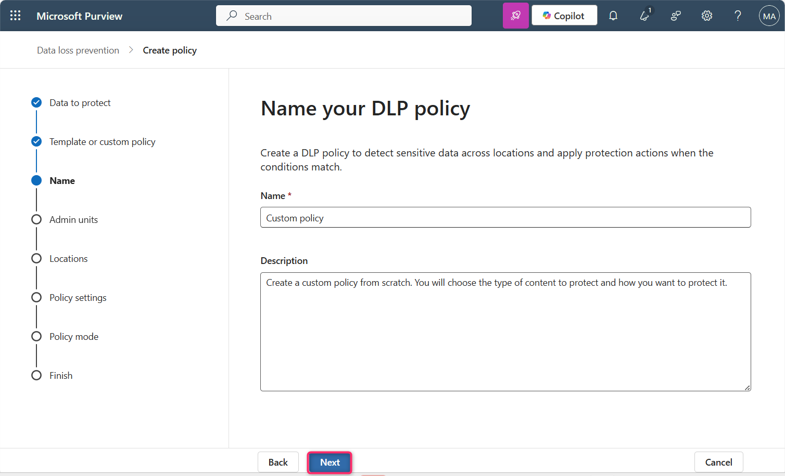
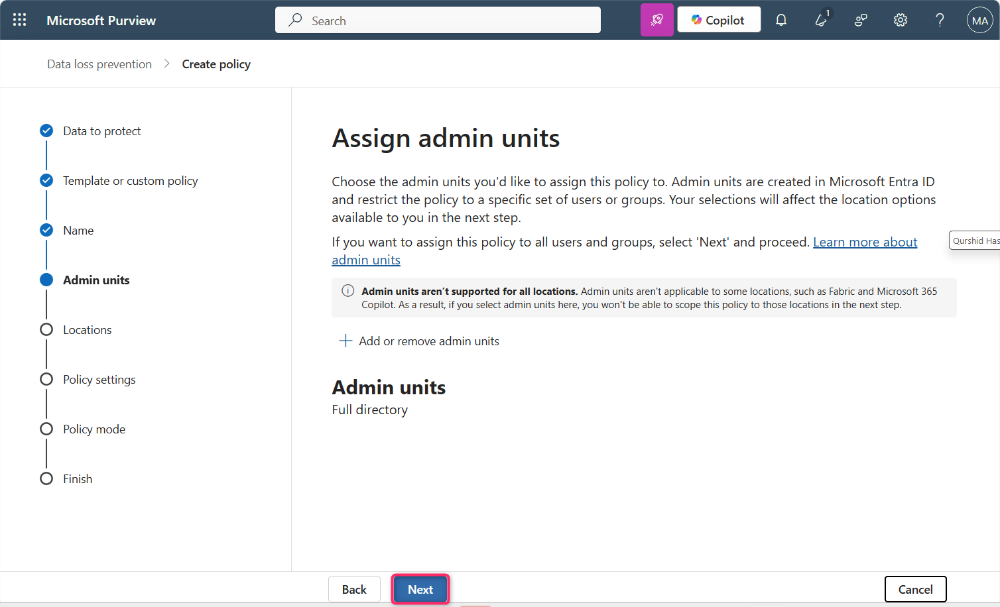
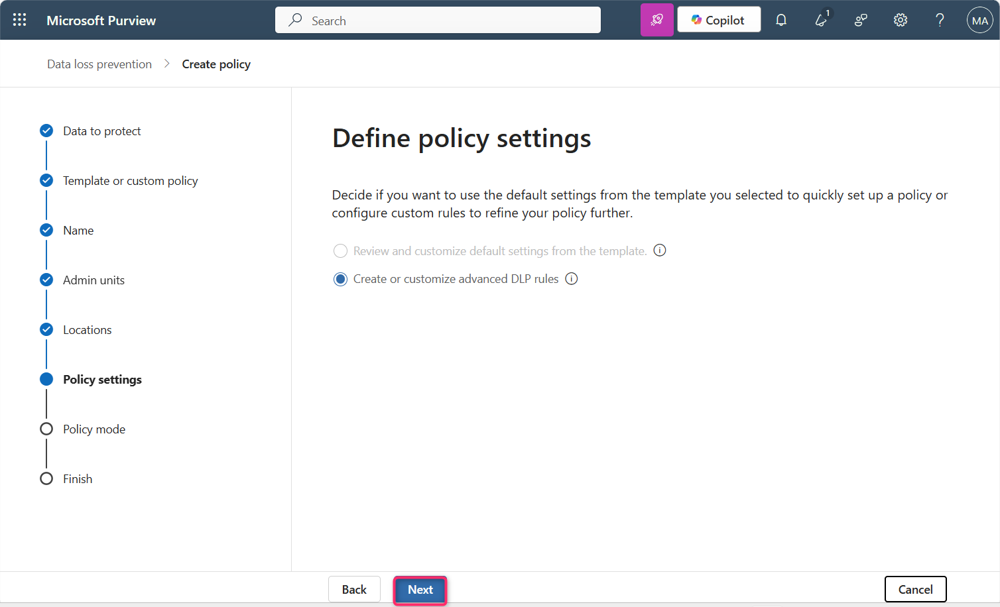
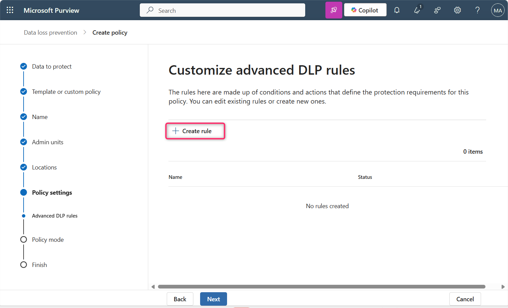
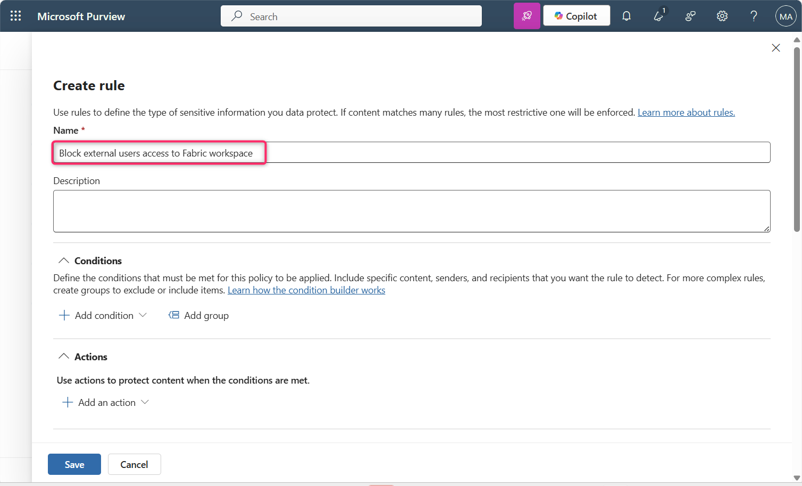
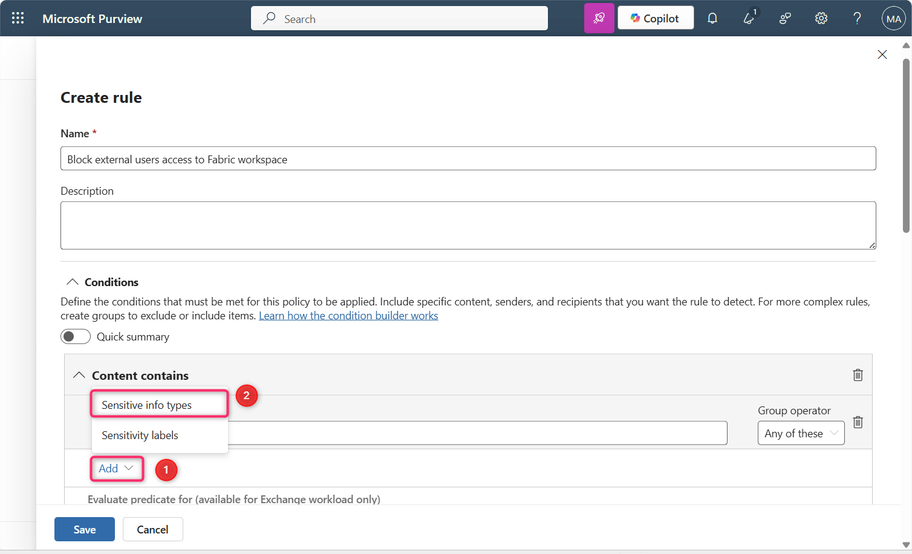
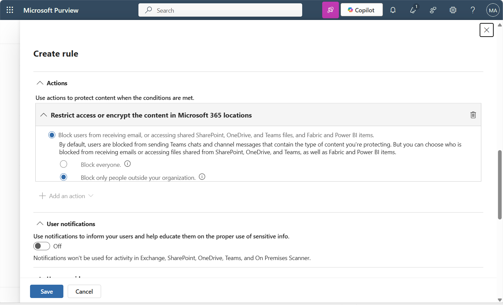
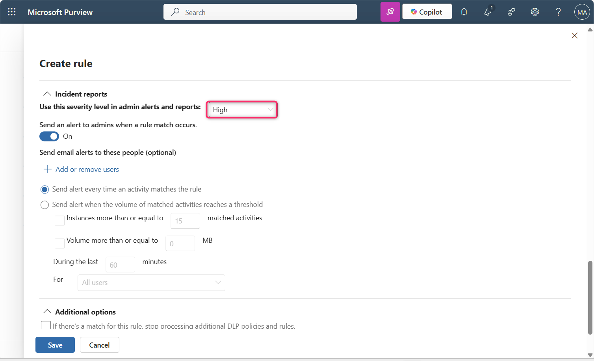

**Laboratório 12 – Criar uma política de DLP que bloqueia o acesso de usuários externos ao espaço de trabalho do Fabric**

**Introdução**

Precisamos bloquear usuários externos de relatórios que contenham números de cartão de crédito, a menos que os dados sejam rotulados com o rótulo de confidencialidade “Altamente confidencial – Interno”, caso em que uma política de proteção restringe o acesso a grupos de segurança selecionados. Queremos notificar o administrador de conformidade sempre que um modelo semântico for bloqueado e o proprietário dos dados para que esteja ciente da restrição. Também queremos que os usuários internos estejam cientes de que os dados são altamente confidenciais e que não devem compartilhá-los fora da organização

| **Declaração** | **Pergunta de configuração respondida e mapeamento de configuração** |
|----|----|
| " Precisamos bloquear usuários externos…" | Onde monitorar: **Fabric and Power BI** Escopo administrativo: **Diretório completo**. Ação: **Restringir. Acesse ou criptografe o conteúdo em locais do Microsoft 365 \> Impedir que usuários recebam e-mails ou acessem arquivos compartilhados do SharePoint, OneDrive e Teams, além de itens do Power BI \> Bloquear apenas pessoas fora da sua organização** |
| "... a partir de relatórios que contenham números de cartão de crédito..." | O que monitorar: use o **modelo personalizado**. Condições para correspondência: edite-o para adicionar o tipo de informação confidencial Número do cartão de crédito. |
| "... exceto se os dados estiverem rotulados com o rótulo de confidencialidade “Altamente confidencial - Interno..." | Configuração do grupo de condições: crie um grupo de condições booleanas NÃO interligadas à primeira condição usando uma condição booleana E Condição para correspondência: edite-a para adicionar o rótulo de confidencialidade Altamente confidencial - Interno. |
| " Queremos notificar o administrador de conformidade sempre que um semantic model for bloqueado…" | Relatórios de incidentes: **enviar um alerta aos administradores quando ocorrer uma correspondência com a regra: ativado**. Enviar um alerta sempre que uma atividade corresponder à regra: **selecionado** |
| "... que o proprietário dos dados seja informado de que a restrição foi aplicada. Também queremos que os usuários internos estejam cientes de que os dados são altamente confidenciais e que não devem ser compartilhados fora da organização." | Notificações do usuário: a**tivadas**. Arquivos do Microsoft 365 e itens do Microsoft Fabric: Notificar os usuários no serviço Office 365 com uma dica de política ou notificações por e-mail: **selecionado**. Dicas de política: Personalizar o texto da dica de política: selecionado. Adicione texto na caixa de texto explicando as regras que regem o compartilhamento de dados altamente confidenciais. |

**Importante**

Para os fins deste procedimento de criação da política, você aceitará os valores padrão de inclusão/exclusão e deixará a política desativada. Essas configurações serão alteradas quando a política for implementada.

**Objetivo**

- Criar uma política personalizada de Data Loss Prevention (DLP) no Microsoft Purview para bloquear o acesso de usuários externos a conteúdos do Fabric e do Power BI que contenham informações confidenciais.

**Exercício 1: Criando uma política de DLP personalizada para bloquear o acesso externo a espaços de trabalho do Fabric**

1.  No Microsoft Purview portal, clique em **Solutions** e, em seguida, navegue e clique em **Data Loss Prevention**.

> 

2.  Agora, clique em **Policies**.

> 

3.  Na página **Policies**, clique em **+ Create policy**.

> 

4.  No painel **What info do you want to protect?**, selecione **Enterprise applications and devices**.

> 

5.  Na página **Choose what type of data to protect**, certifique-se de que o botão de opção **Data stored in connected sources** esteja selecionado e, em seguida, clique no botão **Next**.

> 

6.  Na página **Start with a template or create a custom policy**, clique em **Custom** em **Categories**.

Selecione **Custom policy** na lista **Regulations** e, em seguida, clique no botão **Next**.

\

7.  Na página **Name your DLP policy**, no campo **Name**, certifique-se de que **Custom policy** esteja mencionado.

> **Observação**: você pode usar aqui a declaração de intenção da política. As políticas não podem ser renomeadas.
>
> Em seguida, clique no botão **Next**.
>
> 

8.  Na página **Assign Admin units**, clique no botão **Next**.

> 

9.  Na página **Choose where to apply the policy**, clique no botão **Next**.

> 

10. Na página **Define policy settings**, certifique-se de que o botão de opção **Create or customize advanced DLP rules** esteja selecionado. Em seguida, clique no botão **Next**.

> 

11. Na página **Customize advanced DLP rules**, selecione **+ Create rule**.

> 

12. Na página **Create rule**, no campo **Name**, insira **+++Block external users access to Fabric workspace+++**.

> 

13. Na seção **Conditions**, selecione **Add condition** \> **Content contains** \> **Add** \> **Sensitive info types**.

> 
>
> 

14. No painel **Sensitive info types** exibido no lado direito, clique na barra de pesquisa, digite **+++credit card number+++** e pressione Enter.

> 
>
> 

15. Selecione a caixa de seleção ao lado de **Credit Card Number** e, em seguida, clique no botão **Add**.

> 

16. Em **Actions**, selecione **Add an action** \> **Restrict access or encrypt the content in Microsoft 365 locations**.

> 

17. Certifique-se de que as opções **Block users from receiving email or accessing shared SharePoint, OneDrive, and Teams files, and Power BI items** e **Block only people outside your organization** estejam selecionadas.

> 

18. Em **User notifications**, defina o controle como **On**.

> 
>
> 

19. Selecione a caixa de seleção **Notify users in Office 365 service with a policy tip or email notifications** e a caixa de seleção **Customize the policy tip text**.

> 

20. Na seção **User overrides**, selecione a caixa **Allow users to override policy restrictions in Fabric (including Power BI), Exchange, SharePoint, OneDrive, and Teams** e, em seguida, selecione a caixa **Override the rule automatically if they report it as a false positive**.

> 

21. Em **Incident reports**, defina **Use this severity level in admin alerts and reports** como **High**.

> 
>
> 

22. Certifique-se de que o controle **Send an alert to admins when a rule match occurs** esteja definido como **On**.

23. Certifique-se de que o botão de opção **Send alert every time an activity matches the rule** esteja selecionado.

> 

24. Clique no botão **Save**.

> 

25. Revise a regra e, em seguida, clique no botão **Next**.

> 

26. Certifique-se de que o botão de opção **Run the policy in simulation mode** e a caixa de seleção **Show policy tips while in simulation mode** estejam selecionados. Em seguida, clique no botão **Next**..

> 

27. Na página **Review and finish**, clique no botão **Submit**. Após alguns segundos, a política será criada com sucesso.

> 
>
> 

**Observação importante**:

Você pode encontrar o seguinte erro devido a uma limitação de licenciamento neste ambiente de laboratório.

Este laboratório está sendo executado com uma licença do Power BI Pro, que não oferece suporte à integração do Microsoft Purview DLP para áreas de trabalho do Fabric ou Premium. Como resultado, ações de política de DLP como “Bloquear usuários externos” não podem ser definidas corretamente, e o assistente falha com o seguinte erro:

Para bloquear apenas pessoas fora da sua organização, você deve selecionar a condição 'Content is shared with people outside my organization'.

Em um ambiente empresarial real, esse problema não ocorrerá se o seu locatário tiver:

- Liença do Power BI Premium Per User (PPU)

- ou uma capacidade do Microsoft Fabric (F64+)

Essas licenças permitem a integração completa da política de DLP com o Microsoft Fabric e o Power BI, incluindo suporte para ações de bloqueio e definição adequada do escopo das condições.

**Sumário**

Neste laboratório, você criou uma política DLP personalizada no Microsoft Purview para proteger o conteúdo do Fabric e do Power BI, detectando dados confidenciais e aplicando restrições para bloquear o acesso de usuários externos. A política também habilita notificações ao usuário e alertas ao administrador.
