**Laboratório 13 – Implementar e gerenciar a retenção**

Você é Patti Fernandez, administradora de conformidade na Contoso Ltd. A empresa está reforçando sua estratégia de segurança de dados para reduzir a exposição a riscos relacionados a dados financeiros e comunicações confidenciais. Você foi solicitada a configurar soluções de retenção do Microsoft Purview que ofereçam suporte à preparação para auditorias, limitem a retenção desnecessária de dados e garantam a supervisão adequada de comunicações confidenciais.

**Tarefas**:

- Criar um rótulo de retenção

- Publicar um rótulo de retenção

- Criar uma política de rótulos de retenção com aplicação automática.

- Criar uma política de retenção estática

- Recuperar conteúdo do SharePoint

**Exercício 1 – Criar um rótulo de retenção**

Nesta tarefa, você criará um rótulo de retenção para dados financeiros confidenciais que precisam ser mantidos para fins de auditoria e investigação.

1.  Faça login na VM como administrador.

2.  No Microsoft Edge, acesse https://purview.microsoft.com e faça login como pattif@TenantName.

3.  Navegue até **Solutions \> Data Lifecycle Management.**

> 

4.  Em seguida, selecione **Retention labels.**

> 

5.  Na página **Labels**, selecione **Create a label.**

> 

6.  Na página **Name your retention label**, insira:

    - **Name**: Sensitive Financial Records

    - **Description for users**: Use for financial files with sensitive data that must be retained for audit or security purposes.

    - **Description for admins**: Retains high-impact financial data for 5 years to support audits and security investigations.

7.  Selecione **Next**.

> 

8.  Na página **Define label settings**, selecione **Retain items forever or for a specific period** e, em seguida, selecione **Next**.

> 

9.  Na página **Define the retention period**, certifique-se de que estes valores estejam definidos no campo de configuração do período de retenção:

    - **Qual a duração do período?**: 5 Years

> 

- **Quando deve começar o período?**: When items were modified.

> 

10. Selecione **Next**.

> 

11. Na página **Choose what happens after the retention period,** selecione **Delete items automatically** e, em seguida, selecione **Next**.

> 

12. Na página **Review and finish**, selecione **Create label**.

> 

13. Na página **Your retention label is created**, selecione a opção **Do nothing** e, em seguida, selecione **Done**.

> 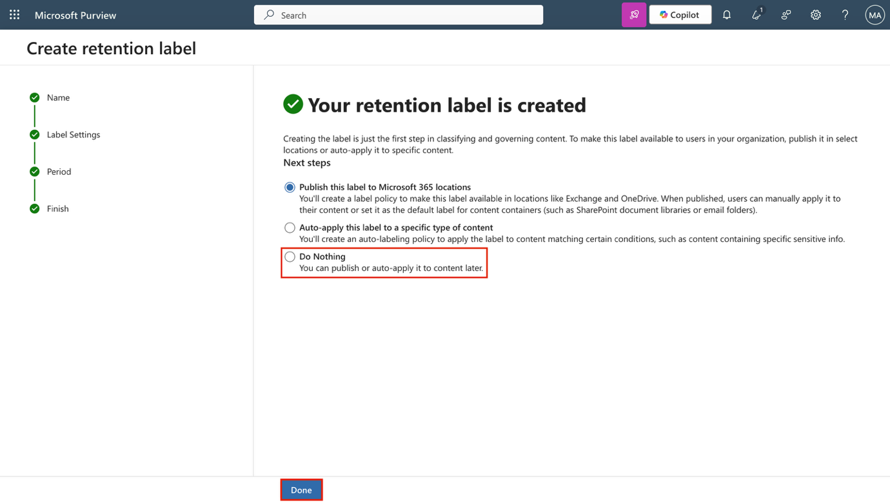

Você criou um rótulo de retenção que mantém o conteúdo financeiro por cinco anos e o exclui posteriormente para reduzir a exposição de dados.

**Exercício 2 – Publicar um rótulo de retenção**

Nesta tarefa, você publicará o rótulo de retenção para que os usuários possam aplicá-lo em serviços do Microsoft 365, como Exchange, SharePoint e OneDrive.

1.  No Microsoft Purview, navegue até **Solutions \> Data Lifecycle Management \> Retention labels.**

> 

2.  Selecione a caixa ao lado do rótulo **Sensitive Financial Records** e, em seguida, selecione o ícone **Publish labels** para publicar este rótulo de retenção.

> 

3.  Na página **Choose labels to publish**, verifique se o rótulo **Sensitive Financial Records** está selecionado e, em seguida, selecione **Next**.

> 

4.  Na página **Policy Scope**, selecione **Next**.

> 

5.  Na página **Choose the type of retention policy to create,** selecione **Static** e, em seguida, selecione **Next**.

> 

6.  Na página **Choose where to publish labels**, selecione **Let me choose specific locations** e selecione:

    - Exchange mailboxes

    - SharePoint classic and communication sites

    - OneDrive accounts

    - Deselect all other locations

7.  Selecione **Next**.

> 

8.  Em **Name your policy,** insira:

    - **Name**: Sensitive Financial Data Retention

    - **Description**: Makes the 'Sensitive Financial Records' label available to users in Exchange, SharePoint, and OneDrive.

9.  Selecione **Next**.

> 

10. Em **Finish**, selecione **Submit**.

> 

11. Na página **Your retention label was published**, selecione **Done**.

> 

Você publicou o rótulo de retenção, disponibilizando-o para que os usuários o apliquem em serviços importantes do Microsoft 365.

**Exercício 3 – Criar uma política de rótulo de retenção com aplicação automática**

Nesta tarefa, você configurará uma política que aplica automaticamente um rótulo de retenção ao conteúdo que contém informações financeiras pessoais.

1.  No Microsoft Purview, navegue até **Solutions** \> **Data Lifecycle Management** \> **Policies** \> **Label policies**.

> 

2.  Na página **Label policies**, selecione **Auto-apply a label** para iniciar a configuração do rótulo.

> 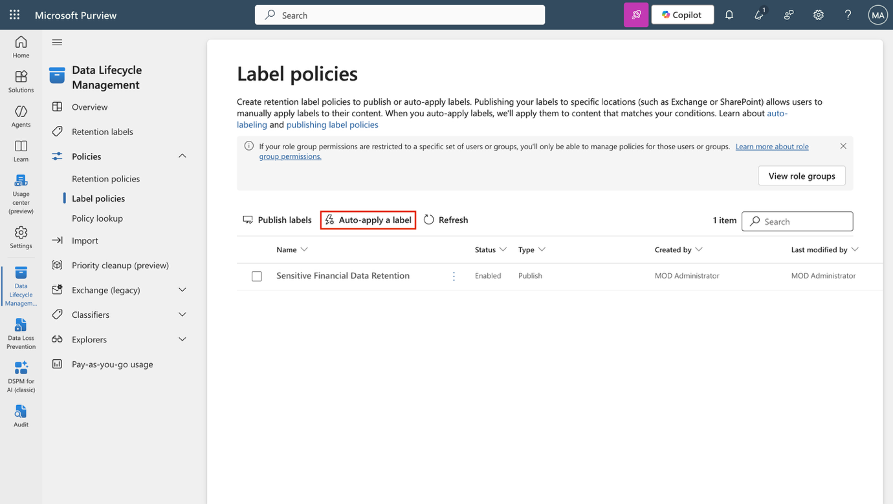

3.  Em **Let's get started page**, digite:

    - **Name**: Auto-apply Personal Financial PII

    - **Description**: Applies this label to personal financial data to help meet audit and investigation requirements. Retains content for 3 years.

4.  Selecione **Next**.

> 

5.  Na página **Choose the type of content you want to apply this label to**, selecione **Apply label to content that contains sensitive info** e, em seguida, selecione **Next**.

> 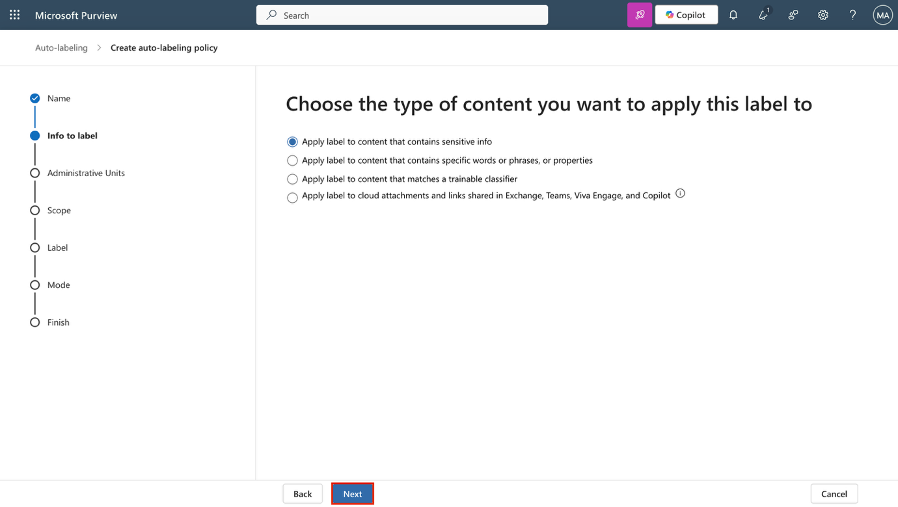

6.  Na página **Content that contains sensitive info**, selecione a categoria **Financial**, depois selecione a regulamentação **U.S. Gramm-Leach-Bliley Act (GLBA)** e, em seguida, selecione **Next**.

> 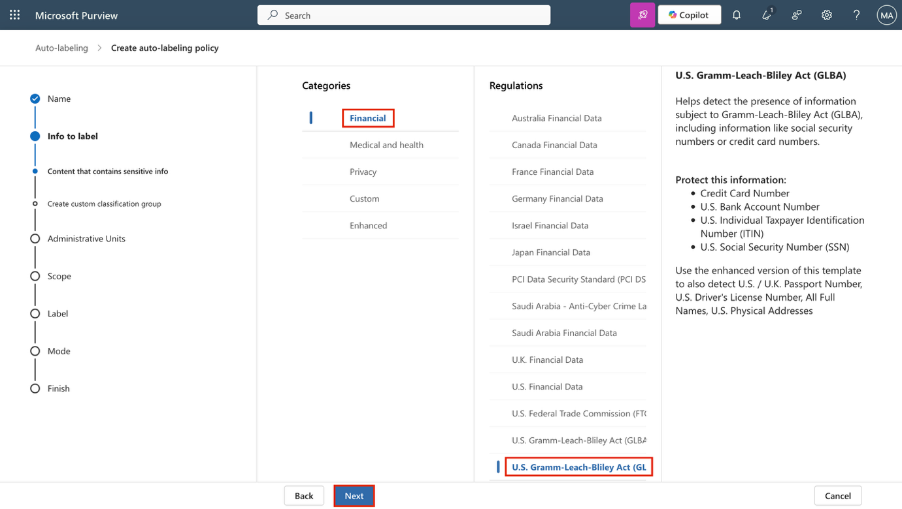

7.  Na página **Define content that contains sensitive info**, selecione **Next**.

> 

8.  Na página **Policy Scope**, selecione **Next**.

> 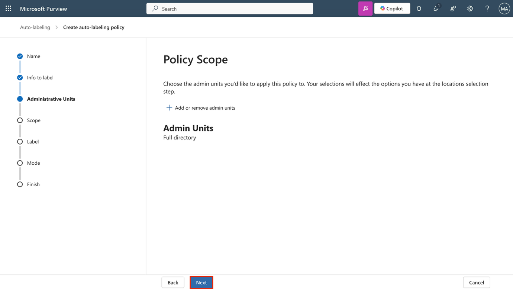

9.  Na página **Choose the type of retention policy to create**, selecione **Static**. Selecione **Next**.

> 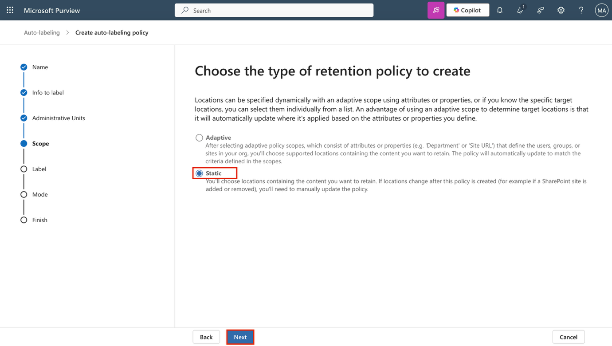

10. Na página **Choose where to publish labels**, selecione **Let me choose specific locations** e selecione:

    - Exchange mailboxes

    - SharePoint classic and communication sites

    - OneDrive accounts

    - Deselect all other locations

11. Selecione **Next**.

> 

12. Na página **Choose a label to auto-apply**, selecione **Add label**.

> 

13. Na janela suspensa **Choose a label**, selecione **Personal Financial PII** e, em seguida, selecione **Add**.

> 

14. Na página **Choose a label to auto-apply**, selecione **Next**.

> 

15. Na tela **Decide whether to test or run your policy**, selecione **Test the policy before running it** e, em seguida, selecione **Next**.

> 

16. Na página **Review and finish**, selecione **Submit**.

> 

17. Em seguida, selecione **Done** na página **Your auto-labeling policy has been created.**

> 

Você criou uma política de aplicação automática que identifica dados financeiros pessoais e aplica um rótulo de retenção automaticamente.

**Exercício 4 – Criar uma política de retenção estática**

Nesta tarefa, você criará uma política de retenção estática para o conteúdo do Microsoft Teams, a fim de ajudar a reduzir o risco de dados a longo prazo.

1.  No Microsoft Purview, navegue até **Solutions** \> **Data Lifecycle Management** \> **Policies** \> **Retention policies**.

> 

2.  Na página **Retention policies**, selecione **New retention policy**.

> 

3.  Na página **Name your retention policy**, insira:

    - **Name**: Teams Retention

    - **Description**: Retains Teams chats and channel messages for 3 years, then deletes them to reduce long-term data risk.

4.  Selecione **Next**.

> 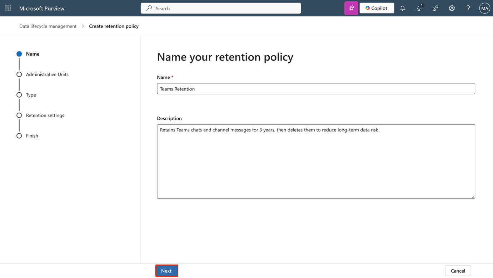

5.  Na página **Policy Scope**, selecione **Next**.

> 

6.  Na página **Choose the type of retention policy to create**, selecione **Static** e, em seguida, selecione **Next**.

> 

7.  Na página **Choose locations to apply the policy**, ative:

    - Teams channel messages

    - Teams chats

    - Leave all other locations disabled.

8.  Selecione **Next**.

> 

9.  Na página **Decide if you want to retain content, delete it, or both**, certifique-se de que estes valores estejam definidos para a configuração de retenção:

    - Selecione **Retain items for a specific period**.

    - Em **Retain items for a specific period**, selecione **Custom** na lista suspensa.

> 

- Altere o campo **years** para 3

<!-- -->

- **Start the retention period based on**: When items were last modified.

> 

- **At the end of the retention period**: Delete items automatically.

10. Selecione **Next**.

> 

1.  Na página **Review and finish,** selecione **Submit**.

> 

2.  Em seguida, selecione **Done** na página **You successfully created a retention policy**.

> 

Você configurou uma política de retenção estática que mantém as mensagens do Teams por três anos antes de excluí-las automaticamente.

**Exercício 5 – Criar um escopo adaptativo**

Nesta tarefa, você definirá um escopo adaptativo que tem como alvo grupos do Microsoft 365 associados a funções de liderança e operações.

1.  No Microsoft Purview, acesse **Settings** \> **Roles and scopes** \> **Adaptive scopes**.

2.  Na página **Adaptive scopes**, selecione **+ Create scope**.

> 

3.  Na página **Name your adaptive policy scope,** insira:

    - **Name**: Leadership and Ops Groups

    - **Description**: Targets Leadership and Operations M365 groups with privileged access to sensitive data.

4.  Selecione **Next**.

> 

5.  Na página **Assign admin unit,** selecione **Next**.

> 

6.  Na página **What type of scope do you want to create?,** selecione **Microsoft 365 Groups** e, em seguida, selecione **Next**.

> 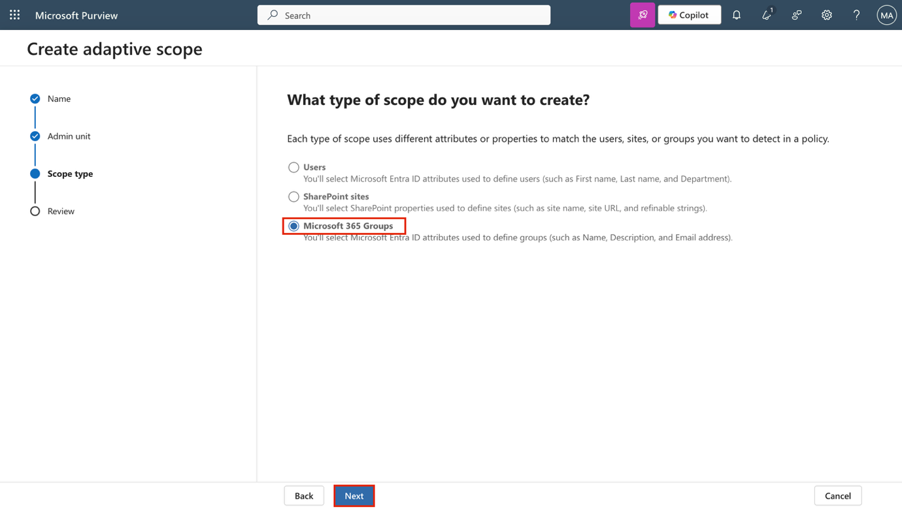

7.  Na página **Create the query to define users**, na seção **User attributes**, certifique-se de que esses valores estejam selecionados para a configuração de atributos do usuário:

    - Selecione o **Attribute** no menu suspenso e, em seguida, selecione **Name.**

> 

- Mantenha o valor padrão **is equal to no** campo seguinte.

- Insira Leadership como **Value.**

8.  Adicione um segundo atributo selecionando **+ Add attribute** na página **Create the query to define users**

> 

9.  No novo campo, abaixo do que acabamos de configurar, insira os seguintes valores:

    - Selecione o menu suspenso do operador de consulta e altere-o de **And** para **Or**.

> 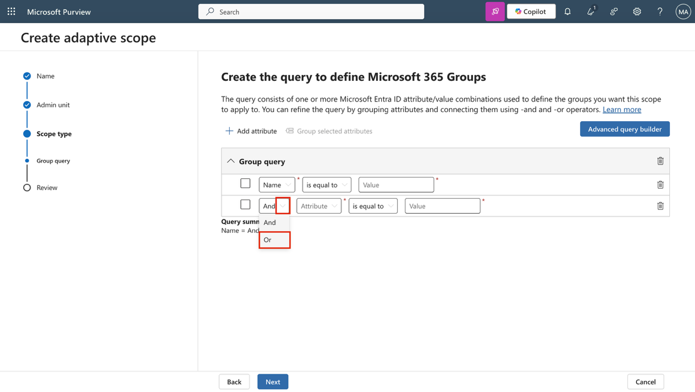

- Selecione **Attribute** no menu suspenso e, em seguida, selecione **Name**.

> 

- Deixe o valor padrão *i**s equal to*** no campo seguinte.

- Insira Operations como o **Value.**

10. Selecione **Next**.

> 

11. Na página **Review and finish,** selecione **Submit**.

> 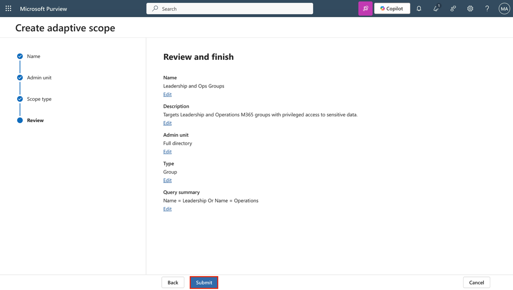

12. Após criar seu escopo adaptativo, selecione **Done** na página **Your scope was created.**

> 

Você criou um escopo adaptável para oferecer suporte à retenção direcionada para grupos privilegiados na organização.

**Exercício 6 – Crie uma política de retenção adaptativa**

Nesta tarefa, você usará o escopo adaptativo que criou para configurar uma política de retenção para grupos do Microsoft 365 com responsabilidades confidenciais.

1.  No Microsoft Purview, navegue até **Solutions** \> **Data Lifecycle Management** \> **Policies** \> **Retention policies**.

> 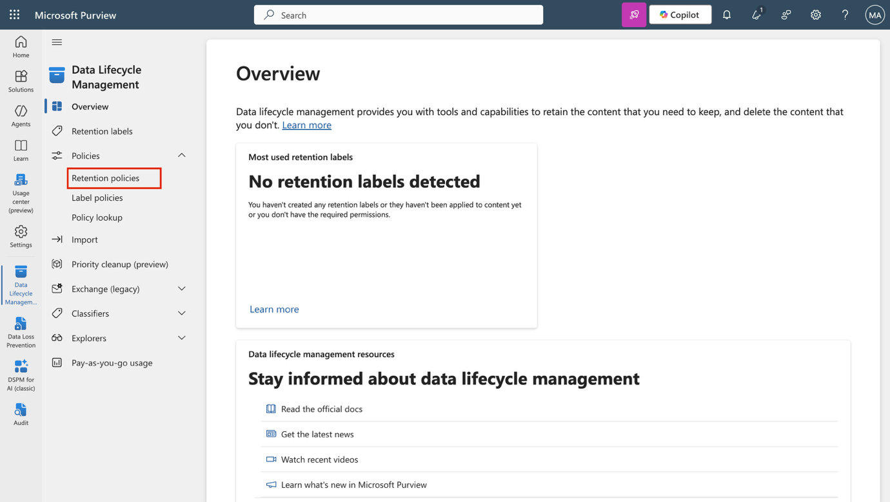

2.  Na página **Retention policies**, selecione **+ New retention policy**.

> 

3.  Na página **Name your retention policy,** insira:

    - **Name**: Privileged Group Retention

    - **Description**: Retains content from Leadership and Operations groups for 5 years to support audit and investigation.

4.  Selecione **Next**.

> 

5.  Na página **Policy Scope**, selecione **Next**.

> 

6.  Na página **Choose the type of retention policy to create,** selecione **Adaptive** e, em seguida, selecione **Next**.

> 

7.  Na página **Choose adaptive policy scopes and locations,** selecione **+ Add scopes**.

> 

8.  No painel suspenso **Choose adaptive policy scopes,** selecione a caixa de seleção **Leadership and Ops Groups** e, em seguida, selecione **Add** na parte inferior do painel.

> 

9.  De volta à tela **Choose locations to apply the policy,** habilite:

    - Microsoft 365 Group mailboxes & sites

    - Leave all other locations disabled.

10. Selecione **Next**.

> 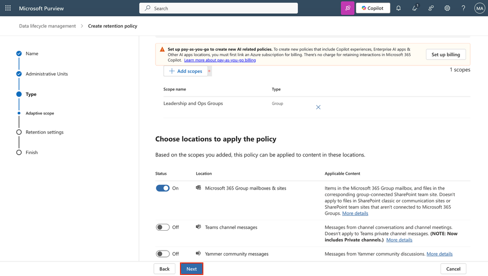

11. Na página **Decide if you want to retain content, delete it, or both,** certifique-se de que esses valores estejam definidos para a configuração de retenção:

    - Selecione **Retain items for a specific period**.

    - Em **Retain items for a specific period**, selecione **5 years** na lista suspensa.

    - **Start the retention period based on**: When items were last modified.

    - **At the end of the retention period**: Delete items automatically.

12. Selecione **Next**.

> 

13. Na página **Review and finish,** selecione **Submit**.

> 

14. Selecione **Done** após a criação da política.

> 

Você criou uma política de retenção que se aplica ao conteúdo pertencente a grupos privilegiados, mantendo-o por cinco anos antes de sua exclusão.

**Exercício 7 – Recuperar conteúdo do SharePoint**

Nesta tarefa, você simulará a restauração de um documento excluído de um site do SharePoint para validar suas opções de recuperação.

1.  Você ainda deve estar conectado à VM e logado como Patti Fernandez no Microsoft Purview.

2.  Selecione o iniciador de aplicativos (o ícone de grade) no canto superior esquerdo e, em seguida, selecione **More apps** no submenu.

> 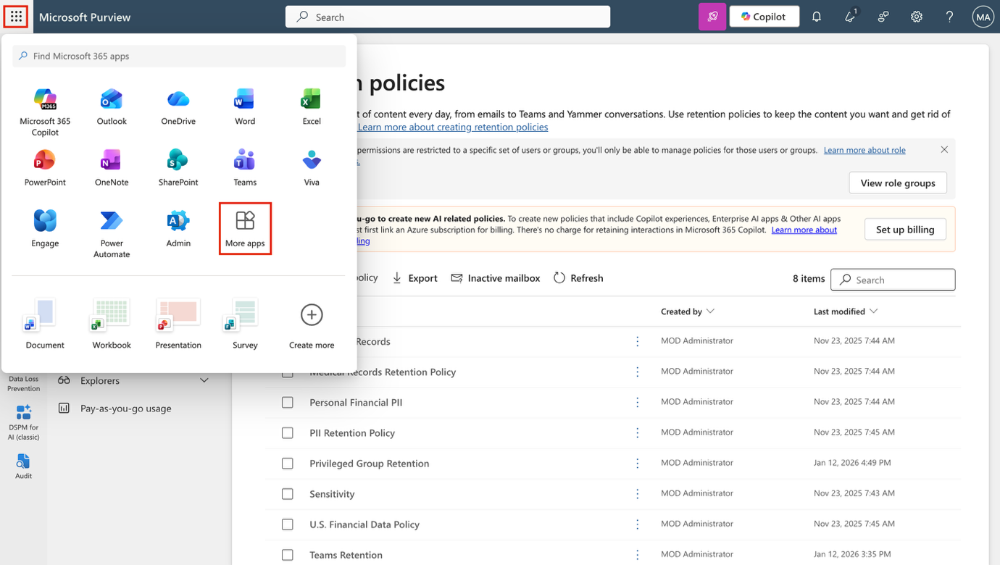

3.  Selecione **SharePoint**.

> 

4.  Na página inicial do SharePoint, pesquise por Benefits e selecione **Benefits @ Contoso** nos resultados da pesquisa.

> 

5.  Na barra lateral esquerda, selecione **Documents**.

> 

6.  Na página **Documents**, selecione a caixa de seleção do arquivo **Vacation Policies.pptx** e, em seguida, selecione **Delete** na barra de ações.

> 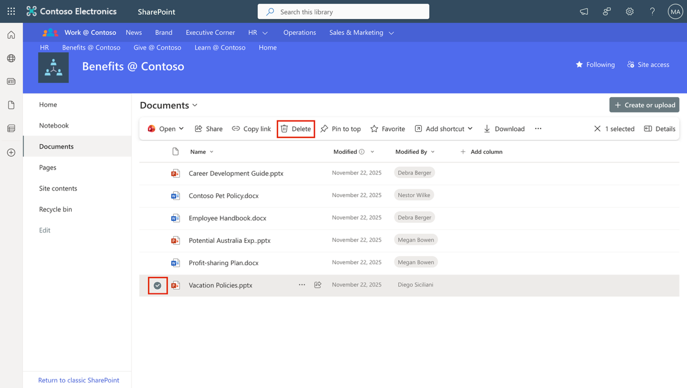

7.  Na caixa de diálogo **Delete?,** selecione **Delete**.

> 

8.  Na barra lateral esquerda, selecione **Recycle bin**.

> 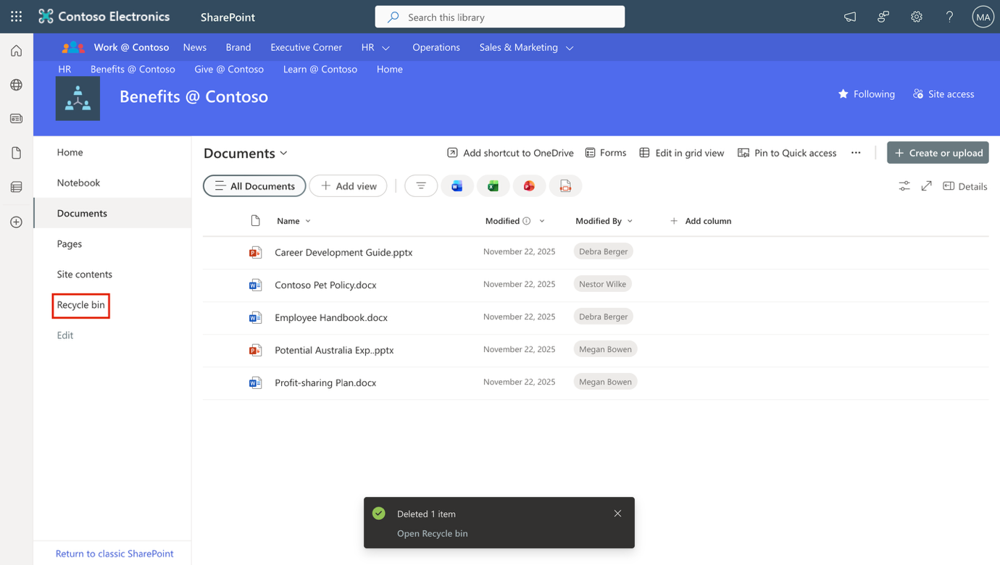

9.  Na página **Recycle bin**, clique com o botão direito do mouse em **Vacation Policies.pptx** e selecione **Restore**.

> 

10. Na barra lateral esquerda, selecione **Documents** e observe que o arquivo foi restaurado.

> 

Você recuperou com sucesso um documento excluído de um site do SharePoint.
