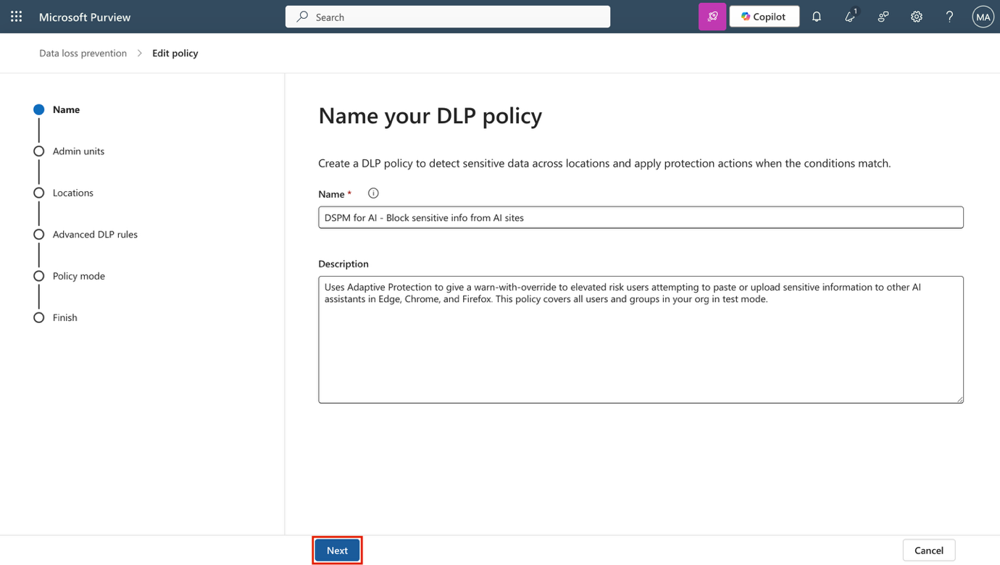

**Laboratório 14 – Usando o DSPM para AI para proteger seus agentes e aplicativos de AI**

Você é Patti Fernandez, Administradora de Segurança da Informação da Contoso Ltd. À medida que ferramentas de AI como o Microsoft Copilot se tornam cada vez mais integradas aos fluxos de trabalho diários, sua equipe foi solicitada a avaliar e aprimorar as proteções em torno de dados confidenciais. Neste laboratório, você explorará como o Microsoft Purview DSPM para AI pode ajudar a proteger interações de dados com ferramentas de AI por meio da aplicação de políticas, detecção de riscos e avaliações de exposição.

**Tarefas**:

- Usar o DSPM para AI para criar uma política de DLP para sites de AI generativa.

- Criar uma política de risco interno para detectar interações de AI que apresentam risco.

- Detectar comportamentos antiéticos em aplicativos de AI.

- Executar uma avaliação de dados para detectar conteúdo não rotulado.

**Tarefa 1 – Usar o DSPM para AI para criar uma política de DLP para sites de AI generativa**

Para reduzir o risco de perda de dados por meio de assistentes de AI, comece criando uma política de DLP usando a recomendação Fortalecer a segurança dos seus dados. Essa política usa a Proteção Adaptativa para restringir a colagem ou o upload de dados confidenciais em ferramentas de AI como ChatGPT e Copilot no Edge, Chrome e Firefox.

1.  Faça login na VM como administrador.

2.  No **Microsoft Edge**, navegue até https://purview.microsoft.com and sign in as **Patti Fernandez**, Pattif@TenantName.

3.  No Microsoft Purview, navegue até DSPM para AI selecionando **Solutions** \> **DSPM for AI** \> **Recommendations**

> 

4.  Selecione a recomendação **Fortify your data security**.

> 

5.  Na página de painel **Data security for AI**, revise o resumo e selecione **Create policies**. Isso cria uma política de DLP pré-configurada direcionada a sites de AI generativa.

> 

6.  Você verá a política “Block elevated risk users from pasting or uploading sensitive info on AI sites criada”. Como as outras duas políticas exigem capacidade pay-as-you-go, elas não serão criadas neste locatário. Após a criação da política, selecione **Policy details**.

> 

7.  Na seção **Policy details**, selecione **Edit policy in solution** para abrir a solução **Data Loss Prevention** no Microsoft Purview.

> 

8.  Selecione **Next** até chegar à página **Choose where to apply the policy**.

> 

9.  Confirme que a política está com escopo em **Devices**. Selecione **Next**.

10. Na página **Customize advanced DLP rules**, selecione o ícone de lápis ao lado de **Block with override for elevated risk users** para visualizar a regra.

11. Revise a configuração da regra criada pelo DSPM para AI:

    - Em **Conditions**, observe os **sensitive info types** incluídos e que a regra utiliza **Adaptive Protection** com base em risco elevado.

> 

- Em **Actions**, para as atividades Upload e Paste, selecione **Edit** ao lado de **Sensitive service domain group restriction(s)**.

> 

- Na configuração do grupo de domínios de serviço, confirme que **Generative AI Websites** está definido como **Block with override**.

> 

- Selecione **Close** para fechar o painel.

> 

1.  Selecione **Cancel** para sair do editor de regras sem fazer alterações.

2.  De volta à página **Customize advanced DLP rules**, selecione **Next**.

3.  Na página **Policy mode**, selecione **Turn the policy on if it's not edited within fifteen days of simulation** e, em seguida, selecione **Next**.

4.  Na página **Review and finish**, selecione **Submit** e depois **Done**.

Você criou uma política que bloqueia usuários de alto risco de compartilhar dados confidenciais em sites de AI generativa e confirmou a configuração da política definida pelo DSPM para AI.

Você pode revisar da mesma forma as demais políticas selecionando **Solutions \> DSPM para AI \> Recommendations**. Se você tiver a capacidade pay-as-you-go em seu próprio locatário ou ID de usuário, poderá continuar com os próximos exercícios.

**Tarefa 2 – Criar uma política de risco interno para detectar interações de AI em risco**

Em seguida, você criará uma política que ajuda a detectar comportamentos de prompt arriscados no Copilot.

1.  No Microsoft Purview, navegue até **DSPM for AI** selecionando **Solutions \> DSPM para AI \> Recommendations**.

2.  Selecione a recomendação **Detect risky interactions in AI apps (preview)**.

3.  Na página de painel **Detect risky interactions in AI apps (preview)**, revise o resumo e selecione **Create policy**.

4.  Após a criação da política, selecione **View policy**.

5.  Na seção **Policy details**, selecione **Edit policy in solution** para abrir a área **Insider Risk Management** do Microsoft Purview.

6.  Na página **Policies**, localize e selecione a política **DSPM for AI - Detect risky AI usage**

7.  No painel, selecione **Edit policy** para revisar a configuração completa da política.

8.  Na página **Choose a policy template**, observe que a política utiliza o modelo **Risky AI usage (preview)**.

9.  Selecione **Next** até chegar à página **Choose triggering event for this policy**. Confirme que o evento de disparo é **User account deleted from Microsoft Entra ID**, o que sinaliza riscos potenciais relacionados a desligamento que podem anteceder ou seguir atividades arriscadas com AI.

10. Selecione **Next**.

11. Na página **Indicators**, expanda as categorias de indicadores para revisar quais sinais estão selecionados:

    - Navegou em sites de AI generativa

    - Recebeu uma resposta sensível do Copilot

    - Inseriu um prompt arriscado no Copilot

12. Selecione **Next** até chegar à página **Review and finish** e, em seguida, selecione **Cancel** para sair do editor sem fazer alterações.

Você criou uma política que detecta interações de AI arriscadas, incluindo solicitações e respostas, para ajudar a identificar sinais precoces de comportamento arriscado do usuário.

**Tarefa 3 – Detectar comportamentos antiéticos em aplicativos de AI**

Nesta tarefa, você criará uma política no DSPM para que a AI detecte comportamentos antiéticos ou inadequados no Microsoft 365 Copilot e em outros aplicativos de AI.

1.  No Microsoft Purview, acesse **DSPM for AI** selecionando **Solutions \> DSPM para AI \> Recommendations**.

2.  Selecione a recomendação **Detect unethical behavior in AI apps**.

3.  No painel, revise a visão geral do que essa política irá configurar:

    - O nome padrão da política é **DSPM for AI – Unethical behavior in AI apps.**

    - A política detecta informações confidenciais ou inadequadas em prompts e respostas no Microsoft 365 Copilot e em outros agentes de AI.

    - Ela se aplica a todos os usuários e grupos da sua organização.

4.  Selecione **Create policy** para criar a política de Communication Compliance.

5.  Na página **Policy successfully created**, selecione **X** para fechar o painel.

6.  A página **Recommendations** será atualizada, e a recomendação **Detect unethical behavior in AI apps** será movida para **Completed**.

7.  No menu de navegação à esquerda, selecione **Policies**.

8.  Selecione a política recém-criada **DSPM for AI – Unethical behavior in AI apps** para revisar sua configuração e status.

9.  Na página **DSPM for AI - Unethical behavior in AI apps**, selecione **X** para fechar o painel.

Você criou uma política que detecta atividades antiéticas em aplicativos de AI, ajudando a Contoso a manter o uso responsável do Copilot.

**Tarefa 4 – Criar uma avaliação de risco de dados para detectar conteúdo sem rótulos**

Para compreender possíveis lacunas na cobertura de rotulagem, você executará uma avaliação de risco de dados para identificar arquivos sem sensitivity labels que possam ser acessados pelo Copilot.

1.  Em **DSPM for AI**, selecione a recomendação **Protect sensitive data referenced in Copilot and agent responses**.

2.  No painel **Protect sensitive data referenced in Copilot and agent responses**, revise o resumo e selecione **Go to assessments**.

3.  Na página **Data risk assessments**, selecione **Create custom assessment**.

4.  Na página **Basic details**, insira:

    - **Name**: Unlabeled File Exposure Assessment

    - **Description**: Identifies files without sensitivity labels that may be exposed in Microsoft 365 Copilot responses and provides recommendations to reduce oversharing risks.

5.  Selecione **Next**.

6.  Na página **Add users**, selecione **All** e, em seguida, selecione **Next**.

7.  Na página **Add data sources to assess**, mantenha a localização padrão **SharePoint** selecionada e selecione **Next**.

8.  Na página **Review and run the data assessment scan**, selecione **Save and run**.

9.  Na página **Data assessment successfully created**, selecione **Done**.

Agora você utilizou o Microsoft Purview DSPM para AI para detectar riscos relacionados à AI, aplicar políticas e avaliar a exposição de dados confidenciais, ajudando sua organização a usar AI de forma segura.
