**Laboratório 2 – Gerenciamento de Sensitive Information Types​**

**Introdução**

A Contoso Ltd. anteriormente enfrentava problemas com colaboradores que, acidentalmente, enviavam informações pessoais de clientes ao trabalhar em tíquetes de suporte na solução de chamados.

Para educar os usuários no futuro, é necessário um sensitive information type personalizado para identificar IDs de funcionários em e-mails e documentos, os quais consistem em três caracteres em letras maiúsculas e seis números, utilizando sensitive information types. Para reduzir a taxa de falsos positivos, serão usadas as palavras-chave "Employee" e "IDs".

**Objetivos**

- Criar um **sensitive information type personalizado** usando expressões regulares e listas de palavras-chave.

- Configurar e definir um **sensitive information type baseado em EDM** usando dados estruturados de funcionários.

- Aplicar hash e carregar os dados dos funcionários no **agente de carregamento EDM** para classificação.

- Criar um **sensitive information type baseado em dicionário de palavras-chave** para identificar termos confidenciais relacionados à saúde.

- Testar e validar sensitive information types personalizados quanto à precisão antes de aplicá-los em políticas.

**Exercício 1 – Criando sensitive information types personalizados**

Neste exercício, você usará o módulo do **Security and Compliance Center PowerShell** para criar um sensitive information type personalizado que reconheça o padrão de IDs de funcionários próximos às palavras-chave "Employee" e "ID".

1.  Abra uma janela de navegação privada no navegador Edge, digite o seguinte URL na barra de endereços para abrir o portal do Microssoft Purview: https://purview.microsoft.com, em seguida, faça login como **Patti Fernandez** usando o nome de usuário **PattiF@TenantName** e a senha de usuário fornecida na guia recursos.

> 
>
> 

2.  Se a caixa de diálogo **Welcome to the new Microsoft Purview portal!** for exibida, clique no botão **Get Started.**

> 

3.  No menu de navegação à esquerda, selecione **Solutions** \> **Data Loss Prevention**.

> 
>
> **Observação**: Caso você não veja **Data Loss Prevention** na lista Solutions, aguarde alguns minutos e recarregue a página. Se ainda assim Data Loss Prevention não aparecer na lista Solutions, faça login utilizando uma janela de navegação Regular (Normal).

4.  Selecione **Classifiers** no painel esquerdo. Em seguida, selecione **Sensitive info types** no painel de subnavegação. Selecione **+Create sensitive info type** para abrir o assistente de criação de um novo sensitive information type.

> 

5.  Na página **Name your sensitive info type**, insira as seguintes informações:

    - **Name**: Contoso Employee IDs

    - **Description**: Pattern for Contoso employee IDs

6.  Selecione **Next**.

> 

7.  Na página **Define patterns for this sensitive info type**, selecione **Create pattern**.

8.  No painel **New pattern** que aparece no lado direito, selecione **Add primary element** e, em seguida, selecione **Regular expression**.

9.  No novo painel à direita **Add a regular expression**, insira as seguintes informações:

    - **ID**: Contoso IDs

    - **Regular expression**: \s\\A-Z\\{3}\\0-9\\{6}\s

    - Selecione **String match**

10. Selecione **Done**.

11. No painel New pattern, reduza o valor de **Character proximity** para ***100* characters**.

> 
>
> 

12. Navegue até o cabeçalho **Supporting elements**, clique no menu suspenso **+ Add supporting elements or group of elements** e selecione **Keyword list**.

> 

13. No painel **Add a keyword list**, insira as seguintes informações:

    - **ID**: Employee ID keywords

    - **Case insensitive**:Employee ID

> 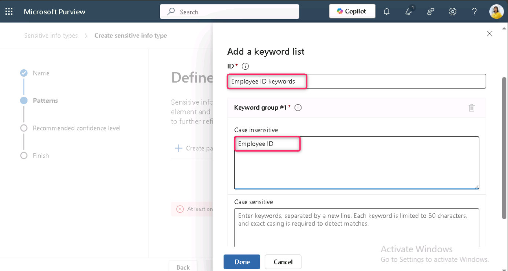

14. Role para baixo e selecione o botão de opção ao lado de **Word match**. Em seguida, clique no botão **Done**. 

> 

15. Agora, clique no botão **Create**.

> 

16. De volta à página **Define patterns for this sensitive info type**, selecione **Next**.

> 

17. Na página **Choose the recommended confidence level to show in compliance policies**, use o valor padrão e selecione o botão **Next**.

> 

18. Na página **Review settings and finish**, revise as configurações e selecione **Create**. Quando a criação for concluída com sucesso, selecione **Done**.

> 
>
> 

19. Deixe a janela do navegador aberta.

Você criou com sucesso um novo sensitive information type para identificar IDs de funcionários no padrão de três caracteres em letras maiúsculas, seis números e as palavras-chave "Employee" ou "IDs" dentro de um intervalo de 100 caracteres.

**Exercício 2 – Criação de um tipo de informação classificada com base em EDM**

Como um padrão de pesquisa adicional, você criará uma classificação baseada em EDM com um esquema de banco de dados de dados de funcionários. O arquivo de origem do banco de dados será formatado com os seguintes campos de dados dos funcionários: Name, Birthdate, StreetAddress e EmployeeID.

1.  Clique em Solutions e, em seguida, selecione **Data Loss Prevention**.

> 

2.  Clique em **Classifiers** e, em seguida, selecione **EDM classifiers**. Na página EDM classifiers, clique no botão de alternância ao lado de **New EDM experience** para desativá-lo (**Off**).

> 

3.  Em seguida, clique em **Create EDM schema**.

> 

4.  No campo **Name**, insira employeedb.

5.  No campo **Description**, insira Employee Database schema. Desmarque a opção **Ignore delimiters and punctuation for all schema fields**.

> 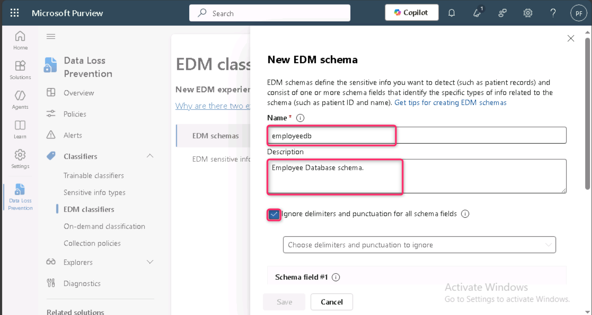
>
> 

6.  No primeiro campo Schema field name, insira Name e marque a caixa **Field is searchable**.

> 

7.  Clique no menu suspenso **Choose delimiters and punctuation to ignore** e selecione **Hyphen**, **Period**, **Space**, **Open parenthesis** e **Close parenthesis**.

> 

8.  Selecione **+ Add schema data field** na parte inferior da página.

> 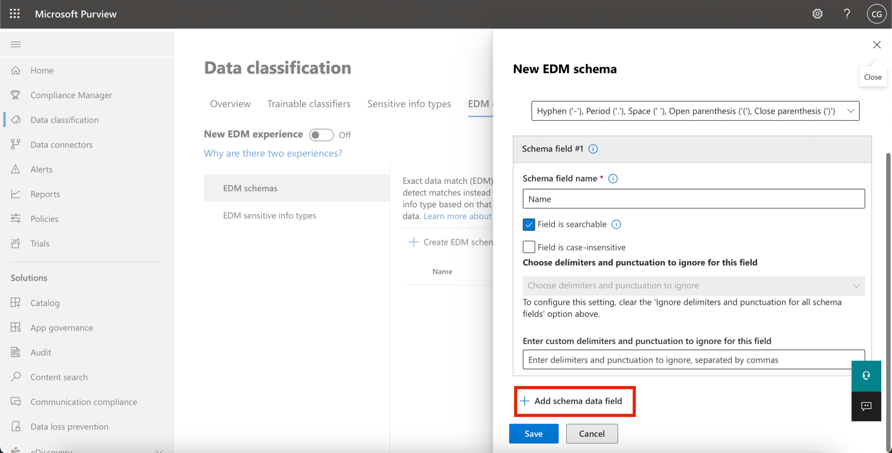

9.  No campo **Schema field name**, abaixo de **Schema field \#2**, insira Birthdate.

10. Selecione **+ Add schema data field** na parte inferior novamente.

11. No campo **Schema field name**, abaixo de **Schema field \#3**, insira StreetAddress.

12. Selecione **+ Add schema data field** na parte inferior uma última vez.

13. No campo **Schema field name**, abaixo de **Schema field \#4**, insira EmployeeID.

14. Selecione **Field is searchable**.

15. Selecione **Save**.

> 

16. Selecione **EDM sensitive info types** no painel esquerdo e selecione **+ Create EDM sensitive info type** para abrir o assistente do pacote de regras EDM.

> 

17. Na página **Define data store schema**, selecione **Choose an existing EDM schema**.

> 

18. Selecione **employeedb** e, em seguida, selecione **Add**.

> 

19. Revise o esquema do repositório de dados e selecione **Next**.

> 

20. Na página **Define patterns for this EDM sensitive info type**, selecione **+ Create pattern**.

> 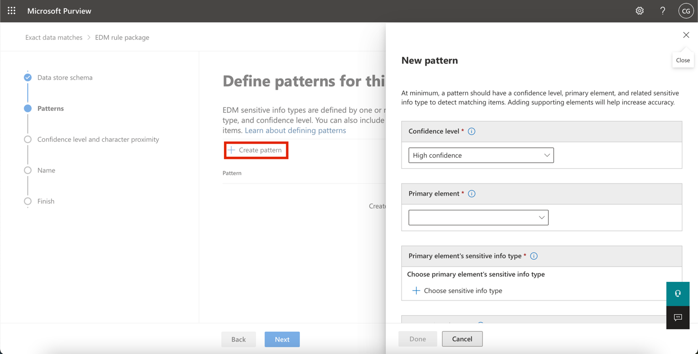

21. No painel **New pattern** no lado direito, no campo **Primary element**, selecione ***EmployeeID***.

22. Below **Primary element's sensitive info type**, select **Choose sensitive info type**.

> 

23. Na barra de **pesquisa**, insira Contoso e pressione a tecla Enter.

24. Selecione **Contoso Employee IDs** e selecione **Done**.

25. Selecione **Done**.

> 

26. Selecione **Next** na tela *Define patterns for this EDM sensitive info type* screen.

> 

27. Na página **Choose the recommended confidence level and character proximity**, mantenha o valor padrão e selecione **Next**.

> 

28. Na página **Name and describe your EDM sensitive info type**, insira Contoso Employee EDM no campo Name.

29. No campo **Description for admins**, insira EDM-based sensitive information type for employee personal information. Em seguida, selecione **Next.**

> 

30. Revise as configurações e selecione **Submit**.

> 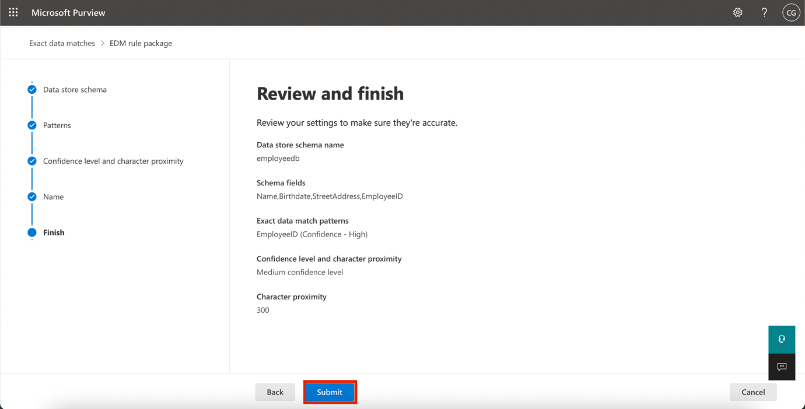

31. Na página **Your EDM sensitive info type was created**, selecione **Done**.

> 

32. Deixe o navegador aberto com o portal do Microsoft Purview.

Você criou com sucesso um novo sensitive information type com classificação, baseado em EDM, para identificar dados de funcionários a partir de uma fonte de arquivo de banco de dados.

**Exercício 3 – Criação de fonte de dados de classificação baseada em EDM**

Para associar a classificação baseada em EDM a um banco de dados que contém dados confidenciais, é necessário, em seguida, fazer o hash e carregar os dados reais para o tipo de informação confidencial por meio da ferramenta EDM Upload Agent.

1.  No navegador **Microsoft Edge**, navegue até https://go.microsoft.com/fwlink/?linkid=2088639 para baixar o EDM download agent.

2.  Clique no link **Open file** para acessar **EdmUploadAgent.msi**.

> 

3.  Na caixa de diálogo **Welcome to the Microsoft Exact Data Match Upload Agent Setup Wizard**, clique no botão **Next**.

> 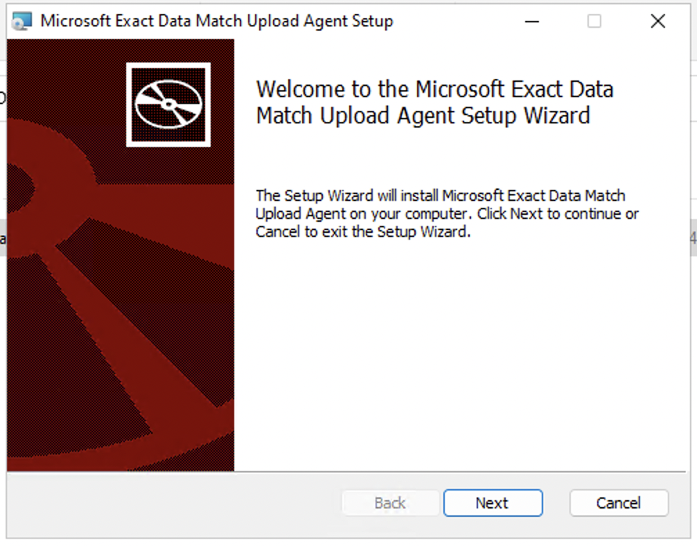

4.  No assistente **Microsoft Exact Data Match Upload Agent Setup**, selecione **Next**.

    - Selecione **I accept the terms in the License Agreement** e selecione **Next**.

    - Não altere o caminho padrão de **Destination Folder** e selecione **Next**.

    - Selecione **Install** para executar a instalação.

    - Quando a janela **User Account Control** for exibida, selecione **Yes**.

    - Se for solicitado login, faça login usando a conta da **Patti**.

    - Quando a instalação for concluída, selecione **Finish.**

5.  Agora, clique com o botão direito do mouse no ícone do Windows, navegue e clique em **Run**. Na caixa de diálogo **Run**, digite notepad e, em seguida, clique no botão **OK**.

> 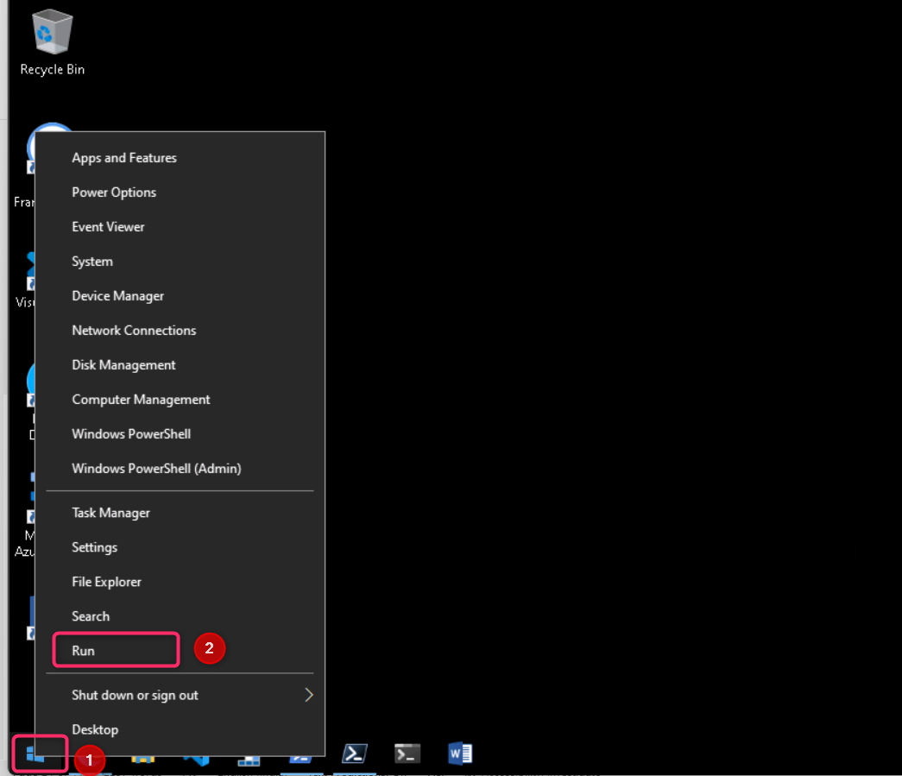
>
> 

6.  Digite o seguinte texto no notepad:

> Name,Birthdate,StreetAddress,EmployeeID
>
> Patti Fernandez,01.06.1980,1Main Street,CSO123456
>
> Christie Cline,31.01.1985,2Secondary Street,CSO654321
>
> 

7.  Selecione File e Save As: EmployeeData.csv

8.  Selecione o menu suspenso em **Save as type:** e escolha **All Files (*.*)**.

9.  No campo **Encoding**, verifique se **UTF-8** está selecionado e, em seguida, clique no botão **Save**.

> 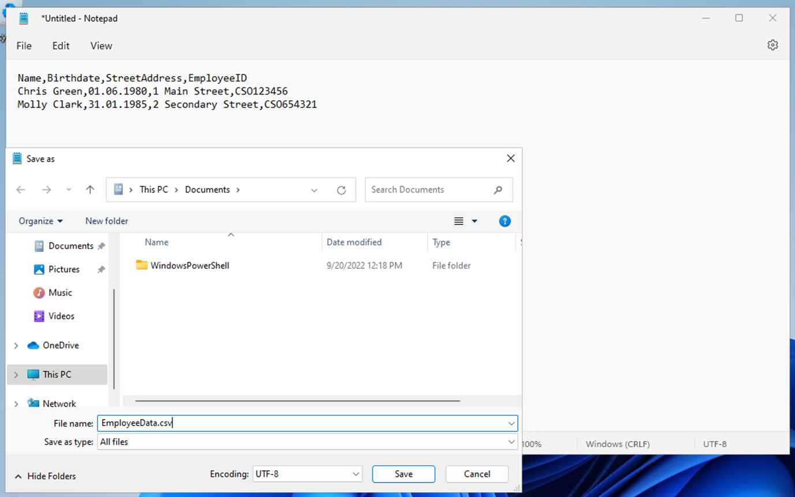

10. Feche a janela do Notepad.

11. Clique com o botão direito no ícone do **Windows** na barra de tarefas e selecione **Windows PowerShell (Admin)** para executá-lo como administrador.

> 

12. Na caixa de diálogo **User Account Control**, clique no botão **Yes**.

> 

13. Navegue até o diretório do EDM Upload Agent:

> cd "C:\Program Files\Microsoft\EdmUploadAgent"
>
> 

14. Autorize com sua conta para carregar o banco de dados para seu locatário executando o seguinte cmdlet:

> .\EdmUploadAgent.exe /Authorize
>
> 

15. Quando a janela **Pick an account** for exibida, faça login como **Patti Fernandez**, usando o nome de usuário **PattiF@TenantName** e a senha de usuário fornecida na guia Resources. (Ou a nova senha que você redefiniu.)

> 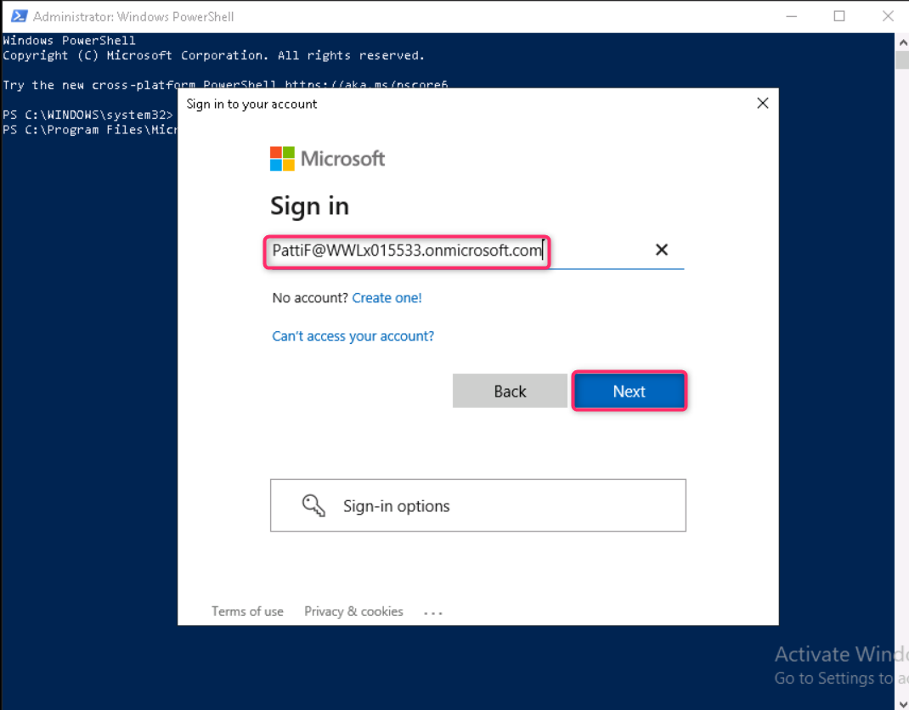
>
> 

16. Baixe a definição do esquema do banco de dados do sensitive information type com classificação baseada em EDM executando o seguinte script no PowerShell:

> .\EdmUploadAgent.exe /SaveSchema /DataStoreName employeedb /OutputDir "C:\Users\Admin\Documents\\
>
> **Observação**: se o último comando falhar, é possível que seja necessário mais tempo até que a associação ao grupo **EDM_DataUploaders** seja aplicada. Pode levar até uma hora para que seja possível baixar o arquivo de esquema.\
> Se falhar, prossiga para a próxima tarefa e retorne a esta etapa posteriormente. Como alternativa, verifique o caminho da pasta Documents na sua VM.
>
> 

17. Hash o arquivo do banco de dados e transfira-o para o sensitive information type com classificação baseada em EDM, executando o seguinte script no PowerShell:

.\EdmUploadAgent.exe /UploadData /DataStoreName employeedb /DataFile C:\Users\Admin\Documents\EmployeeData.csv /HashLocation "C:\Users\Admin\Documents\\ /Schema "C:\Users\Admin\Documents\employeedb.xml"

\

\*\*Note:\*\* If you get the following errors

Error Type: System.IO.FileNotFoundException

Error Message: Unable to find the specified file.

\*\*Check the path where you saved the file EmployeeData.csv\*\*

\

19. Verifique o progresso de carregamento até que o status mude para concluído e, em seguida, execute o seguinte comando do PowerShell:

> .\EdmUploadAgent.exe /GetSession /DataStoreName employeedb
>
> 

Você criou um hash e carregou com sucesso um arquivo de banco de dados para um sensitive information type de classificação baseado em EDM.

**Exercício 4 – Criando um dicionário de palavras-chave**

Várias violações de vazamento de informações pessoais ocorreram quando os usuários enviaram e-mails após colegas terem comunicado licenças médicas. Quando isso aconteceu, o motivo da doença ou enfermidade foi divulgado. Não queremos que isso aconteça.

1.  No **Microsoft Edge**, abra uma **nova janela de navegação privada**, navegue até https://purview.microsoft.com e faça login como **Patti Fernandez** usando o nome de usuário **PattiF@TenantName** e a senha de usuário fornecida na guia Resources.

2.  Na navegação à esquerda, selecione **Solutions** \> **Data Loss Prevention**.

> 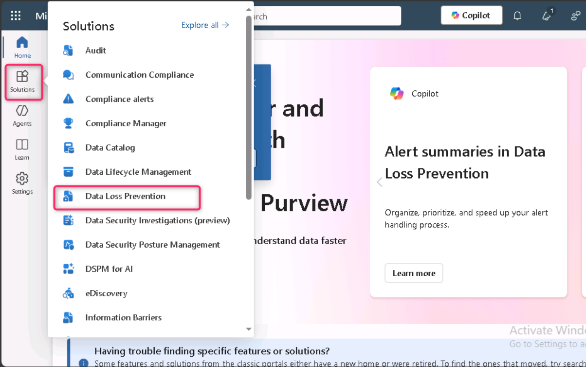

3.  Selecione **Classifiers** no painel esquerdo. Selecione **Sensitive info types** no painel de subnavegação. Selecione **+Create sensitive info type** para abrir o assistente de criação de um novo sensitive information type.

> 

4.  Na página **Name your sensitive info type**, insira as seguintes informações:

    - Name: Contoso Diseases List

    - Description: List of possible diseases of employees.

> 

5.  Selecione **Next**.

6.  Na página **Define patterns for this sensitive info type**, selecione **+ Create pattern**.

> 

7.  Selecione o campo de menu suspenso abaixo de **Primary element** e selecione **Keyword dictionary**.

> 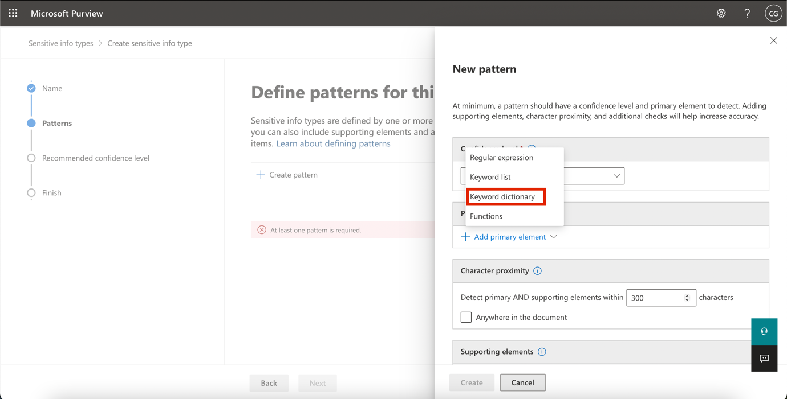

8.  Na página **Add a keyword dictionary**, insira o nome Diseases Dictionary\*.

9.  Na área **Keywords**, insira as seguintes palavras-chave, cada uma em uma linha separada:

> flu
>
> influenza
>
> cold
>
> bronchitis
>
> otitis
>
> 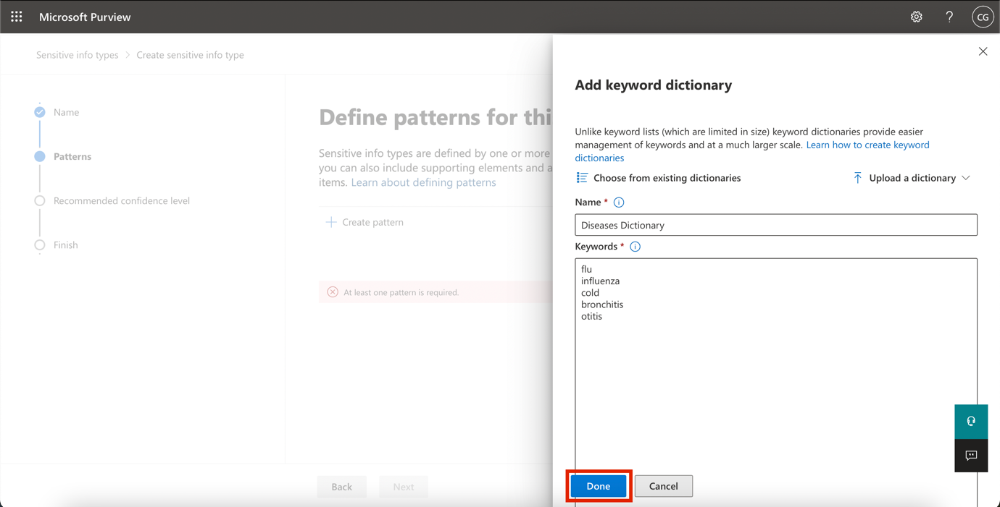

10. Selecione **Done**.

11. Abaixo de **Supporting elements**, selecione o menu suspenso **+ Add supporting elements or group of elements** e escolha **Keyword list** para adicionar suporte adicional ao keyword dictionary.

> 

12. Na página **Add a keyword list**, insira Employee no campo **ID**. No campo **Case insensitive**, insira as seguintes palavras-chave, cada uma em uma linha separada, e depois clique no botão **Done**:

> Employee ID
>
> leave
>
> reason
>
> 

13. Na página **New pattern**, revise a configuração e selecione **Create**.

> 

14. Na página **Define patterns for this sensitive info type**, selecione **Next**.

> 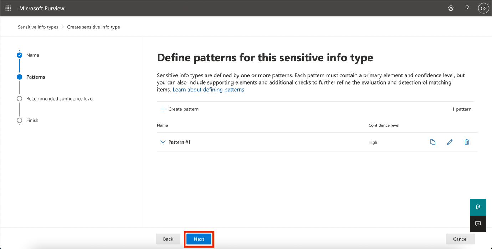

15. Na página **Choose the recommended confidence level to show in compliance policies**, mantenha o valor padrão e selecione **Next**.

> 

16. Na página **Review settings and finish**, revise suas configurações e selecione **Create**. Quando o processo for concluído, selecione **Done**.

> 

17. Deixe a janela do navegador no portal Microsoft Purview aberta.

Você criou com sucesso um novo sensitive information type baseado em um dicionário de palavras-chave e adicionou mais palavras-chave para diminuir a taxa de falsos positivos. Continue com a próxima tarefa.

**Exercício 5 – Trabalhando com sensitive information types personalizados**

Sensitive information types personalizados devem sempre ser testados antes de serem usados em políticas; caso contrário, pode ocorrer perda ou vazamento de dados devido a um padrão de pesquisa personalizado que não esteja funcionando corretamente.

1.  Clique com o botão direito no ícone do Windows, navegue e clique em **Run**. Na caixa de diálogo **Run**, digite +++notepad+++ e, em seguida, clique no botão **OK**.

> 
>
> 

2.  Insira o seguinte texto na janela do Notepad:

> Employee Patti Fernandez with Employee ID ABC123456 is on leave because of the flu/influenza

3.  Selecione **File** and Save As SickTestData e selecione **Save**.

4.  Feche a janela do Notepad.

5.  No **Microsoft Edge**, a guia do **portal do** **Microsoft Purview** ainda deve estar aberta. Se estiver, selecione-a e prossiga para a próxima etapa. Caso tenha sido fechada, abra uma nova guia e navegue até https://purview.microsoft.com. Faça login como **Patti Fernandez**, usando o nome de usuário **PattiF@TenantName** e a senha de usuário fornecida na guia Resources.

6.  No painel de navegação à esquerda, selecione **Solutions** \> **Data Loss Prevention** e, em seguida, selecione **Sensitive info types** em **Classifiers**. Na caixa **Search** no canto superior direito, digite Contoso e pressione **Enter**. Clique em **Contoso Employee IDs** para abrir o painel do lado direito.

7.  Selecione **Test** no painel do lado direito.

> 

8.  Na página **Upload file to test**, selecione **Upload file**.

> 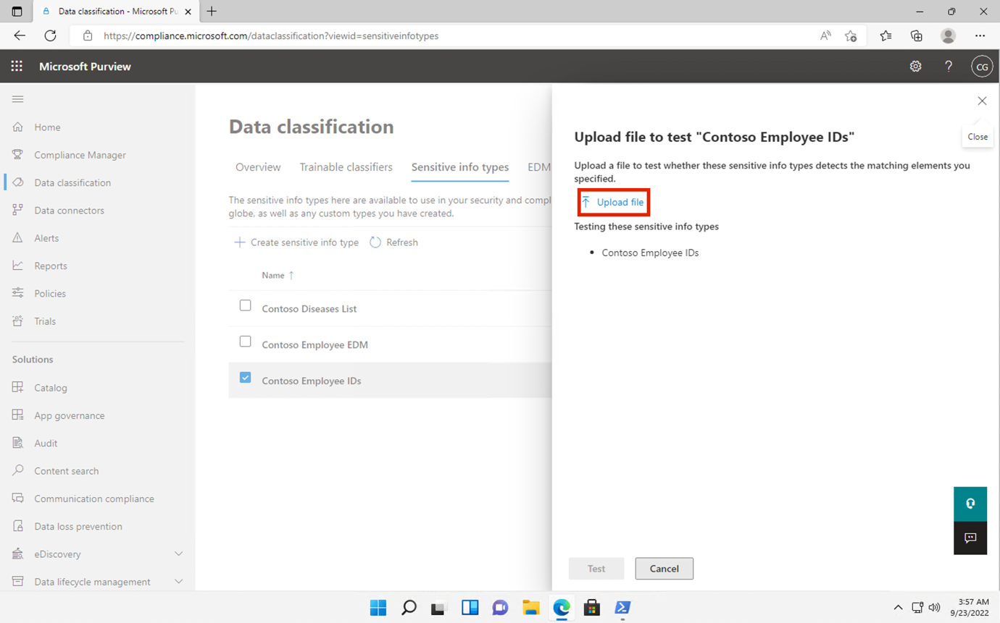

9.  Selecione **Documents** no painel esquerdo, selecione o arquivo com o nome **SickTestData** e selecione **Open**.

> 

10. Selecione **Test** para iniciar a análise.

> 

11. Na página **Match results**, revise a correspondência encontrada.

> 

12. Selecione **Finish** e feche a página de teste clicando no botão **X**.

> 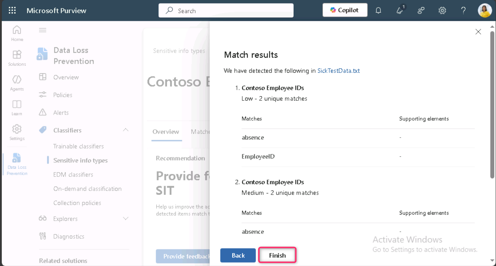

13. De volta à página **Data classification**, selecione o Sensitive Information Type com o nome **Contoso Diseases List**.

14. No painel do lado direito, selecione **Test**.

> 

15. Na página **Upload file to test**, selecione **Upload file**.

> 

16. Selecione **Documents** no painel esquerdo, selecione o arquivo com o nome *SickTestData* e selecione **Open**.

17. Selecione **Test** para iniciar a análise.

> 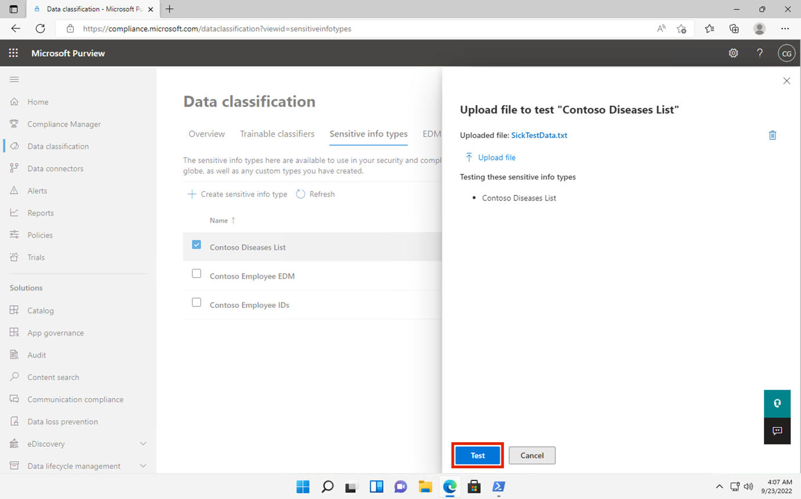

18. Na página **Match results**, revise a correspondência encontrada. Quando concluir a revisão, selecione **Finish**.

> 

**Resumo:**

Neste laboratório, você aprendeu como criar e testar sensitive information types personalizados (SITs) no Microsoft Purview, utilizando expressões regulares, dicionários de palavras-chave e técnicas de Exact Data Match (EDM) para aprimorar as capacidades de prevenção contra perda de dados.
