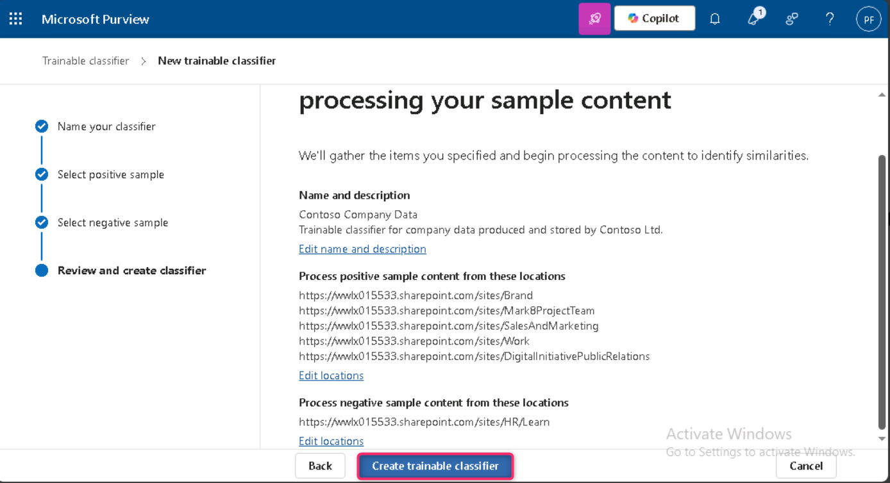

**Laboratório 3 – Gerenciando Trainable Classifiers**

**Introdução**

O locatário da Contoso Ltd. contém uma coleção de sites do SharePoint com o nome Sales and Marketing, que será utilizada futuramente para armazenar diversos documentos e relatórios relacionados a dados financeiros. Devido à natureza desses documentos, é necessário criar um trainable classifier para reconhecer e rotular esses arquivos. Para esse propósito, neste laboratório você ativará trainable classifiers personalizados e criará um novo classificador treinável.

**Objetivos**

- Criar um trainable classifier para identificar e categorizar dados típicos armazenados em sites específicos do SharePoint.

**Exercício 1 – Criando um trainable classifier**

Nesta tarefa, a Patti criará um novo trainable classifier e selecionará diferentes sites do SharePoint para identificar dados típicos criados e armazenados pela Contoso Ltd.

1.  No **Microsoft Edge**, abra uma nova **janela de navegação privada**, acesse **+++[<u>https://purview.microsoft.com+++</u>](https://purview.microsoft.com+++)** e faça login como **Patti Fernandez** usando o nome de usuário [**<u>PattiF@WWLxXXXXXX.onmicrosoft.com</u>**](mailto:PattiF@WWLxXXXXXX.onmicrosoft.com) e a senha de usuário fornecida na guia Resources.

2.  Na navegação à esquerda, selecione **Solutions** \> **Data Loss Prevention**.

> 

3.  Expanda **Classifiers** no painel esquerdo. Selecione **Trainable Classifiers** no painel de subnavegação. Selecione **+ Create trainable classifier** para criar um novo classificador.

> 

4.  Insira as seguintes informações:

5.  Name: **+++Contoso Company Data+++**

6.  Description: **+++Trainable classifier for company data produced and stored by Contoso Ltd.+++**

7.  Selecione **Next**.

> 

8.  Selecione **Choose sites** para abrir o painel do lado direito.

> 

9.  Selecione os seguintes sites do SharePoint e, em seguida, selecione **Add**.

    - Brand

    - Digital Initiative Public Relations

    - Work

    - Sales and Marketing

    - Mark 8 Project Team

> 

10. Aguarde até que os sites selecionados sejam exibidos na lista e selecione **Next**.

> 

11. Na página **Source of the negative sample content**, clique em **+ Choose sites**.

> 

12. No painel **Add SharePoint sites**, navegue e marque a caixa de seleção ao lado de **Learn** e, em seguida, clique no botão **Add**.

> 

13. Clique no botão **Next**.

> 

14. Revise as configurações e selecione **Create trainable classifier**.

> 

15. Na página **Your trainable classifier is being trained**, clique no botão **Done**.

> 

Os documentos e arquivos nos sites do SharePoint selecionados agora estão sendo analisados, o que pode levar até 24 horas.

**Resumo:**

Neste laboratório, você criou um trainable classifier personalizado no Microsoft Purview chamado *Contoso Company Data,* selecionando sites relevantes do SharePoint como fontes de conteúdo positivo e negativo. Esse classificador analisará documentos para identificar dados específicos da empresa, sendo que o processo de treinamento pode levar até 24 horas.
