**Laboratório 4 – Criar e gerenciar rótulos de confidencialidade**

**Introdução**

Patti Fernandez, administradora de segurança de informações da Contoso Ltd., está implementando uma estrutura moderna de rótulos de confidencialidade para fortalecer a proteção de dados em toda a organização. Patti cria e publica grupos de rótulos de confidencialidade e rótulos para classificar e proteger o conteúdo, incluindo criptografia, rotulagem automática e Double Key Encryption (DKE). Patti também integrará o Microsoft Purview ao Microsoft Defender for Cloud Apps para estender os controles de proteção de dados aos arquivos armazenados em locais na nuvem.

**Objetivos:**

- Habilitar suporte para rótulos de confidencialidade

- Criar um grupo de rótulos

- Criar um rótulo secundário

- Publicar rótulos

- Configurar a rotulagem automática

- Criar e publicar um rótulo DKE para conteúdo confidencial

- Habilitar a integração do Microsoft Purview no Defender for Cloud Apps

- Criar uma política de arquivos para rotular arquivos compartilhados externamente

**Exercício 1 – Habilitar suporte para rótulos de confidencialidade**

Nesta tarefa, você habilitará a coautoria para rótulos de confidencialidade, o que também habilita rótulos de confidencialidade para arquivos no SharePoint e no OneDrive.

1.  Você ainda deve estar conectado à VM usando a conta de **administrador**.

2.  Abra o **Microsoft Edge**, navegue até https://purview.microsoft.com e faça login no Microsoft Purview como Patti Fernandes.

3.  Na navegação à esquerda, selecione **Settings \> Information Protection**.

> 

4.  Na página **Information Protection settings**, certifique-se de estar na guia **Co-authoring for files with sensitivity labels**.

5.  Selecione a caixa de seleção **Turn on co-authoring for files with sensitivity labels**.

> 

6.  Selecione **Apply** na parte inferior da tela.

> 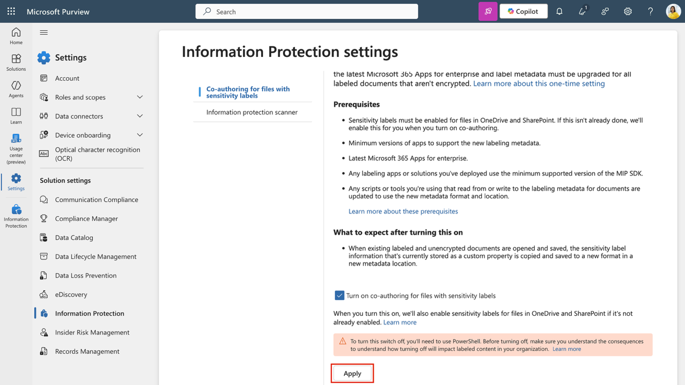

Você habilitou com sucesso o suporte a rótulos de confidencialidade para arquivos no SharePoint e OneDrive.

**Exercício 2 - Trabalhando com rótulos de confidencialidade**

**Tarefa 1 – Criar um grupo de rótulos**

Nesta tarefa, você criará um grupo de rótulos para organizar rótulos de confidencialidade internos. Os grupos de rótulos funcionam como recipientes para rótulos relacionados, como classificações de departamento ou unidade de negócios.

1.  No **Microsoft Edge**, navegue até https://purview.microsoft.com.

2.  No portal Microsoft Purview, selecione **Solutions** na barra lateral esquerda e, em seguida, selecione **Information Protection**.

> 

3.  Na página **Microsoft Information Protection**, na barra lateral esquerda, selecione **Sensitivity labels**.

> 

4.  Na página **Sensitivity labels**, selecione **+ Create \> Label group**.

> 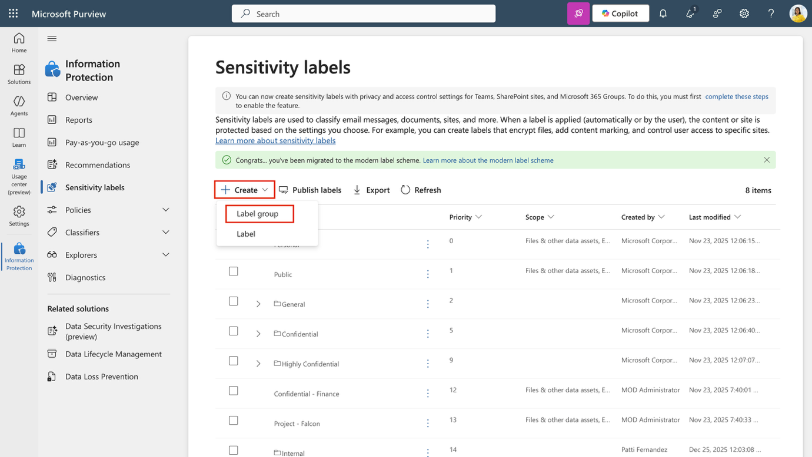

5.  A configuração **New label group** será iniciada. Em **Provide basic details for this label group**, insira:

    - **Name**: Internal

    - **Display name**: Internal

    - **Description for users**: Internal sensitivity label.

    - **Description for admins**: Internal sensitivity label group for Contoso.

6.  Selecione **Next**.

> 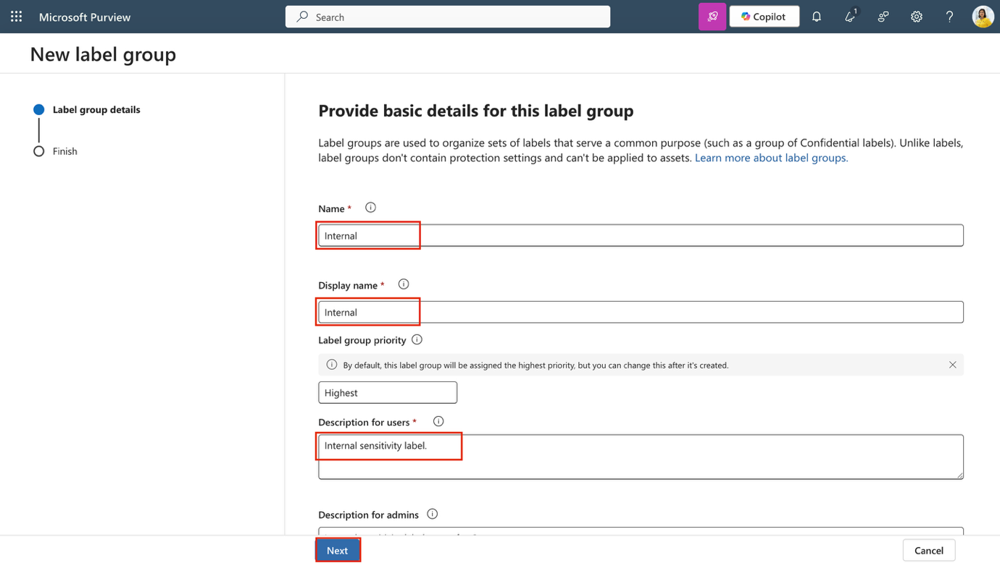

7.  Na página **Review your settings and finish**, selecione **Create label group**.

> 

8.  Na página **Your label group was created successfully**, selecione **Don't create a label yet** e, em seguida, selecione **Done**.

> 

Você criou um grupo de rótulos para uso interno. Esse grupo ajuda a gerenciar rótulos relacionados para departamentos ou categorias de dados específicas.

**Tarefa 2 – Criar um rótulo secundário**

Agora que você criou um grupo de rótulos, você adicionará um rótulo secundário para conteúdo relacionado a RH. Esse rótulo aplica criptografia e marcações de conteúdo para proteger dados de RH contra acesso não autorizado.

1.  Na página **Sensitivity labels**, localize o grupo de rótulos de confidencialidade **Internal**. Selecione as reticências verticais (**…**) ao lado dele e, em seguida, selecione **+ Create label in group** no menu suspenso.

> 

2.  O assistente **New sensitivity label** será iniciado. Na página **Provide basic details for this label**, insira:

    - **Name**: Employee data (HR)

    - **Display name**: Employee data (HR)

    - **Description for users**: This HR label is the default label for all specified documents in the HR Department.

    - **Description for admins**: This label is created in consultation with Ms. Jones (Head of the HR department). Contact her if you need to change the label settings.

3.  Selecione **Next**.

> 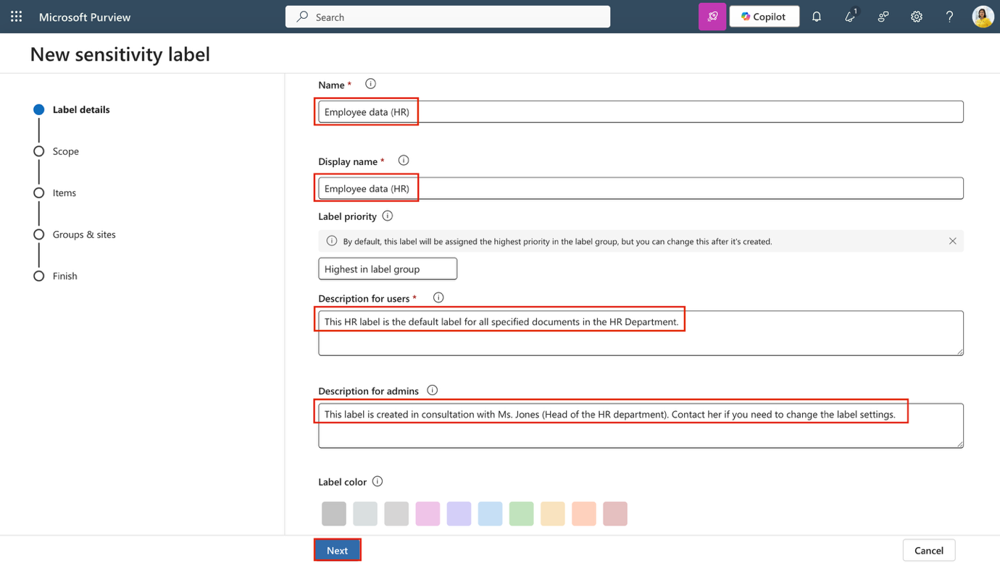

4.  Na página **Define the scope for this label**, selecione **Files** e **Emails**. Se a caixa de seleção **Meetings** estiver selecionada, certifique-se de desmarcá-la.

5.  Selecione **Next**.

> 

6.  Na página **Choose protection settings for labeled items**, selecione as opções **Control access** e **Apply content marking**, e depois selecione **Next**.

> 

7.  Na página **Access control**, selecione **Configure access control settings**.

8.  Configure as configurações de criptografia com as seguintes opções:

    - **Assign permissions now or let users decide?**: Assign permissions now

    - **User access to content expires**: Never

    - **Allow offline access**: Only for a number of days

    - **Users have offline access to the content for this many days**: 15

    - Selecione o link **Assign permissions**. No painel **Assign permissions**, selecione **+ Add any authenticated users** e, em seguida, selecione **Save** para aplicar essa configuração.

9.  Na página **Access control**, selecione **Next**.

> 

10. Na página **Content marking**, selecione o botão de alternância para habilitar **Content marking**.

> 

11. Para cada um dos seguintes tipos de marcação, marque a caixa de seleção e selecione o ícone de edição para inserir o texto:

| **Tipo de marcação** | **Texto**            |
|----------------------|----------------------|
| Add a watermark      | INTERNAL USE ONLY    |
| Add a header         | Internal Document    |
| Add a footer         | Contoso Confidential |

12. Selecione **Next**.

> 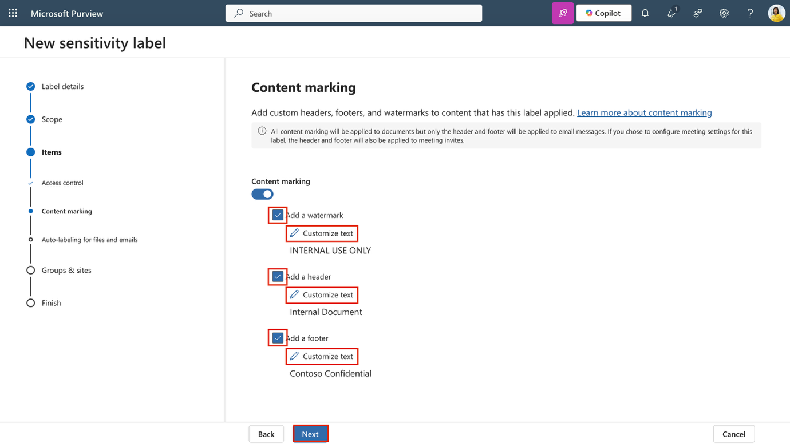

13. Na página **Auto-labeling for files and emails**, selecione **Next**.

> 

14. Na página **Define protection settings for groups and sites**, selecione **Next**.

> 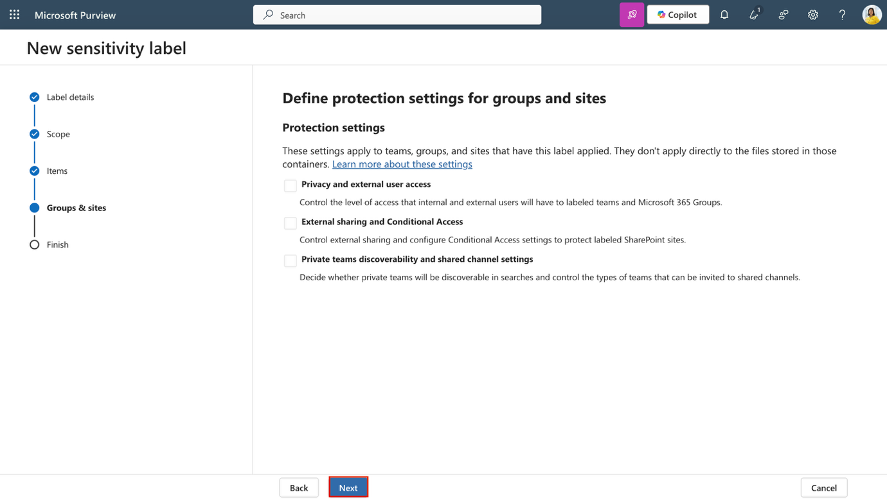

15. Na página **Review your settings and finish**, selecione **Create label**.

> 

16. Na página **Your sensitivity label was created**, selecione **Don't create a policy yet** e, em seguida, selecione **Done**.

> 

Você criou um rótulo secundário dentro do grupo interno. O rótulo aplica criptografia e marcações de conteúdo a documentos de RH, tornando os dados sensíveis fáceis de identificar e protegidos por política.

**Tarefa 3 – Publicar rótulos**

Em seguida, você publicará o rótulo de RH do grupo Internal para que os usuários do departamento de RH possam aplicá-lo aos seus documentos.

1.  No **Microsoft Edge**, a guia do portal **Microsoft Purview** ainda deve estar aberta. Caso contrário, navegue até https://purview.microsoft.com \> **Solutions** \> **Information Protection** \> **Sensitivity labels**.

2.  Na página **Sensitivity labels**, selecione **Publish labels**.

> 

3.  A configuração dos rótulos de confidencialidade será iniciada.

4.  Na página **Choose sensitivity labels to publish**, selecione o link **Choose sensitivity labels to publish**.

> 

5.  No painel **Sensitivity labels to publish**, selecione a caixa de seleção **Internal/Employee data (HR)** e, em seguida, selecione **Add** na parte inferior do painel.

> 

6.  De volta à página **Choose sensitivity labels to publish**, selecione **Next**.

> 

7.  Na página **Assign admin units**, selecione **Next**.

> 

8.  Na página **Publish to users and groups**, selecione **Next**.

> 

9.  Na página **Policy settings**, selecione **Next**.

> 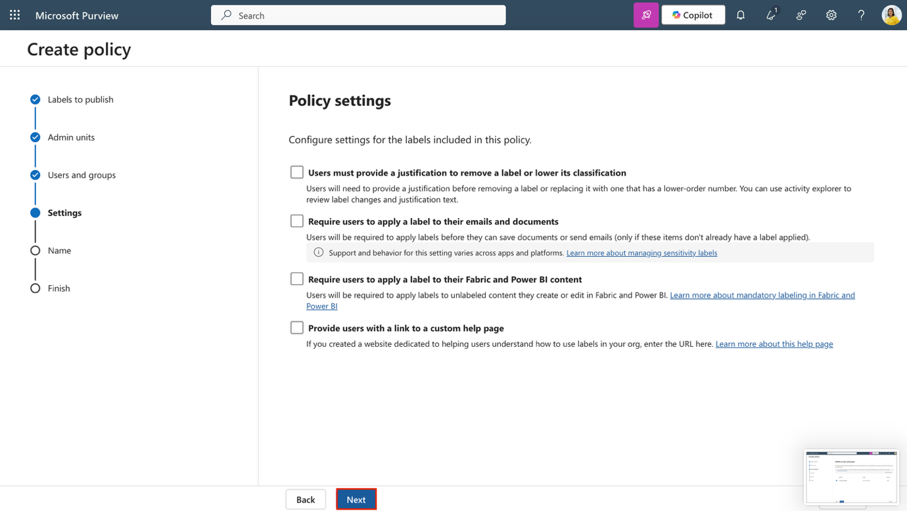

10. Na página **Default settings for documents**, selecione **Next**.

> 

11. Na página **Default settings for emails**, selecione **Next**.

> 

12. Na página **Default settings for meetings and calendar events**, selecione **Next**.

> 

13. Na página **Default settings for Fabric and Power BI content**, selecione **Next**.

> 

14. Na página **Name your policy**, insira:

    - **Name**: Internal HR employee data

    - **Enter a description for your sensitivity label policy**: This HR label is to be applied to internal HR employee data.

15. Selecione **Next**.

> 

16. Na página **Review and finish**, selecione **Submit**.

> 

17. Na página **New policy created**, selecione **Done** para concluir a publicação da política de rótulos.

> 

Você publicou o grupo de rótulos interno e seu rótulo de RH para que os usuários possam aplicá-los aos documentos de RH. Pode levar até 24 horas para que a política seja propagada pelos serviços.

**Tarefa 4 – Configurar rotulagem automática**

1.  No portal **Microsoft Purview**, selecione **Solutions \> Information Protection \> Sensitivity labels**.

2.  Na página **Sensitivity labels**, localize o grupo de rótulos de confidencialidade **Internal**. Selecione as reticências verticais (**...**) e, em seguida, selecione **+ Create label in group** no menu suspenso.

> 

3.  Na página **Provide basic details for this label**, insira:

| **Detalhes** | **Texto** |
|----|----|
| **Name** | Financial Data |
| **Display name** | Financial Data |
| **Description for users** | This content contains financial data that must be labeled and protected. |
| **Description for admins** | This label is used for content that includes sensitive financial identifiers. |

4.  Selecione **Next**.

> 

5.  Na página **Define the scope for this label**, selecione **Files and Emails**. Se a caixa de seleção **Meetings** estiver selecionada, certifique-se de desmarcá-la.

6.  Selecione **Next**.

> 

7.  Na página **Choose protection settings for labeled items**, selecione **Next**.

> 

8.  Na página **Auto-labeling for files and emails**, defina **Auto-labeling for files and emails** como habilitado.

> 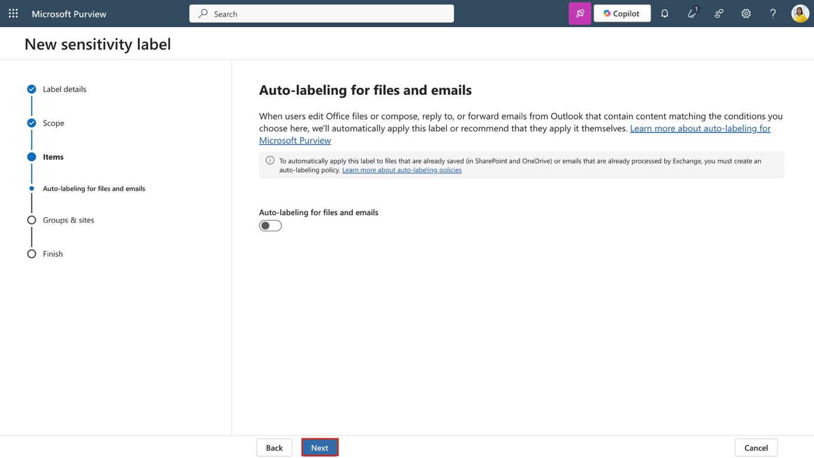

9.  Na seção **Detect content that matches these conditions**, selecione **+ Add condition \> Content contains**.

> 

10. Na seção **Content contains**, selecione **Add \> Sensitive info types**.

> 

11. No painel **Sensitive info types**, pesquise e selecione os seguintes tipos de informações confidenciais:

    - Credit Card Number

    - ABA Routing Number

    - SWIFT Code

12. Selecione **Add**.

> 

13. De volta à página **Auto-labeling for files and emails**, selecione **Next**.

> 

14. Na página **Define protection settings for groups and sites**, selecione **Next**.

> 

15. Na página **Review your settings and finish**, selecione **Create label**.

> 

16. Na página **Your sensitivity label was created**, selecione **Automatically apply label to sensitive content** e, em seguida, selecione **Done**.

> 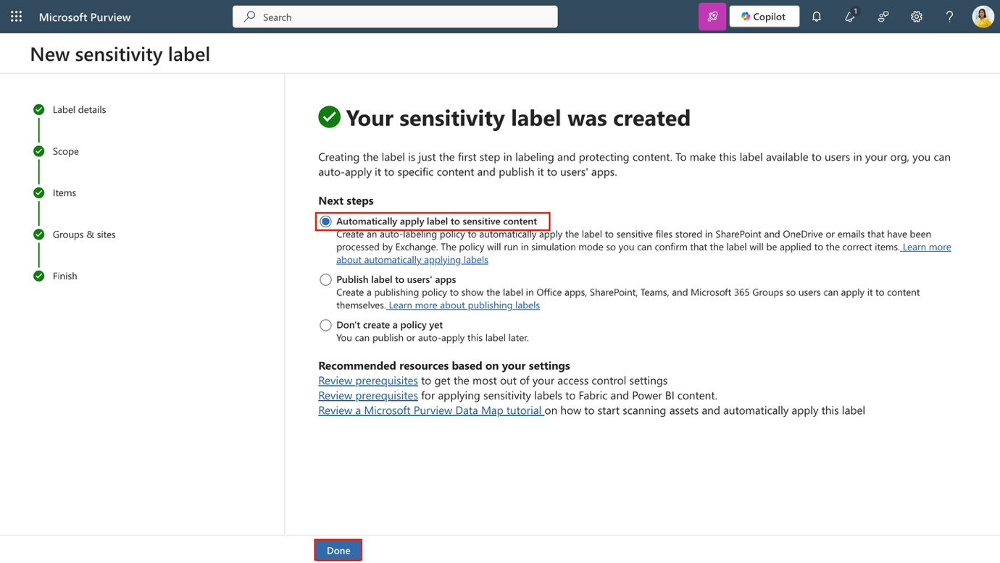

17. Na página **Create auto-labeling policy**, selecione **Review policy**.

> 

18. Na página **Name your auto-labeling policy**, mantenha o valor padrão e selecione **Next**.

> 

19. Na página **Choose a label to auto-apply**, verifique se o rótulo *Internal/Financial Data* está selecionado e selecione **Next**.

> 

20. Na página **Assign admin units**, selecione **Next**.

> 

21. Na página **Choose locations where you want to apply the label**, selecione as opções para:

    - Exchange email

    - SharePoint sites

    - OneDrive accounts

22. Selecione **Next**.

> 

23. Na página **Set up common or advanced rules**, mantenha **Common rules** selecionado e selecione **Next**.

> 

24. Na página **Define rules for content in all locations**, expanda a regra *Financial Data* para confirmar que as regras esperadas estão definidas e selecione **Next**.

> 

25. Na página **Additional settings for email**, selecione **Next**..

> 

26. Na página **Decide if you want to test out the policy now or later**, selecione **Run policy in simulation mode** e marque a caixa **Automatically turn on policy if not modified after 7 days in simulation.**

> 

27. Selecione **Next**.

> 

28. Na página **Review and finish**, selecione **Create policy**.

> 

29. Na página **Your auto-labeling policy was created**, selecione **Done**..

Você criou um rótulo secundário para dados financeiros e configurou uma política de rotulagem automática que detecta e rotula o conteúdo que contém informações financeiras.

**Tarefa 5 – Criar e publicar um rótulo DKE para conteúdo confidencial**

Em seguida, você criará um rótulo secundário no grupo interno que utiliza Double Key Encryption (DKE) e marca d’água dinâmica para proteger conteúdo jurídico confidencial.

1.  No **Microsoft Edge**, navegue até https://purview.microsoft.com e entre no portal Microsoft Purview como **Patti Fernandes**.

2.  No portal **Microsoft Purview**, selecione **Solutions \> Information Protection \> Sensitivity labels**.

3.  Na página **Sensitivity labels**, localize o grupo de rótulos de confidencialidade **Internal**. Selecione as reticências verticais (**...**) e selecione **+ Create label in group** no menu suspenso.

> 

4.  Na página **Provide basic details for this label**, insira:

| **Detalhes** | **Texto** |
|----|----|
| **Name** | Confidential Legal |
| **Display name** | Confidential Legal |
| **Description for users** | Use this label for highly sensitive legal content that must be encrypted using Double Key Encryption. |
| **Description for admins** | Label configured with DKE and dynamic watermarking for highly sensitive legal content. |

5.  Selecione **Next**.

> 

6.  Na página **Define the scope for this label**, selecione **Files and Emails**. Certifique-se de que **Meetings** esteja desmarcado e selecione **Next**.

> 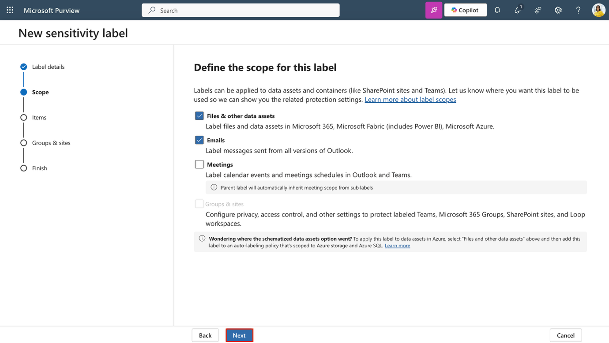

7.  Na página **Choose protection settings for the types of items you selected**, selecione **Control access** e selecione **Next**.

> 

8.  Na página **Access control**, selecione **Configure access control settings**.

> 

9.  Defina as configurações de criptografia com as seguintes opções:

    - **Assign permissions now or let users decide?**: Assign permissions now

    - **User access to content expires**: A number of days after label is applied

    - **Access expires this many days after the label is applied**: 5

    - **Allow offline access**: Never

    - Selecione o link **Assign permissions**. No painel **Assign permissions**, selecione **+ Add users or groups**.

> 

- No painel **Add users or groups**, pesquise e selecione Legal Team e Patti Fernandes, depois selecione **Add**.

> 

- Na página **Assign permissions**, selecione **Save**.

> 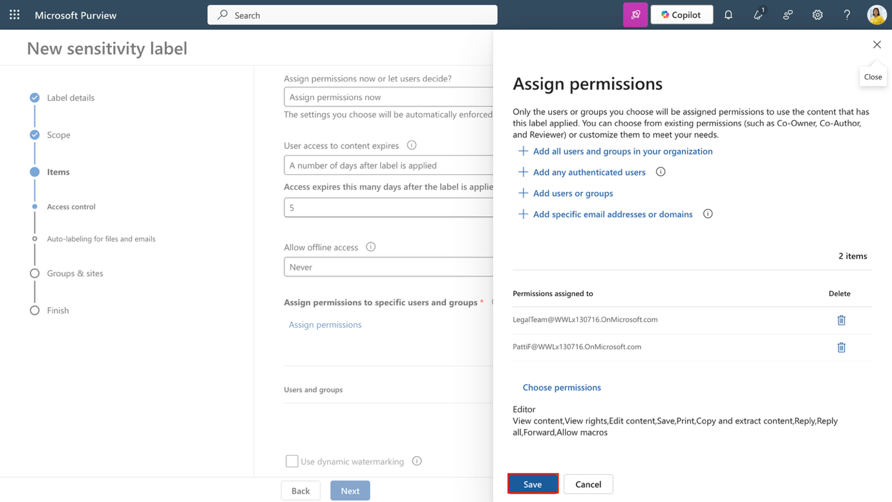

10. De volta à página **Access control**, marque a caixa **Use dynamic watermarking** e selecione **Customize text (optional)**.

> 

11. Na página **Add custom text to watermark (optional)**, insira **Confidential** e selecione **UPN** e **Timestamp**.

12. Selecione **Save** na parte inferior do painel lateral.

> 

13. De volta à página **Access control**, marque a caixa de seleção **Use Double Key Encryption** e insira https://testingdke1.azurewebsites.net/Test como a URL do serviço de Double Key Encryption.

14. Selecione **Next**.

> 

15. Na página **Auto-labeling for files and emails**, selecione **Next**.

> 

16. Na página **Define protection settings for groups and sites**, selecione **Next**.

> 

17. Na página **Review your settings and finish**, selecione **Create label**.

> 

18. Na página **Your sensitivity label was created**, selecione **Publish label to users' apps** e, em seguida, selecione **Done**.

> 

19. Na página lateral **Publish label**, selecione **Create new label policy**.

> 

20. Na página **Choose sensitivity labels to publish**, selecione **Choose sensitivity labels to publish** e adicione **Internal/Confidential Legal label**, em seguida selecione **Add**.

> 

21. Selecione **Next.**

> 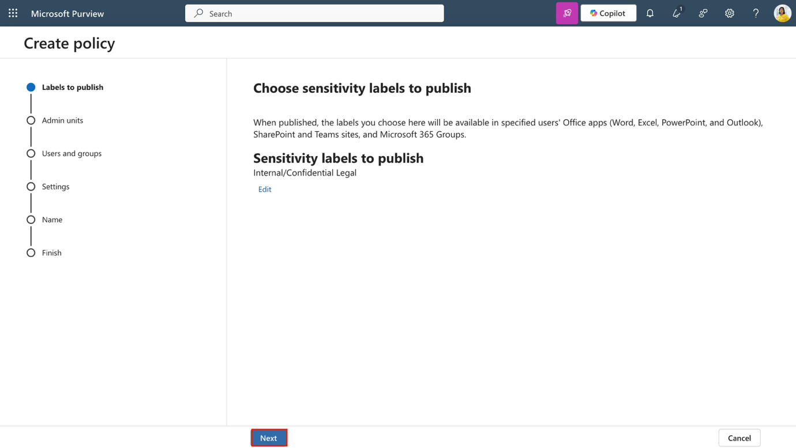

22. Na página **Assign admin units**, selecione **Next**.

> 

23. Na página **Publish to users and groups**, mantenha a opção padrão selecionada e selecione **Next**.

> 

24. Na página **Policy settings**, marque a caixa de seleção **Users must provide a justification to remove a label or lower its classification** e selecione **Next**.

> 

25. Na página **Default settings for documents**, selecione **Next**.

> 

26. Na página **Default settings for emails**, selecione **Next**.

> 

27. Na página **Default settings for meetings and calendar events**, selecione **Next**.

> 

28. Na página **Default settings for Fabric and Power BI content**, selecione **Next**.

> 

29. Na página **Name your policy**, insira:

    - **Name**: Confidential Legal

    - **Description**: Enables manual use of the DKE label for confidential content accessible by Legal.

30. Selecione **Next**.

> 

31. Na página **Review and finish**, selecione **Submit**.

> 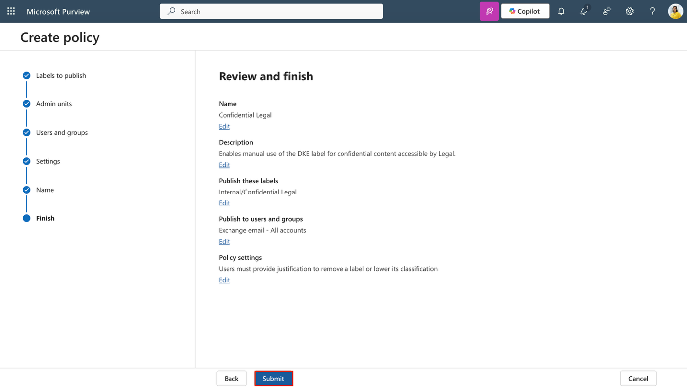

32. Na página **New policy created**, selecione **Done**.

> 

Você criou e publicou um rótulo secundário usando Double Key Encryption (DKE) e marca d’água dinâmica. Esse rótulo restringe o acesso a usuários autorizados e exige justificativa para rebaixamento da classificação.

**Exercício 3 – Política de arquivos usando rótulos de confidencialidade com o Microsoft Purview**

**Tarefa 1 – Habilitar a integração do Microsoft Purview no Defender for Cloud Apps**

Com os rótulos de confidencialidade criados e publicados, você agora integrará o Microsoft Purview ao Microsoft Defender for Cloud Apps. Essa integração permite que o Defender examine arquivos em busca de rótulos de confidencialidade e aplique monitoramento de arquivos.

1.  Abra o **Microsoft Edge** e acesse o **Microsoft Defender** navegando até https://security.microsoft.com.

2.  Na navegação à esquerda, selecione **Settings** e, em seguida, **Cloud Apps**.

> 

3.  Na seção **Information Protection** no painel esquerdo, selecione **Microsoft Information Protection**.

> 

4.  Na página **Microsoft Information Protection**, marque ambas as caixas de seleção disponíveis na página:

    - **Automatically scan new files for Microsoft Information Protection sensitivity labels and content inspection warnings**

> Permite que o Defender for Cloud Apps examine automaticamente arquivos novos ou modificados em busca de rótulos de confidencialidade e avisos de inspeção de conteúdo do Microsoft Purview.

- **Only scan files for Microsoft Information Protection sensitivity labels and content inspection warnings from this tenant**

> Limita a verificação a rótulos e avisos criados apenas na sua própria organização. Rótulos aplicados por locatários externos serão ignorados.

5.  Selecione **Save** para aplicar as configurações.

> 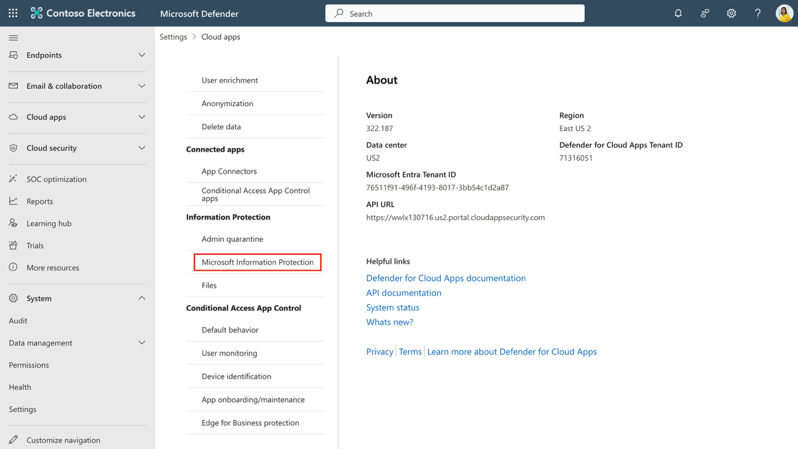

6.  Na seção **Information Protection** no painel esquerdo, selecione **Files**.

> 

7.  Na página **Files**, selecione **Enable file monitoring**.

> 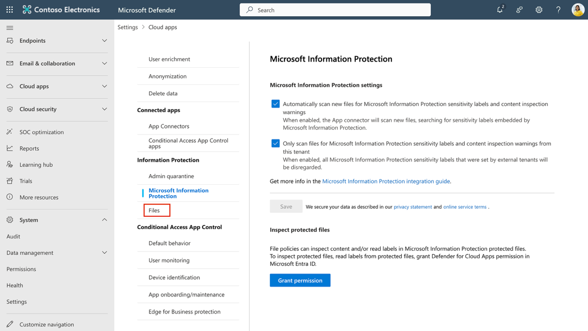

8.  Selecione **Save** para aplicar as configurações.

> 

Você habilitou a integração do Microsoft Purview no Defender for Cloud Apps. Agora, o Defender pode detectar rótulos de confidencialidade e monitorar arquivos para avaliação de políticas e ações de governança.

**Tarefa 2 – Criar uma política de arquivos para rotular arquivos compartilhados externamente**

Por fim, você criará uma política de arquivos que aplica automaticamente um rótulo de confidencialidade a arquivos compartilhados externamente. Isso garante que o conteúdo sensível permaneça protegido mesmo quando compartilhado fora da organização.

1.  No **Microsoft Defender**, navegue até **Cloud apps \> Policies \> Policy management**.

> 

2.  Selecione a guia **Information protection** e, em seguida, **Create policy \> File policy**.

> 

3.  Na página **Create file policy**, configure:

    - **Policy name**: Auto-label externally shared files

    - **Policy severity**: **High**

    - **Category**: **DLP**

    - Na seção **Files matching all of the following**:

      - Para o primeiro filtro, configure os menus suspensos como: **Access level equals external**

      - Para o segundo filtro, configure os menus suspensos como: **Last modified after (date)** e utilize a data de hoje

> 

- Em **Governance actions**, expanda **Microsoft OneDrive for Business**:

  - Marque a caixa **Apply sensitivity label**

  - No menu suspenso, selecione **Highly Confidential-Specified People**

> 

- Repita o mesmo processo para **Microsoft SharePoint Online**

  - Selecione a caixa de seleção **Apply sensitivity label**

  - Selecione **Highly Confidential-Specified People** no menu suspenso

> 

4.  Selecione **Create** para concluir a criação da política de arquivos.

> 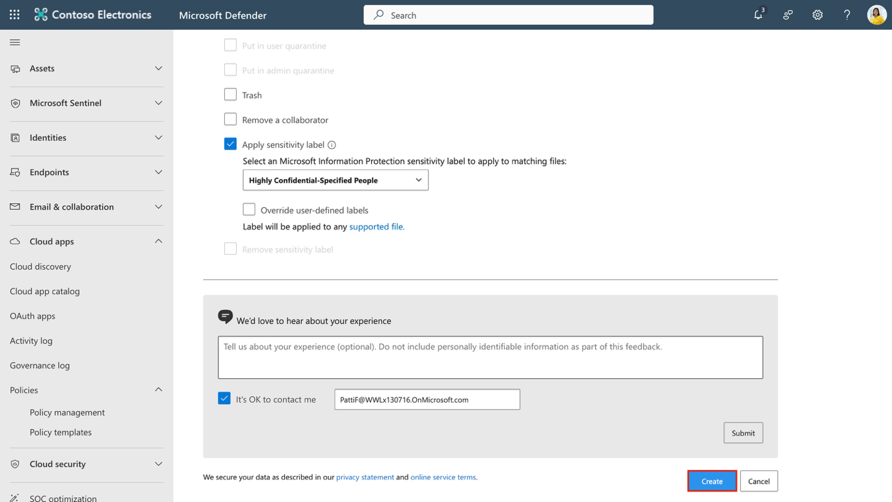

Você criou uma política de arquivos que aplica rótulos de confidencialidade a arquivos compartilhados externamente. Essa política amplia sua estratégia de proteção de informações para conteúdos armazenados na nuvem.

**Resumo**

Neste laboratório, você assumiu o papel de Patti Fernandez, administradora de segurança da informação na Contoso Ltd., e implementou proteção de informações usando rótulos de confidencialidade do Microsoft Purview. Você habilitou o suporte a rótulos de confidencialidade, criou e publicou grupos e rótulos secundários, configurou rotulagem automática, aplicou Double Key Encryption (DKE) e integrou o Microsoft Purview ao Microsoft Defender for Cloud Apps. Além disso, você criou políticas de arquivo para garantir que conteúdos confidenciais permaneçam protegidos, mesmo quando compartilhados externamente.
