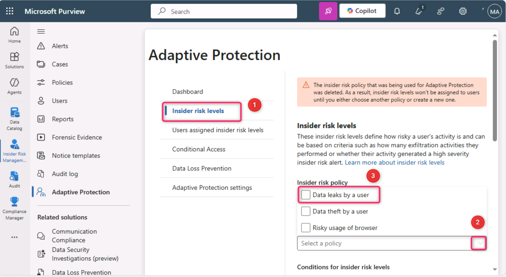
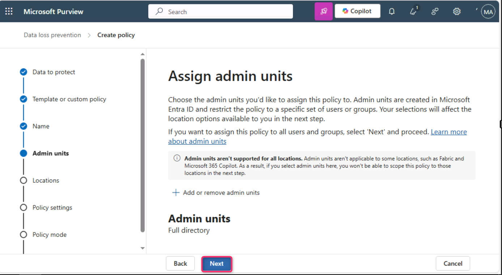
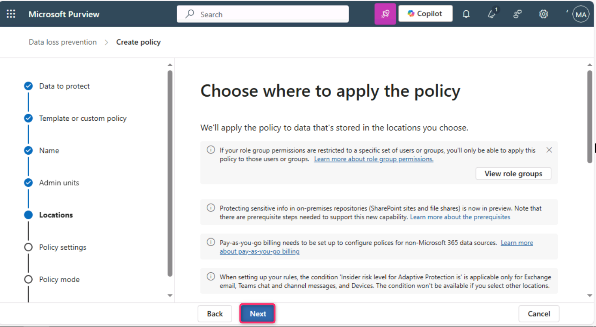
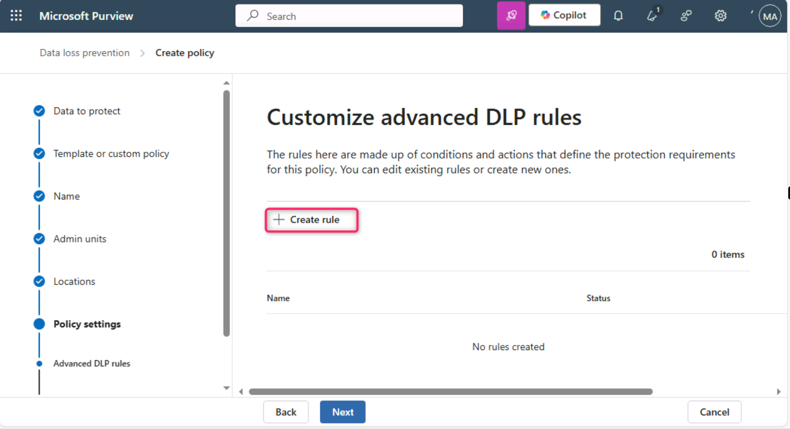
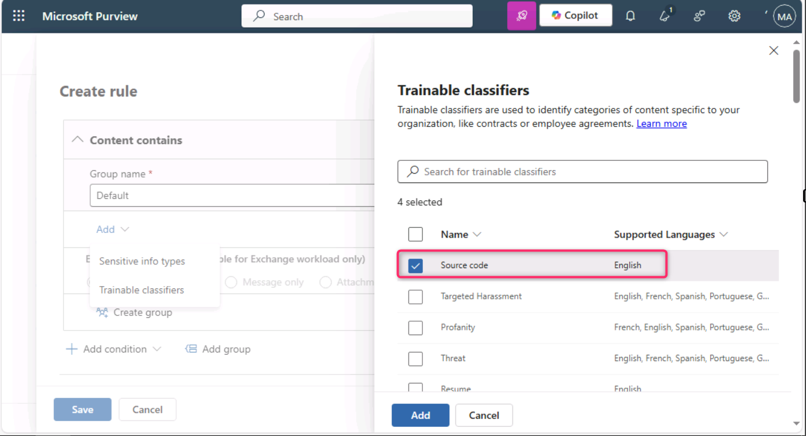

**Laboratório 5 – Explorando os recursos da Proteção Adaptativa**

**Introdução**

A Proteção Adaptativa no Microsoft Purview integra o Microsoft Purview Insider Risk Management com o Microsoft Purview Data Loss Prevention (DLP). Quando o Insider Risk identifica um usuário que está envolvido em comportamento arriscado, ele é atribuído dinamicamente a um nível de risco interno. Em seguida, a Proteção Adaptativa pode criar automaticamente uma política de DLP para ajudar a proteger a organização contra o comportamento arriscado associado a esse nível de risco interno

**Objetivos**

- Definir limites de risco para a Proteção Adaptativa no Insider Risk Management.

- Criar e configurar uma política de DLP personalizada para proteção de endpoints.

- Definir condições usando trainable classifiers e níveis de risco interno.

- Aplicar ações para bloquear atividades de exfiltração de dados de alto risco.

- Habilitar a política para aplicação imediata.

**Exercício 1 – Configurar a Proteção Adaptativa**

**Tarefa 1 – Configurar os níveis de risco para a Proteção Adaptativa**

1.  Abra uma guia do navegador Microsoft Edge em uma janela normal, faça login no portal do Microsoft Purview usando as credenciais do **MOD Administrator** e navegue até **Solutions** \> **Insider risk management**.

> 

2.  No painel esquerdo do **Insider Risk Management**, navegue e clique em **Adaptive Protection**.

> 

3.  Na página **Adaptive Protection**, clique em **Insider risk levels**. Em seguida, navegue até a seção **Insider risk policy** e clique no menu suspenso ao lado de **Select a policy**. Navegue e marque a caixa de seleção ao lado de **Data leaks by a user**.

> 
>
> 

4.  Em **Conditions for insider risk levels**, selecione User performs at least 3 data exfiltration activities, each… para o campo **Elevated risk level**. Selecione User performs at least 2 data exfiltration activities, each… para o campo **Moderate risk level**. Selecione User performs at least 1 data exfiltration activities, each… para o campo **Minor risk level**. Em seguida, role a página para baixo e selecione o botão **Save**.

> 

5.  Clique no botão **Save**.

> 

**Tarefa 2 – Criar uma política DLP de proteção adaptativa personalizada para endpoint**

1.  Na página **Adaptive Protection**, navegue e clique em **Data Loss Prevention** e, em seguida, clique em **+ Create policy**.

> 

2.  Na página **Choose what type of data to protect**, certifique-se de que o botão de opção **Data stored in connected sources** esteja selecionado.

> 

3.  Na página **Template or custom policy**, na seção **Categories**, navegue e selecione **Custom** e, em seguida, em **Regulations**, clique em **Custom policy**.

> 

4.  Na página **Name your DLP policy**, no campo **Name**, insira Custom Policy for Endpoint.

> 

5.  Na página **Assign admin units**, clique no botão **Next**.

> 

6.  Na página **Choose where to apply the policy**, clique no botão **Next**.

> 

7.  Na página **Define policy settings**, clique no botão **Next**.

> 

8.  Na página **Customize advanced DLP rules**, clique em **+ Create rule**.

> 

9.  No campo **Create rule**, insira Adaptive Protection block rule for Endpoint DLP

> 

10. Clique no menu suspenso ao lado de **Select one or more risk levels** e marque a caixa de seleção ao lado de **Elevated risk level**.

> 

11. Clique no menu suspenso ao lado de **+ Add condition** e selecione **Content contains**.

> 

12. Na seção **Content contains**, clique no menu suspenso ao lado de **Add** e selecione **Trainable classifiers**.

> 

13. No painel **Trainable classifiers** exibido no lado direito, navegue e marque as caixas de seleção ao lado de **Source code**, **Agreements**, **HR** e **IP**, e clique no botão **Add**.

> 
>
> 

14. Na seção **Actions**, clique no menu suspenso ao lado de **Add an action** e selecione **Audit or restrict activities on devices**.

> 

15. Selecione **Block** para **Copy to clipboard**, **Copy to a removable USB device**, **Copy to a network share** e **Print**.

> ..
>
> 

16. Na seção **Incident reports**, no campo **Use this severity level in admin alerts and reports**, selecione **Low** no menu suspenso. Em seguida, clique no botão **Save**.

> 

17. Clique no botão **Next**.

> 

18. Na página **Policy mode**, selecione o botão de opção ao lado de **Turn the policy on immediately** e clique no botão **Next**.

> 

19. Na página **Review and finish**, clique no botão **Submit**.

> 

20. Na página **New policy created**, clique no botão **Done**.

> 

**Resumo**

Neste exercício, você configurou a Proteção Adaptativa no Microsoft Purview, definindo inicialmente os níveis de risco interno com base em limites de atividades de exfiltração de dados. Em seguida, você criou uma política personalizada de Data Loss Prevention (DLP) para dispositivos de endpoint que utiliza a Proteção Adaptativa para restringir automaticamente atividades — como cópia para USB ou impressão — quando um risco elevado é detectado. A política direciona conteúdo sensível usando trainable classifiers e aplica ações rigorosas com base nos níveis de risco interno para mitigar possíveis vazamentos de dados.
