**Laboratório 6 - Criando e gerenciando políticas de DLP**

**Introdução**

Você é Patti Fernandez, o recém-contratado Administrador de Conformidade da Contoso Ltd. com a tarefa de configurar o locatário do Microsoft 365 da empresa para prevenção de perda de dados. A Contoso Ltd. é uma empresa que oferece instrução de direção nos Estados Unidos e você precisa garantir que as informações confidenciais dos clientes não saiam da organização.

**Objetivos**

- Criar e testar políticas de DLP no Microsoft Purview.

- Usar o PowerShell para gerenciar as configurações de DLP.

- Habilitar o monitoramento de arquivos e criar políticas de arquivos no Defender for Cloud Apps.

- Implementar o DLP para a Power Platform para controlar os fluxos de dados.

**Exercício 1 - Criando políticas de DLP**

**Tarefa 1 - Criar uma política de DLP no modo de teste**

Neste exercício, você criará uma política de Data Loss Prevention no portal Microsoft Purview para proteger os dados confidenciais de serem compartilhados pelos usuários. A política de DLP que você criar informará aos usuários se eles desejam compartilhar conteúdo que contenha informações de cartão de crédito e permitirá que eles forneçam uma justificativa para o envio dessas informações. A política será implementada no modo de teste porque você ainda não quer que a ação de bloqueio afete os usuários..

1.  No **Microsoft Edge**, navegue até https://purview.microsoft.com e verifique se você está conectado ao portal **Microsoft Purview** como **Patti Fernandez**.

2.  No portal **Microsoft Purview**, no painel de navegação esquerdo, selecione **Solutions** \> **Data loss prevention**.

> 

3.  Na janela **Data loss prevention**, selecione a guia **Policies** e, em seguida, selecione **+ Create policy** para iniciar o assistente de criação de uma nova política de prevenção contra perda de dados.

> 

4.  No painel **What info do you want to protect?**, selecione **Enterprise applications and devices**.

> 

5.  Na página **Start with a template or create a custom policy**, role a página para baixo e selecione **Custom** em **Categories**. Em seguida, selecione **Custom policy** em **Regulations**. Clique no botão **Next**.

> 

6.  Na página **Name your DLP policy**, digite Credit Card DLP Policy no campo **Name** e field and Protect credit card numbers from being shared. no campo **Description**. Selecione **Next**.

> 

7.  Na página **Assign admin units**, selecione **Next**.

> 

8.  Na página **Choose where to apply the policy**, marque a caixa de seleção ao lado de **Teams chat and channel messages** e desmarque a caixa de seleção ao lado dos outros recursos. Em seguida, clique no botão **Next**.

> 

9.  Na página **Define policy settings**, certifique-se de que o botão de opção **Create or customize advanced DLP rules** esteja selecionado e clique no botão **Next**.

> 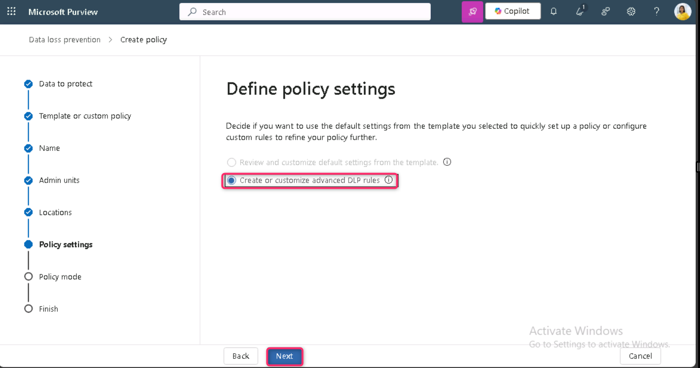

10. Na página **Customize advanced DLP rules**, selecione **+ Create rule**.

> 

11. Na página **Create rule**, digite no campo **Name**.

> 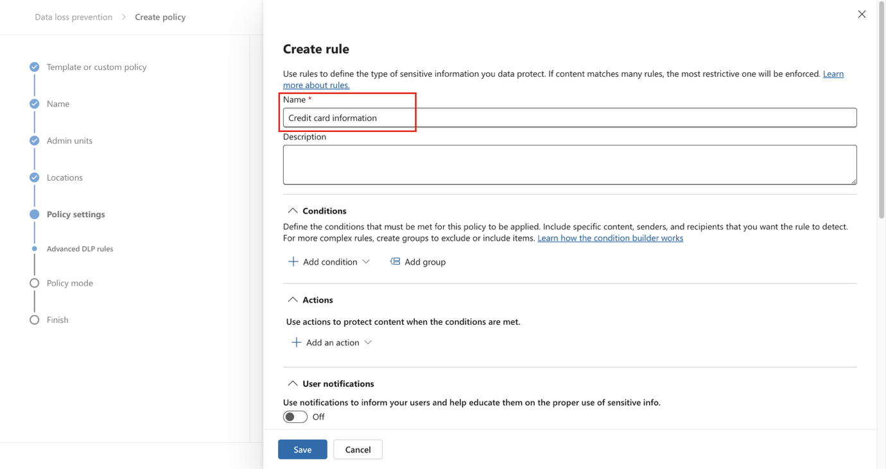

12. Em **Conditions,** na página **Create rule**, selecione **+ Add condition** e escolha **Content is shared from Microsoft 365** no menu suspenso.

> 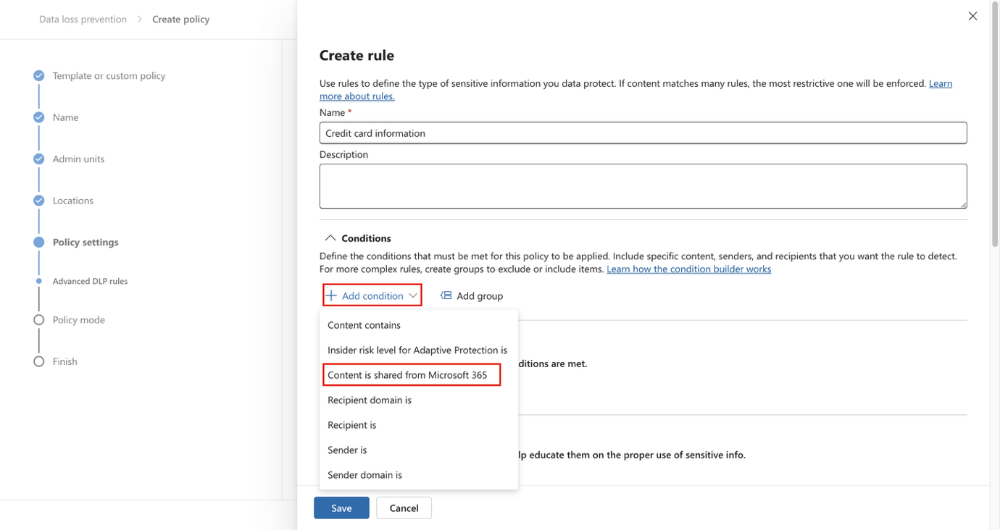

13. Na nova seção **Content is shared from Microsoft 365**, selecione a opção **with people outside my organization**.

> 

14. Selecione **+ Add Condition** e, em seguida, selecione **Content contains** no menu suspenso.

> 

15. Na nova área **Content contains**, selecione **Add** e escolha **Sensitive info types** no menu suspenso.

> 

16. No painel **Sensitive info types** exibido no lado direito, digite credit card number na barra de pesquisa e pressione **Enter**. Marque a caixa de seleção ao lado de **Credit Card Number** e selecione o botão **Add**.

> 

17. Na página **Create rule**, selecione **+ Add an action** e escolha **Restrict access or encrypt the content in Microsoft 365 locations**.

> 

18. Na seção **Restrict access or encrypt the content in Microsoft 365 locations**, certifique-se de que o botão de opção **Block users from receiving email or accessing shared SharePoint, OneDrive, and Teams files, and Power BI items** esteja selecionado e, em seguida, certifique-se de que o botão de opção **Block only people outside your organization** esteja selecionado.

> 

19. Na página **Create rule**, na seção **User notifications**, selecione o botão de alternância para colocá-lo na posição **On**.

> 

20. Na página **Create rule**, na seção **User overrides**, em **Allow overrides from M365 services**, marque a caixa **Allow overrides from M365 services. Allows users in Exchange, SharePoint, OneDrive and Teams to override policy restrictions.**

> 

**Observação**: Caso não seja possível selecionar a caixa **Allow overrides from M365 services**, habilite a caixa **Notify users in Office 365 with a policy tip**, que pode ser encontrada na página **Create rule**, em **User notification \> Microsoft 365 services**, na etapa anterior. Em seguida, selecione a caixa **Allow overrides from M365 services. Allows users in Exchange, SharePoint, OneDrive and Teams to override policy restrictions.**

21. Marque a caixa **Require a business justification to override**.

> 

22. Na seção **Incident reports**, no menu suspenso **Use this severity level in admin alerts and reports**, selecione **Low**.

> 

23. Selecione **Save** e, em seguida, selecione **Next**.

> 
>
> 

24. Na página **Policy mode**, certifique-se de que o botão de opção **Run the policy in simulation mode** esteja selecionado e que a caixa ao lado de **Show policy tips while in test mode** esteja marcada. Em seguida, clique no botão **Next**.

> 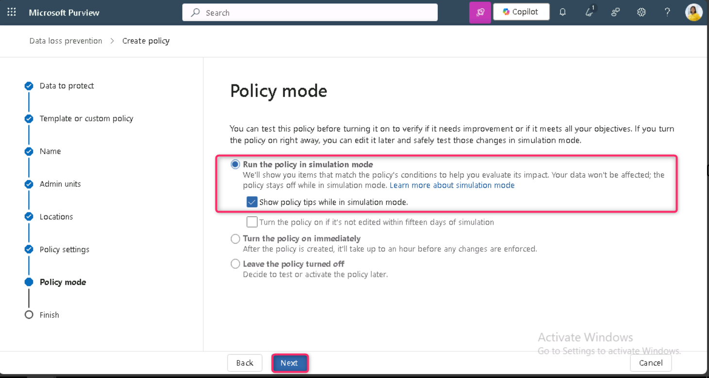

25. Selecione **Submit** para criar a política.

> 

26. Após a criação da política, selecione **Done**.

> 
>
> Você criou uma política de DLP que verifica números de cartão de crédito em chat e canais do Microsoft Teams e permite que os usuários forneçam uma justificativa comercial para substituir a política.
>
> 

**Tarefa 2 – Modificar uma política de DLP**

Nesta tarefa, você modificará a política de DLP existente criada na etapa anterior para também verificar e-mails em busca de informações de cartão de crédito e informar aos usuários se eles desejam compartilhar esse conteúdo em um e-mail.

1.  Selecione a caixa ao lado de **Credit Card DLP Policy** e clique no ícone **Edit** na barra de comandos, conforme mostrado na imagem abaixo.

> 

2.  Na página **Name your DLP policy** e **Assign admin units**, selecione **Next**.

> 
>
> 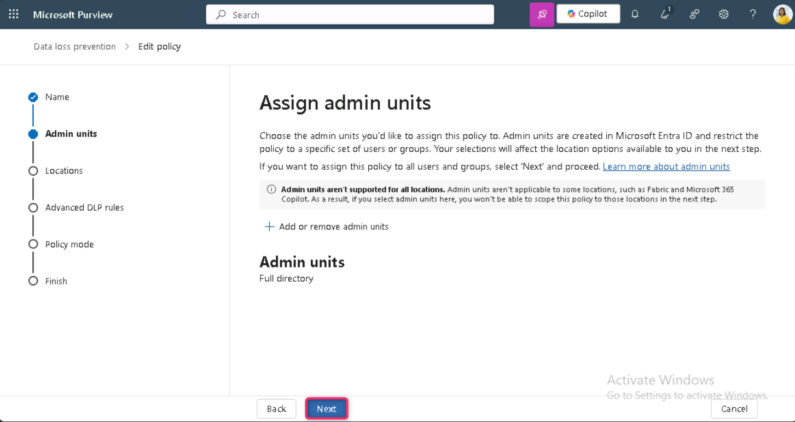

3.  Na página **Choose where to apply the policy**, selecione apenas a caixa ao lado de **Exchange email** e selecione **Next** até chegar à página **Review and finish**.

> 

4.  Selecione **Submit** para aplicar a alteração feita na política.

> 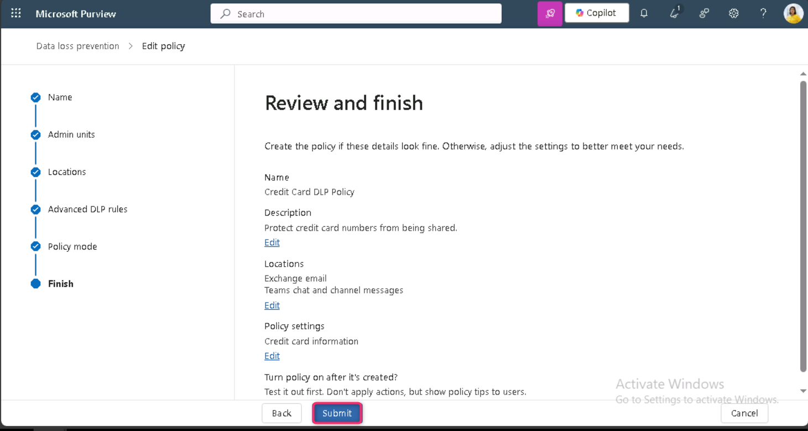

5.  Após a atualização da política, selecione o botão **Done**.

> 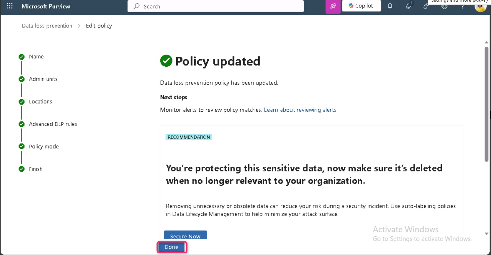

Agora você modificou uma política de DLP existente e alterou os locais em que ela examina o conteúdo.

**Tarefa 3 – Criar uma política de DLP no PowerShell**

Nesta tarefa, você usará o PowerShell para criar uma política de DLP para proteger os IDs de funcionários da Contoso e impedir que sejam compartilhados no Exchange. Os usuários serão informados de que estão tentando compartilhar dados confidenciais e serão impedidos de enviar o e-mail se ele incluir IDs de funcionários da Contoso.

1.  Clique com o botão direito do mouse no ícone do Windows na barra de tarefas e selecione Windows PowerShell (Admin) para executá-lo como administrador.

> 

2.  Na caixa de diálogo **User Account Control**, clique no botão **Yes**.

> 

3.  No PowerShell, execute os seguintes comandos:

> Install-Module ExchangeOnlineManagement
>
> Import-Module ExchangeOnlineManagement
>
> 
>
> 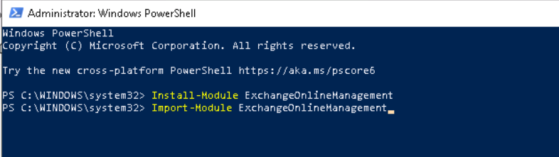

4.  Na janela do **PowerShell**, digite Connect-IPPSSession e faça login como **Patti Fernandez.**

> 
>
> 
>
> Caso a Caixa de diálogo **Automatically sign in to all desktop apps and websites on this device?** seja exibida, clique em **No, this app only**.
>
> 
>
> 

5.  Insira o seguinte comando no PowerShell para criar uma política de DLP que examine todas as caixas de correio do Exchange:

> New-DlpCompliancePolicy -Name "EmployeeID DLP Policy" -Comment "This policy blocks sharing of Employee IDs" -ExchangeLocation All
>
> 

6.  Insira o seguinte comando no PowerShell para adicionar uma regra de DLP à política criada na etapa anterior:

> New-DlpComplianceRule -Name "EmployeeID DLP rule" -Policy "EmployeeID DLP Policy" -BlockAccess \$true -ContentContainsSensitiveInformation @{Name="Contoso Employee IDs"}
>
> 
>
> 

7.  Use o seguinte comando para revisar a regra **EmployeeID DLP**:

> Get-DLPComplianceRule -Identity "EmployeeID DLP rule"
>
> 

Agora você criou uma política de DLP que examina Contoso EmployeeIDs no Exchange usando PowerShell.

**Tarefa 4 – Ativar uma política no modo de teste**

Nesta tarefa, você ativará a política DLP de informações de cartão de crédito criada no modo de teste para que ela aplique suas ações de proteção.

1.  Na **janela de navegação privada do Microsoft Edge**, navegue até https://purview.microsoft.com e certifique-se de estar conectado ao portal **Microsoft Purview** como **Patti Fernandez**.

2.  No portal **Microsoft Purview**, no painel de navegação esquerdo, selecione **Solutions \> Data loss prevention**.

> 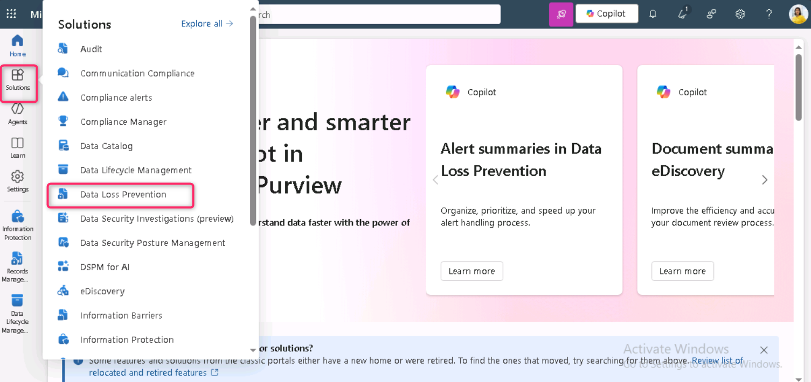

3.  Em **Data loss prevention**, selecione **Policies**, depois selecione a política chamada **Credit Card DLP Policy** e, em seguida, selecione **Edit policy** (ícone de lápis) para abrir o assistente da política.

> 

4.  Selecione **Next** até chegar à página **Test or turn on the policy** e selecione **Turn the policy on immediately**.

> 

5.  Selecione **Next** e depois selecione **Submit** para ativar a política.

> 

6.  Após a atualização da política, selecione **Done**.

> 

Você ativou com sucesso a política de DLP. Caso a política detecte uma tentativa de compartilhamento de informações de Cartão de Crédito, ela bloqueará a tentativa e permitirá que os usuários forneçam uma justificativa comercial para substituir a ação de bloqueio.

**Exercício 2 – Gerenciamento de políticas de DLP**

**Tarefa 1 – Modificação da prioridade da política**

Após criar duas políticas de DLP, você deseja garantir que a política mais restritiva seja processada com uma prioridade maior do que a política menos restritiva. Por esse motivo, você deseja mover a política de DLP EmployeeID para uma prioridade mais alta.

1.  No **Microsoft Edge**, navegue até https://purview.microsoft.com e certifique-se de estar conectado ao portal **Microsoft Purview** como **Patti Fernandez**.

2.  No portal **Microsoft Purview**, no painel de navegação esquerdo, selecione **Solutions \> Data loss prevention**.

> 

3.  Em **Data loss prevention**, selecione **Policies**, depois selecione a política chamada **Credit Card DLP Policy**. Selecione **Move to top (highest priority)**.

> 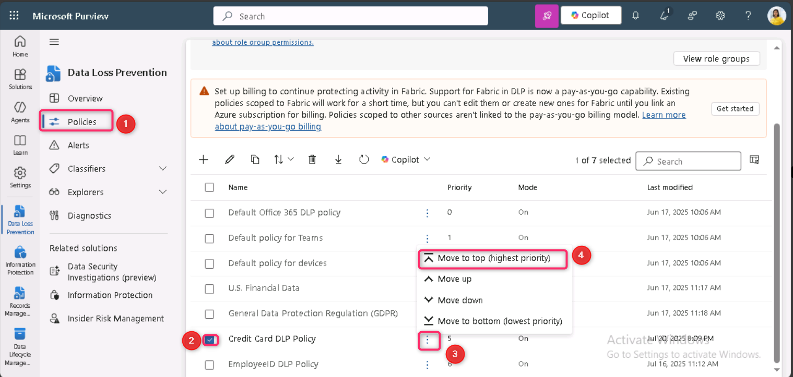

4.  Na janela **Data loss prevention**, selecione **Refresh** e revise a prioridade na coluna **Order** da tabela de políticas.

> 

Você modificou com sucesso a prioridade das políticas de DLP. Caso ambas as políticas correspondam ao mesmo conteúdo, a ação da política com maior prioridade será aplicada.

**Tarefa 2 – Ativar o monitoramento de arquivos no Microsoft Defender**

Você deseja usar políticas de arquivo no **Microsoft Defender** para proteger arquivos no OneDrive e SharePoint Online. Antes de criar uma política de arquivo, é necessário habilitar o monitoramento de arquivos para que o Microsoft Defender possa examinar arquivos na sua organização.

1.  Abra uma nova aba no Microsoft Edge em uma janela normal, insira o seguinte URL na barra de endereços para abrir o portal do Microsoft Defender:  https://security.microsoft.com. Em seguida, faça login no portal Microsoft Defender como **MOD Administrator**.

2.  No portal **Microsoft Defender**, role a página para baixo e clique em **System \> Settings** no menu de navegação à esquerda. Na página **Settings**, clique em **Cloud Apps**.

> 

3.  Role a página até a seção **Information Protection** e clique em **Files**. Na página **Files**, marque a caixa **Enable file monitoring** e clique no botão **Save**.

> 

**Observação**: se o monitoramento de arquivos já estiver habilitado por padrão, ignore a etapa acima e passe para a próxima tarefa.

Você habilitou com sucesso o monitoramento de arquivos no Microsoft Defender for Cloud Apps e agora pode verificar arquivos em busca de conteúdo confidencial usando políticas de arquivos.

**Tarefa 3 – Criação de política de arquivos para o Microsoft Defender**

Nesta tarefa, você deseja criar uma política de arquivos no Microsoft Defender para verificar arquivos no OneDrive e no SharePoint Online e colocar automaticamente em quarentena os arquivos que contenham informações de cartão de crédito, caso sejam compartilhados.

1.  Agora, na mesma seção **Information Protection**, clique em **Microsoft Information Protection** e, em seguida, marque a caixa ao lado de **Automatically scan new files for Microsoft Information Protection sensitivity labels and content inspection warnings**. Depois, clique no botão Save.

> 
>
> 

2.  Em **Inspect protected files**, clique em **Grant Permission**.

> 

3.  A caixa de diálogo **Pick an account** será exibida; selecione as credenciais do locatário **MOD Administrator**.

\

4.  Na página **Permissions requested**, clique no botão **Accept**.

> 

5.  Você observará o status **Active**, indicando que a permissão foi concedida com sucesso.

> 

6.  Na subnavegação, na seção **Connected apps**, clique em **App Connectors** e certifique-se de que **Microsoft 365** esteja adicionado.

> 

7.  Agora, no portal **Microsoft Defender**, no painel de navegação à esquerda, expanda **Policies** na seção Cloud Apps e selecione **Policy management**.

> 

8.  Na página **Policies**, clique em **Create policy** e selecione **File policy**.

> 

9.  Na página **Create file policy**, digite Credit Card Information for files no campo **Policy name** e digite Protect credit card numbers from being shared in files. no campo **Description**.

> 

10. Mantenha **Policy Severity** como **Low** (um ícone aceso) e certifique-se de que a **Category** esteja definida como **DLP**. Para uma política de arquivo, essa deve ser a configuração padrão.

> 

11. Na área **Files matching all of the following**, expanda o menu suspenso **Public (Internet), External, Public** e adicione **Internal**.

> 

12. Na seção **Apply to**, no menu suspenso **Inspection Method**, selecione **Data Classification Service**.

> 
>
> **Observação:** Caso **Data Classification Service** ainda não esteja disponível no menu suspenso, selecione **None** por enquanto. Depois de algum tempo, retorne a **Policies \> Policy management \> All Policies \> Search for name: Credit card \> Select Credit Card Information for files**.

13. No menu suspenso **Choose inspection type…**, selecione **Sensitive information type…**.

14. Na caixa de diálogo **Select a sensitive information type**, digite Credit Card Number na barra de pesquisa, marque a caixa ao lado de **Credit Card Number** e clique no botão **Done**.

> 

15. Na seção **Alerts**, marque a caixa ao lado de **Create an alert for each matching file**. Em seguida, clique no botão **Save as default settings**.

> 

16. Na seção **Governance actions**, expanda **Microsoft OneDrive for Business** e selecione **Put in user quarantine**.

> 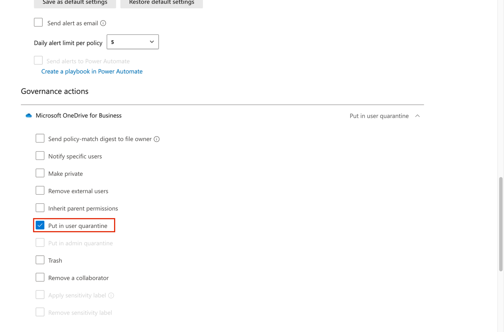

17. Na seção **Governance actions**, expanda **Microsoft SharePoint Online** e selecione **Put in user quarantine**.

> 

18. Selecione **Create** na parte inferior da página.

> 

19. Selecione a **Profile picture** do MOD Admin no canto superior direito e selecione **Sign out** ao lado do ícone de engrenagem; em seguida, feche o navegador.

> 

Você criou uma política de arquivos que verificará continuamente os arquivos salvos no OneDrive e no SharePoint em busca de informações de cartão de crédito e os colocará em quarentena se forem compartilhados dentro da sua organização.

**Tarefa 4 – Criar uma política de DLP para a Power Platform**

Sua empresa usa fluxos do Power Automate para compartilhar dados entre o SharePoint Online e o SalesForce. Nesta tarefa, você criará uma política de DLP para a Power Platform que permite que seus fluxos existentes continuem funcionando, mas impede a criação de fluxos que compartilhem dados entre o SharePoint Online e aplicativos definidos como não comerciais.

1.  No **Microsoft Edge**, navegue até https://admin.powerplatform.microsoft.com e faça login no Power Platform admin center como **MOD Administrator**.

2.  Na página inicial do **Power Platform admin center**, navegue e clique em **Security**.

> 

3.  Em seguida, clique no ícone **Data and privacy**, conforme mostrado na imagem abaixo.

> 

4.  Na página Data protection and privacy, navegue e clique em **Data policy**.

> 

5.  Na página **Data policies**, selecione **+ New Policy**.

> 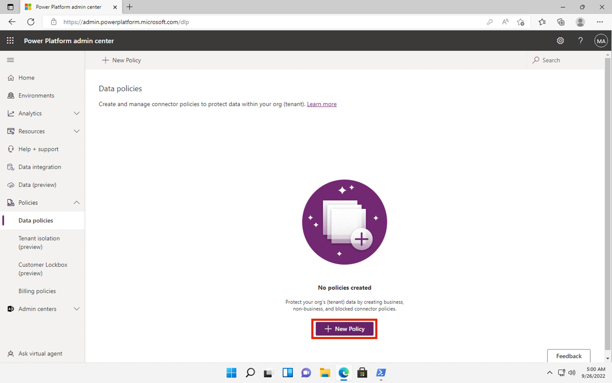

6.  Na página **Name your policy**, digite Tenant-wide SharePoint Policy, e selecione **Next**.

> 

7.  Na guia **Non-business \| Default**, selecione **SharePoint** e **Salesforce** e, em seguida, selecione **Move to Business** na parte superior da página.

> 

8.  Na página **Assign connectors**, selecione a guia **Business** para garantir que **SharePoint** e **Salesforce** apareçam.

> 

9.  Selecione **Next** duas vezes.

> 
>
> 

10. Na página **Define scope**, selecione **Add all environments** e, em seguida, selecione **Next**.

> 

11. Na página **Review and create policy**, revise as configurações da política e selecione **Create policy**.

> 
>
> Agora você criou uma política de DLP do Power Platform que impede que os usuários criem fluxos envolvendo um conector do SharePoint Online e qualquer conector que não seja Salesforce.
>
> 

**Resumo:**

Neste laboratório, você criou e gerenciou políticas de Data Loss Prevention (DLP) para proteger dados confidenciais, como números de cartão de crédito e IDs de funcionários, no Microsoft Teams, Exchange, OneDrive, SharePoint e Power Platform. Você criou políticas usando o Microsoft Purview e o PowerShell, habilitou notificações e substituições de usuários, priorizou políticas, ativou o monitoramento de arquivos no Microsoft Defender e configurou ações de quarentena de arquivos. Além disso, você criou uma política de DLP do Power Platform para restringir o compartilhamento de dados com conectores não comerciais.
