**Laboratório 7 – Configurando o Insider Risk Management**

**Introdução**

Neste laboratório, aprenderemos como configurar o Insider Risk Management usando as Políticas de Insider Risk Management. Utilizaremos os Sensitive Info Types criados no Laboratório 1 e as políticas de DLP criadas no Lab 4 para criar políticas que protegerão a organização contra uso arriscado do navegador, roubo de dados ou vazamentos de informações.

Para isso, criaremos uma infraestrutura no Azure que representará os dispositivos da organização. Aprenderemos como integrar esses dispositivos ao Azure AD e ao Intune, além de instalar um agente MDM, para que seja possível receber alertas dessas máquinas.

**Objetivos**

- Sincronizar os relógios das VMs para garantir configurações de horário precisas para testes de políticas.

- Atribuir usuários ao grupo de funções de Insider Risk Management no Microsoft Purview.

- Habilitar insights analíticos para detecção de riscos internos nos níveis de locatário e usuário.

- Integrar dispositivos Windows 10 ao Microsoft Defender for Endpoint para monitoramento de riscos internos.

- Criar e configurar políticas de Insider Risk Management para::

  - Uso arriscado do navegador

  - Roubo de dados por usuários em desligamento

  - Vazamento de dados por usuários

- Pontuar cada política para simular cenários de detecção de risco interno para a conta MOD Administrator.

**Exercicio 1: Configurando o ambiente**

**Tarefa 0 : Sincronizar o relógio da VM**

1.  Feche todas as abas do navegador Microsoft Edge abertas na VM. Clique no ícone do **Windows** e, em seguida, clique em **Settings**, conforme mostrado na imagem abaixo.

> 

2.  Na barra de pesquisa do **Windows Settings**, digite Date & time settings e selecione **Date & time settings** na lista.

> 

3.  Na página **Date & time**, navegue e clique no botão **Sync now**.

> 

**Exercício 2 – Criar políticas de Insider Risk Management**

**Pré-requisitos**

**Etapa 1 – Adicionar usuários ao grupo de funções de Insider Risk Management**

1.  Abra o portal do Microsoft Purview: https://purview.microsoft.com e faça login com as credenciais do **MOD Administrator**.

2.  No menu de navegação à esquerda, clique em **Settings.**

> 

3.  No painel **Settings**, navegue e clique em **Roles and scopes**. Clique em **Role groups**, marque a caixa ao lado de **Insider Risk Management** e clique no ícone de lápis para **Edit**.

> 
>
> 

4.  Na página **Edit Members of the role group**, clique em **Choose users**.

> 

5.  Marque a caixa ao lado de **Alex Wilber** e clique no botão **Select**.\
    Caso **Alex Wilber** já esteja selecionado, ignore esta etapa.

> **Observação**: caso você não tenha visto os nomes Megan Bowen e MOD Administrator na opção Edit members name, além do nome Alex, selecione também os nomes Megan Bowen e MOD Administrator.
>
> .
>
> 

6.  Certifique-se de que MOD Administrator, Megan Bowen e Alex Wilber estejam listados e clique no botão **Next**.

> 

7.  Selecione **Save** para adicionar os usuários ao grupo de funções.

> 

8.  Selecione **Done** para concluir as etapas.

> 

**Etapa 2 – Habilite insights de análise de risco interno**

1.  No portal do Microsoft Purview, navegue até **Settings**, role a página e clique em **Insider risk management**. Na página **Insider Risk Management settings – Analytics**, ative os botões **Show insights at tenant level** e **Show insights at user level**. Em seguida, clique no botão **Save**.

> 

**Etapa 3 – Integração de um dispositivo**

Neste cenário de implementação, você integrará dispositivos que ainda não foram integrados e deseja detectar atividades de risco interno em dispositivos Windows 10.

Precisamos registrar o dispositivo/VM no Microsoft Entra ID como pré-requisito para criar qualquer política de Insider Risk.

1.  Clique no ícone do Windows e selecione **Settings**, conforme mostrado na imagem abaixo..

> 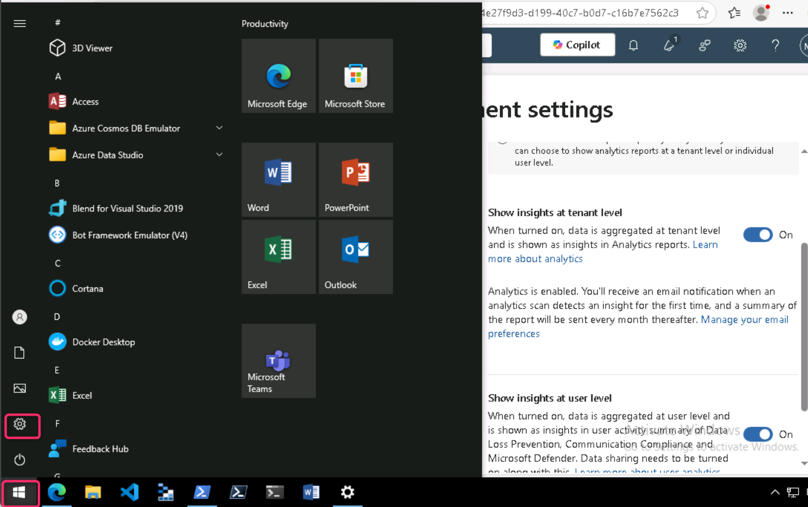

2.  Vá para **Accounts** \> **Access work or school**. Na página **Access work or school**, clique em **Connect**.

> 
>
> 

3.  Na janela **Set up a work or school account**, clique em **Join this device to Microsoft Entra ID**.

> 

4.  Na solicitação de login, faça login com as credenciais de **MOD Administrator** fornecidas na guia Resources do seu ambiente de laboratório.

> 
>
> 

5.  Na caixa de diálogo **Make sure this is your organisation**, clique no botão **Join**.

> 

6.  Após a conclusão, será exibida a janela **You're all set!**. Clique em **Done**.

> 

7.  Novamente, na página **Access work or school**, clique em **Connect**.

> 

8.  Na janela **Set up a work or school account**, faça login usando as credenciais do MOD Administrator.

> 
>
> 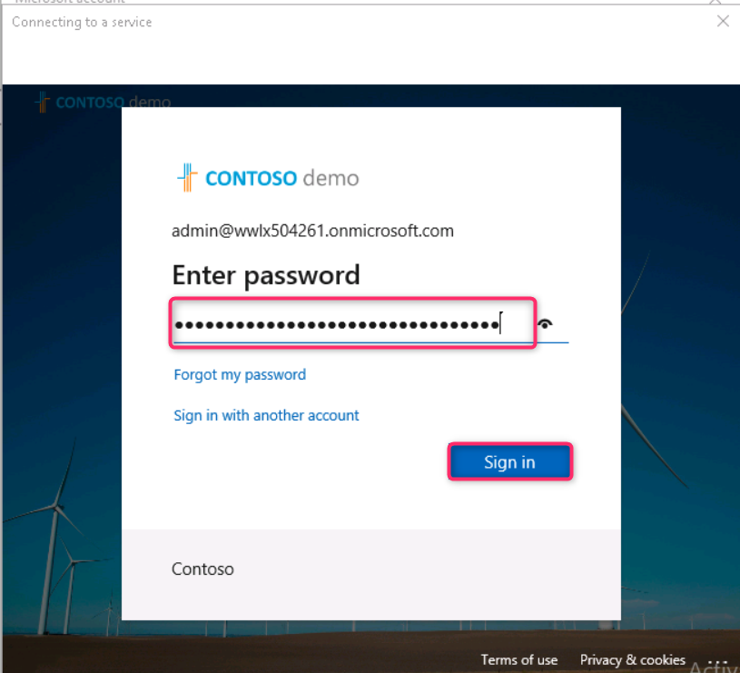

9.  Na caixa de diálogo **Stay signed in?**, clique no botão **Yes**.

> 

10. Caso a caixa de diálogo **Setting up your device** seja exibida, selecione **Got it**.

> 

11. Agora vá para **Windows settings** \> **Accounts** \> **Access work or school** \> **Connected to Contoso MDM** \> **Info** \> **Sync**.

> 
>
> 

12. Clique no símbolo do Windows na sua VM. Selecione o usuário **Admin** e selecione **Sign out**.

> 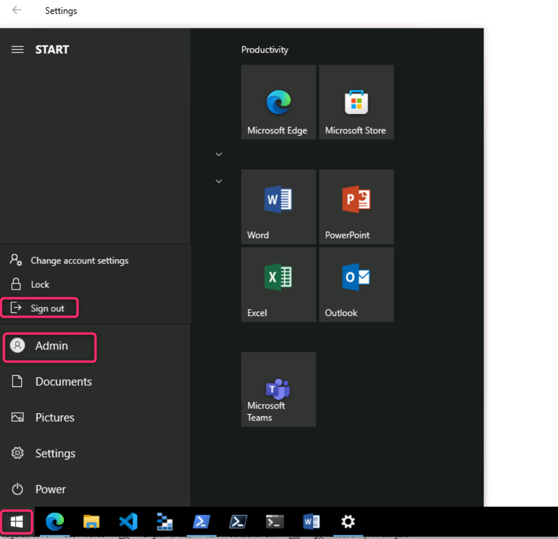

13. Na tela de usuários, selecione **Other user**.

> 

14. Insira suas credenciais do O365 fornecidas na página inicial do ambiente do laboratório e faça login na VM como **MOD Administrator**.

> 

15. Faça login em https://purview.microsoft.com usando sua conta **MOD Administrator** na VM do laboratório.

16. No portal do **Microsoft Purview**, navegue e selecione **Settings** \> **Device onboarding** \> **Devices**. Clique em **Turn on Device onboarding**.

17. Na caixa de diálogo **Turn on device onboarding**, clique no botão **OK**.

> 

18. Na caixa de diálogo **Device monitoring is being turned on**, clique no botão **OK**.

> 

19. Aguarde alguns minutos e, em seguida, atualize a página.

> 
>
> 

20. Em **Settings** \> **Device onboarding** \> **Onboarding**, clique em **Download package**.

> 

21. Após o download, copie o arquivo para a área de trabalho. Clique com o botão direito no arquivo e selecione **Extract all…**, em seguida clique no botão **Extract.**

> 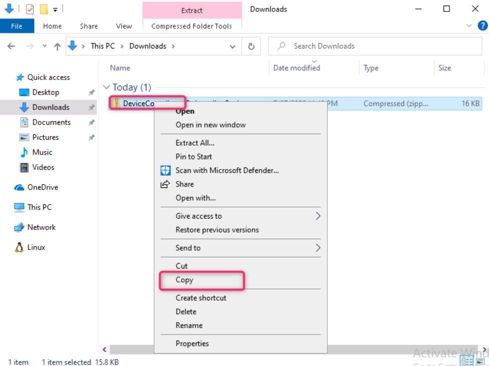
>
> 
>
> 

22. Após a extração, abra a pasta e execute o arquivo com privilégios de **administrador**.

> 

23. Caso a caixa de diálogo **Search for app in the Store?** seja exibida, clique no botão **Yes**; caso contrário, ignore.

24. Na caixa de diálogo **The publisher could not be verified. Are you sure you want to run this software?**, clique no botão **Run**.

> 

25. Caso a caixa de diálogo **User Account Control** seja exibida, clique no botão **Yes**.

> 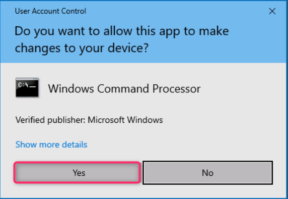

26. No Command Prompt, pressione **Y** e pressione Enter para confirmar. Você receberá uma mensagem informando que o dispositivo foi integrado. No Command Prompt, ao receber a mensagem **Press any key to continue . . .**, pressione qualquer tecla.

> 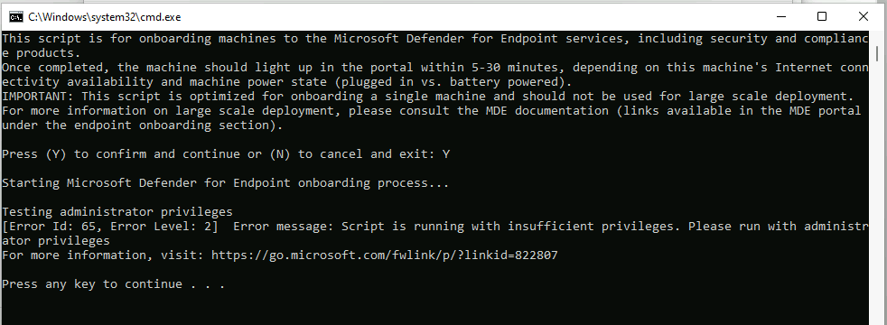

27. Após o fechamento do Prompt de Comando, abra o Prompt de Comando em modo administrador digitando **cmd** na barra de pesquisa do Windows, clicando com o botão direito em **Prompt de Comando** e selecionando **Run as administrator**.

> 

28. Na caixa de diálogo **User Account Control**, clique no botão **Yes**.

> 

29. Execute um teste de detecção executando o seguinte comando. A janela do Command Prompt será fechada automaticamente.

> powershell.exe -NoExit -ExecutionPolicy Bypass -WindowStyle Hidden \$ErrorActionPreference= 'silentlycontinue';(New-ObjectSystem.Net.WebClient).DownloadFile('http://127.0.0.1/1.exe','C:\test-WDATP-test\invoice.exe');Start-Process 'C:\test-WDATP-test\invoice.exe'
>
> 

30. Feche a conexão da VM.

31. Abra as configurações clicando em **Settings** no menu de navegação e selecione **Devices Onboarding** \> **Devices**.

> **Observação:** embora normalmente leve cerca de 60 segundos para a integração de dispositivos ser habilitada, permita até 30 minutos.

32. Você poderá verificar a lista em **Devices**. A lista ficará vazia até que os dispositivos sejam integrados; após isso, você poderá visualizar suas VMs listadas como dispositivos integrados.

**Tarefa 1 – Criar uma política para toda a organização para detectar e pontuar o uso arriscado do navegador**

**Etapa 1 – Criar uma nova política**

1.  No portal do Microsoft Purview, clique em Solutions e, em seguida, clique em **Insider Risk Management**.

> 

2.  Clique em **Policies**. Na página Policies, clique em **+ Create policy** \> **Custom policy**.

> 

3.  Na página Choose a policy template, escolha Risky browser usage (preview), em Risky browser usage (preview).

> 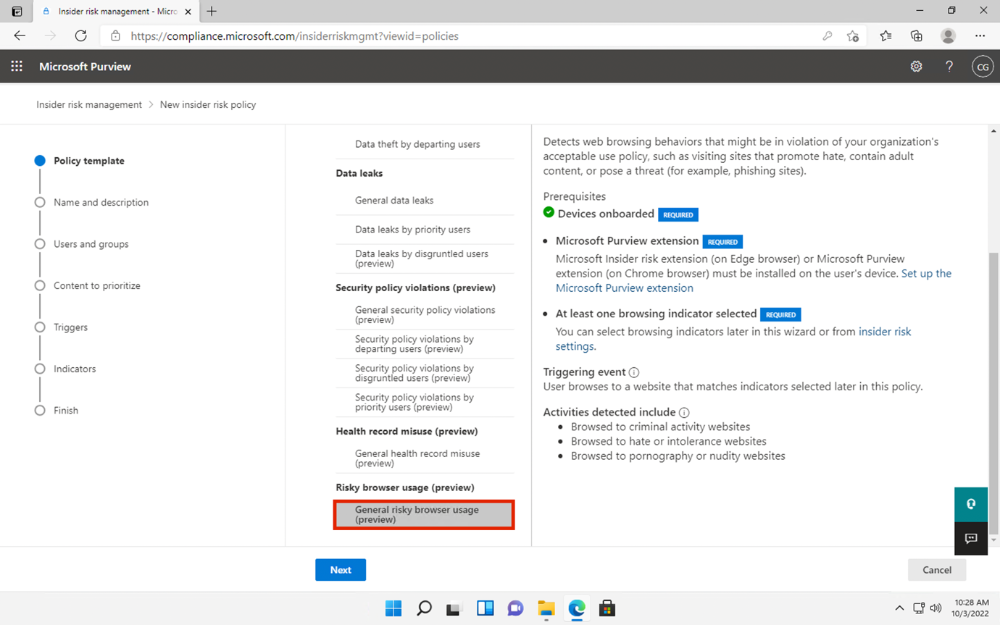

4.  Revise todos os pré-requisitos.

> 

5.  Selecione **Next** para continuar.

> 

6.  Na página **Name and description**, preencha os seguintes campos:

    - Name: Risky usage of browser

    - Description: This is a test policy for the risky browser usage

7.  Selecione **Next** para continuar.

> 

8.  Na página **Choose users, groups, & adaptive scopes**, selecione **All users, groups, & adaptive scopes**. Selecione **Next** para continuar.

> 

9.  Na página **Exclude users and groups**, selecione **Next**.

> 

10. Na página Decide whether to prioritize, selecione **I don't want to priority content right now**. Selecione **Next** para continuar.

> 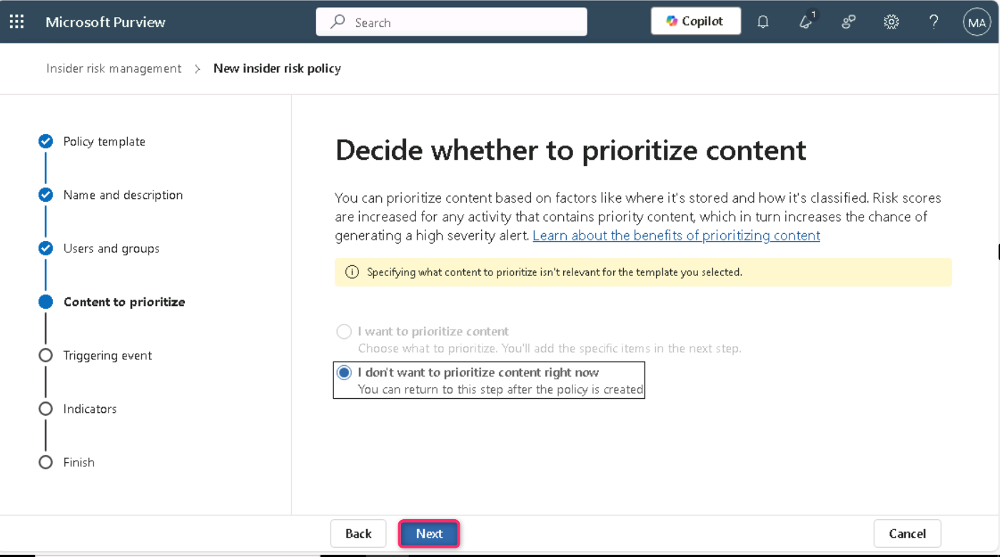

11. Na página **Choose triggering event for this policy**, selecione o botão **Turn on indicators**.

> 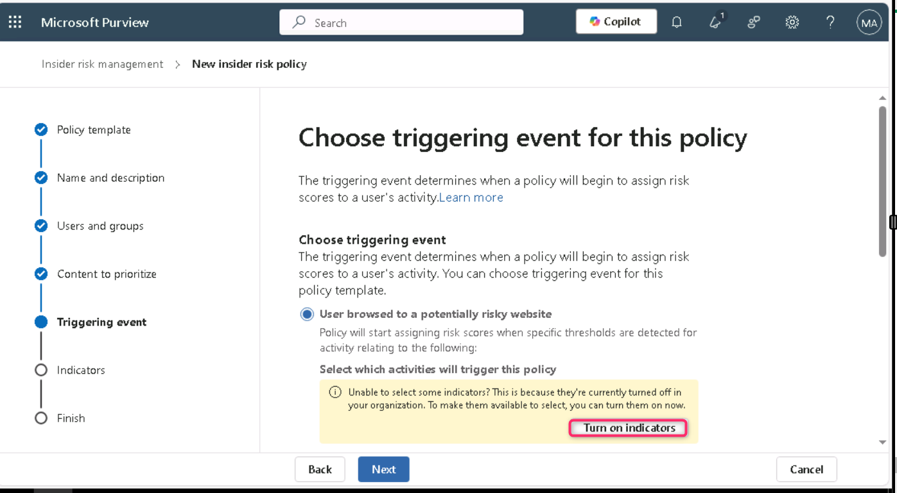

12. Na caixa de diálogo **Turn on indicators for your organization**, role a página para baixo e clique no botão **Choose indicators to turn on**.

> 
>
> 

13. Na caixa de diálogo **Choose indicators to turn on**, certifique-se de que, em Risky browsing indicators (preview), todos os indicadores estejam selecionados.

> 
>
> 

14. Role a página para baixo e selecione **Save**.

15. Na página **Choose triggering event for this policy**, certifique-se de que o botão de opção ao lado de **User browsed to a potentially risky website** esteja selecionado. Em **Select which activities will trigger this policy**, selecione todas as opções e clique no botão **Next**.

> 

16. Na página **Choose thresholds for triggering events**, selecione o botão de opção **Choose your own thresholds**, altere todos os limites para 1 per day e selecione **Next**.

> 
>
> 

17. Na página **Indicators**, selecione **Next**.

> 

18. Na página **Choose threshold type for indicators**, certifique-se de que **Apply thresholds provided by Microsoft** esteja selecionado e clique no botão **Next**.

> 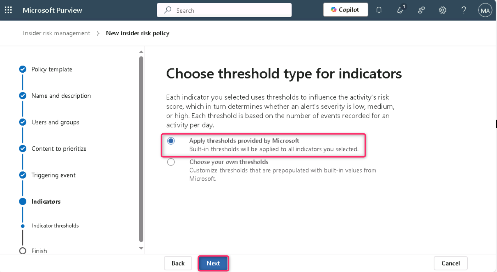

19. Na página **Review settings and finish**, selecione **Submit**.

> 

20. Na página **Your policy was created**, selecione **Done**.

> 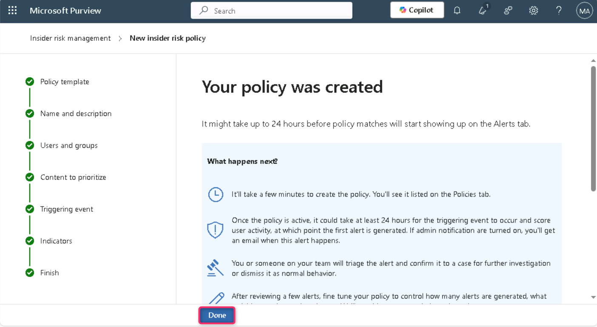

21. Mantenha a guia aberta e continue para a próxima tarefa.

**Etapa 2 – Avalie a política**

1.  Clique na nova política chamada Risky usage of browser. Selecione **Start scoring activity for users**.

> 

2.  No campo Reason for scoring activity, insira Testing the policy. No campo **Scoring activity for this many days (between 5 and 30)**, selecione **10 days**.

> 

3.  No campo Score activity for these users, digite MOD e selecione MOD administrator.

> 

4.  Em seguida, clique no botão **Start scoring activity**.

> 

5.  Clique no botão **Close**.

> 

**Tarefa 2 – Roubo de dados por usuários que estão saindo da empresa**

**Etapa 1 – Criar uma nova política**

1.  Na página **Policies**, clique em **+ Create policy** e selecione **Custom policy**.

> 

2.  Na página Choose a policy template, escolha Data theft by departing users, em Data theft. Selecione Next para continuar.

> 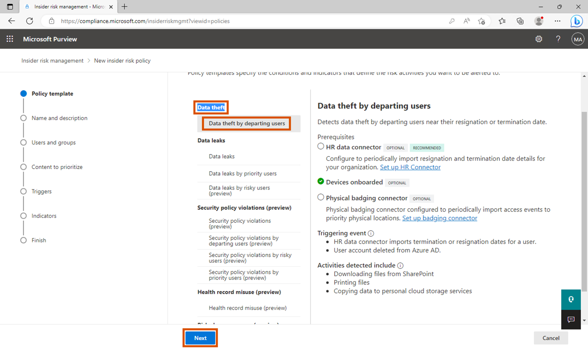

3.  Na página **Name and description**, preencha os seguintes campos:

    - Name: Data theft by a user

    - Description: This is a test policy for preventing data theft

4.  Selecione **Next** para continuar.

> 

5.  Na página **Choose users, groups, & adaptive scopes**, selecione o botão de opção ao lado de \*\* All users, groups, and adaptive scopes\*\*, e clique no botão **Next**.

\

6.  Na página **Exclude users and groups (optional)**, clique no botão **Next**.

\

7.  Na página **Decide whether to prioritize content**, selecione **I want to prioritize content**. Marque apenas as caixas **Sensitivity labels** e **Sensitive info types**. Selecione **Next** para continuar.

> 

8.  Na página **Sensitivity labels to prioritize**, selecione **Add or edit sensitivity labels**. Na barra de pesquisa **Add or edit sensitivity labels**, digite employee e pressione Enter, selecione **Internal/Employee data (HR)** e selecione **Add**. Em seguida, clique em **Next**.

> 

9.  Na página **Sensitive info types to prioritize**, selecione **Add or edit sensitive info types**. No painel lateral, procure e selecione **Credit Card Number**, **Contoso Employee ID** e **Contoso Employee EDM**. Selecione **Add** e, em seguida, clique em **Next**.

> 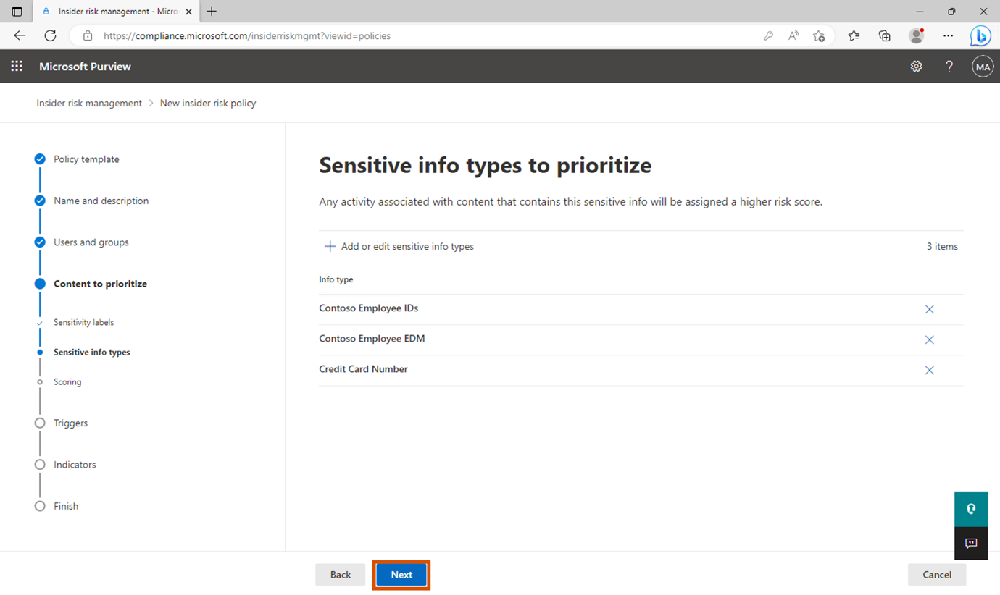

10. Na página **Decide whether to score only activity with priority content**, certifique-se de que **Get alerts for all activity** esteja selecionado. Em seguida, clique no botão **Next**.

> 

11. Na página **Choose triggering event for this policy**, mantenha a seleção padrão e clique em **Next**.

> 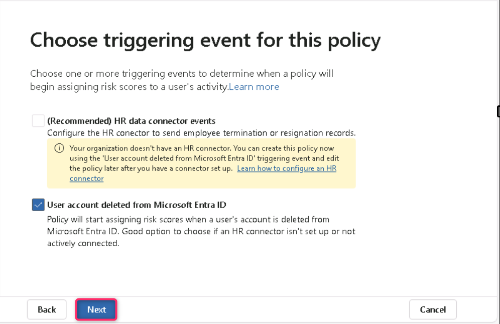

12. Na página **Indicators**, clique no menu suspenso ao lado de **Office indicators (31/31 selected)**.

> 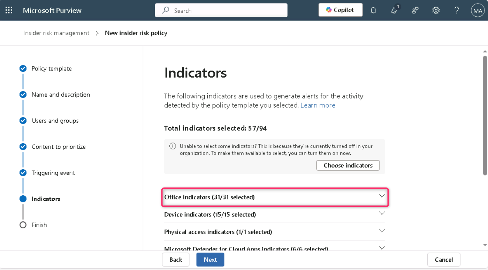

13. Certifique-se de que todos os Office indicators estejam selecionados e clique no botão **Next**.

> 

14. Mantenha todos os parâmetros da página **Detection options** no estado padrão e clique no botão **Next**.

> 

15. Na página **Choose threshold type for indicators**, selecione o botão de opção **Choose your own thresholds**, role a página e clique no menu suspenso **Office indicators**.

> 
>
> 

16. Em **Sharing SharePoint files with people outside the organization**, utilize 1, 2 e 3 eventos para cada estágio, respectivamente, e selecione **Next**.

> 

17. Na página **Review settings and finish**, clique no botão **Submit**.

> 

18. Na página Your policy was created, selecione Done.

> 

**Etapa 2 – Avaliar a política**

1.  Clique na nova política chamada **Data theft by a user**. Selecione **Start scoring activity for users**.

> 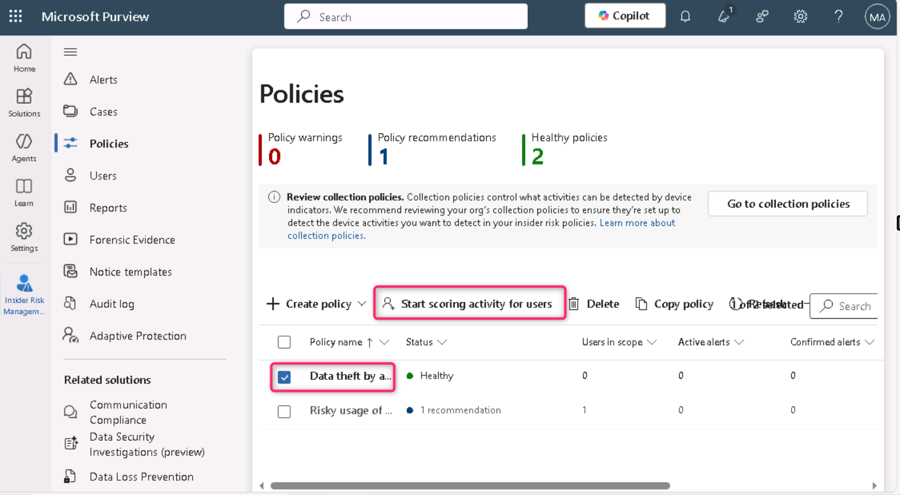

2.  No campo Reason for scoring activity, Testing the policy. No campo **Scoring activity for this many days (between 5 and 30)**, selecione **10 days**.

> 

3.  No campo Score activity for these users, digite MOD e então selecione MOD administrator.

> 

4.  Em seguida, clique no botão **Start scoring activity**.

> 

5.  Clique no botão **Close**.

> 

**Tarefa 3 – Vazamentos de dados por usuários**

**Etapa 1 – Criar uma nova política**

1.  Na página **Policies**, clique em **+ Create policy** e selecione **Custom policy**.

> 

2.  Na página **Choose a policy template**, escolha **Data leaks**, em **Data leaks**. Selecione **Next** para continuar.

> 

3.  Na página **Name and description**, preencha os seguintes campos:

    - Name: Data leaks by a user

    - Description: This is a test policy for preventing data leaks

4.  Selecione **Next** para continuar.

> 

5.  Na página **Choose users, groups, & adaptive scopes**, certifique-se de que o botão de opção **All users, groups, and adaptive scopes** esteja selecionado e clique no botão **Next** para continuar.

> 

6.  Na página **Exclude users and groups (optional)**, clique no botão **Next**.

7.  Na página **Decide whether to prioritize**, selecione **I want to priority content**. Marque as caixas **SharePoint sites**, **Sensitivity labels** e **Sensitive info types**. Clique no botão **Next**.

> 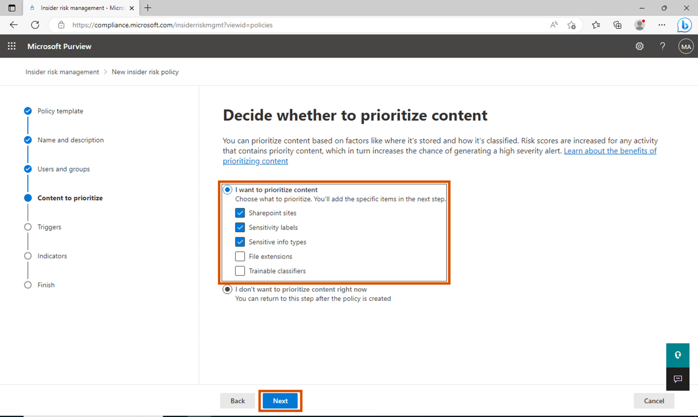

8.  Na página **SharePoint sites to prioritize**, selecione **Add or edit SharePoint sites**. No painel lateral, digite https://WWLxXXXXXX.sharepoint.com/sites/ContosoWeb1, marque a caixa ao lado de **Contoso Web 1** e clique no botão **Add**. Em seguida, clique em **Next**.

> **Observação**: o prefixo do locatário **XXXXXX** está disponível na guia **Resources**.
>
> 
>
> 
>
> 

9.  Na página **Sensitivity labels to prioritize**, selecione **Add or edit sensitivity labels**. No painel lateral, digite employee, marque a caixa Internal/Employee data (HR) e clique no botão **Add**. Em seguida, clique no botão **Next**.

> 
>
> 

10. Na página **Sensitive info types to prioritize**, selecione **Add or edit sensitive info types**. No painel lateral, procure e selecione Credit Card Number, Contoso Employee ID e Contoso Employee EDM. Selecione **Add** e, em seguida, clique em **Next**.

\

11. Na página **Decide whether to score only activity with priority content**, selecione **Get alerts for all activity**. Selecione **Next**.

> 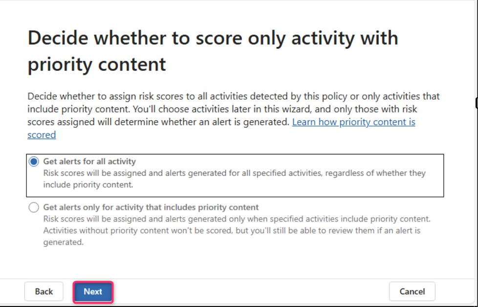

12. Na página **Choose triggering event for this policy**, certifique-se de que o botão de opção **User performs an exfiltration activity** esteja selecionado. Em **Select which activities will trigger this policy**, selecione **Download content from SharePoint**, **Sending email with attachments to recipients outside the organisation** e **Sharing SharePoint files with people outside the organization**, e selecione **Next**.

> 
>
> 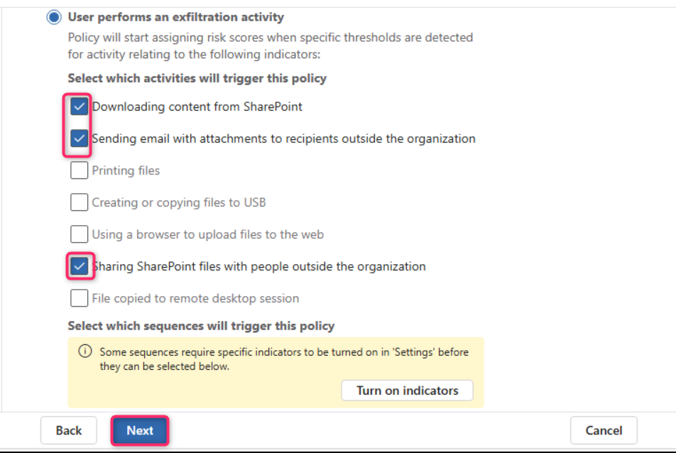

13. Na página **Choose thresholds for triggering events**, selecione o botão de opção **Choose your own thresholds**, defina todos os limites como 1 e selecione **Next**.

> 
>
> 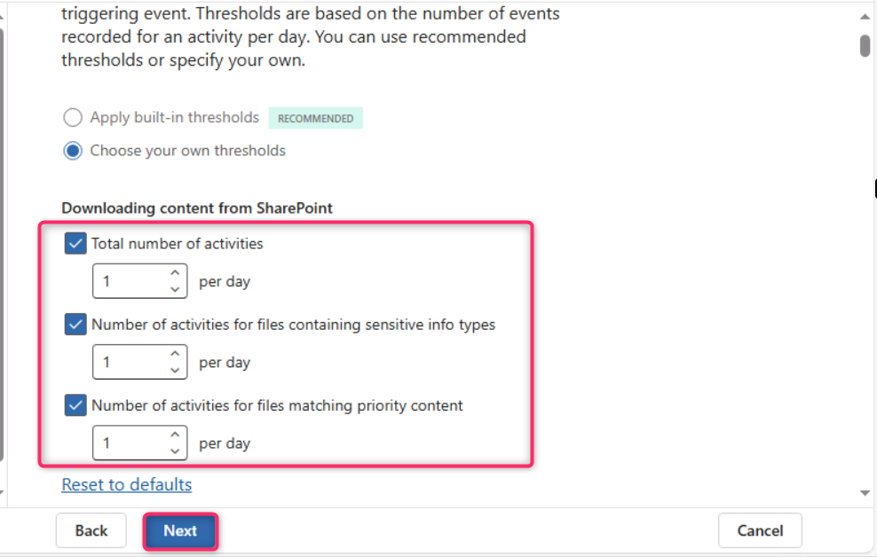

14. Mantenha as configurações padrão na página **Indicators** e selecione **Next**.

> 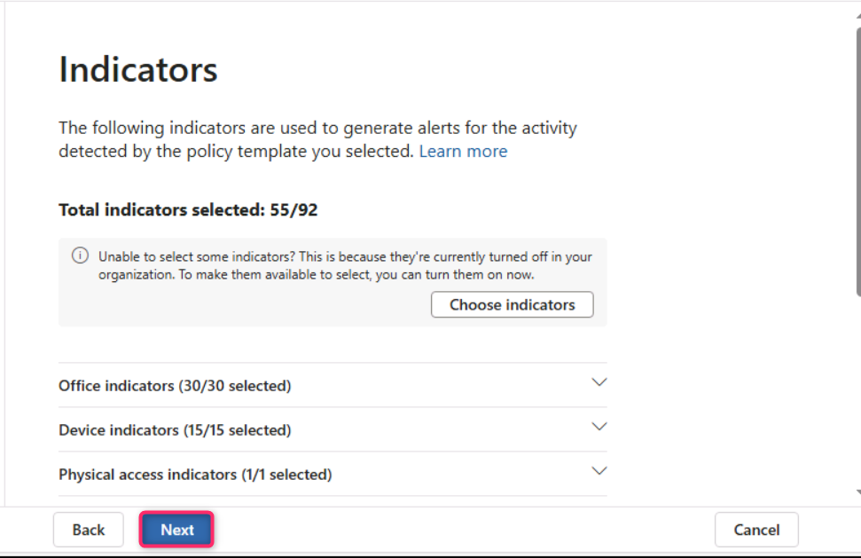

15. Mantenha as configurações padrão na página **Detection options** e selecione **Next**.

> 

16. Na página **Choose threshold type for indicators**, certifique-se de que o botão de opção **Choose your own thresholds** esteja selecionado. Em seguida, clique em Office indicators, utilize 1, 2 e 3 eventos para cada estágio, respectivamente, e selecione **Next**.

> 
>
> 
>
> 

17. Na página **Review settings and finish**, selecione **Submit**.

> 

18. Na página Your policy was created, selecione Done.

> 

**Etapa 2 – Avaliar a política**

1.  Na página **Policies**, marque a caixa ao lado da nova política chamada **Data leaks by a user**. Em seguida, selecione **Start scoring activity for users**.

> 

2.  No campo Reason for scoring activity, digite Testing the policy. No campo **Scoring activity for this many days (between 5 and 30)**, selecione **10 days**. No campo Score activity for these users, digite MOD e selecione MOD administrator.

> 
>
> 

3.  Em seguida, clique no botão **Start scoring activity**.

> 

4.  Clique no botão **Close**.

> 

**Resumo:**

Neste laboratório, você primeiro preparou o ambiente sincronizando os relógios das VMs e integrando os usuários e dispositivos necessários para o Insider Risk Management no Microsoft Purview. Você habilitou insights analíticos e verificou a versão do cliente antimalware Defender em todas as VMs de destino. Após integrar os dispositivos, você criou três políticas diferentes de Insider Risk Management para monitorar e pontuar atividades relacionadas ao uso arriscado do navegador, possível roubo de dados por usuários que estão saindo da empresa e vazamentos de dados por usuários internos. Cada política foi personalizada com rótulos de confidencialidade, sites do SharePoint e sensitive information types como conteúdo prioritário, e os limites foram configurados para acionar alertas e pontuação. Por fim, você iniciou atividades de pontuação para simular cenários reais de risco interno e avaliar a eficácia das políticas configuradas.
