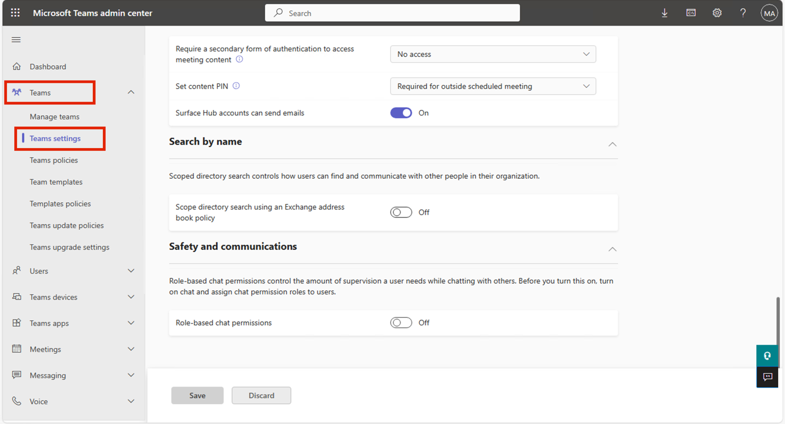
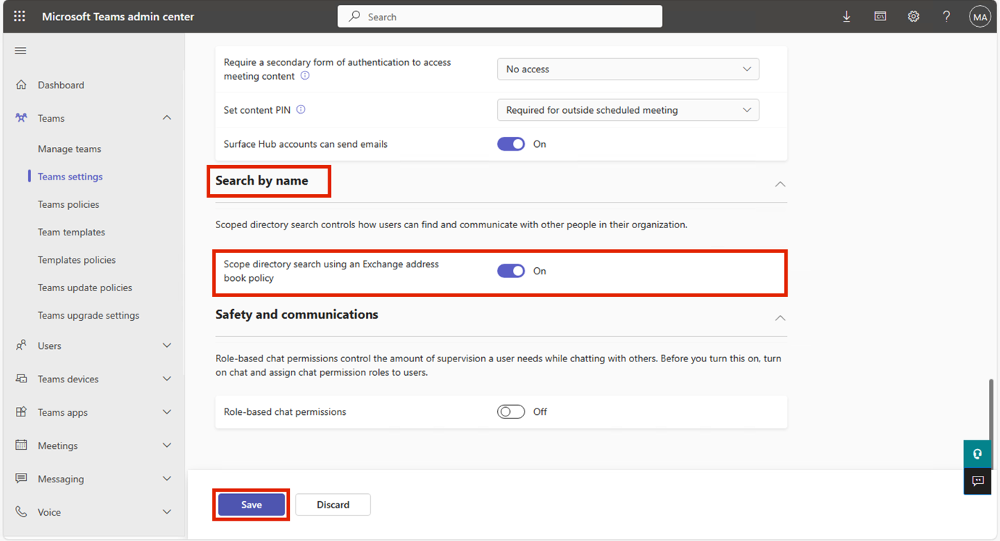
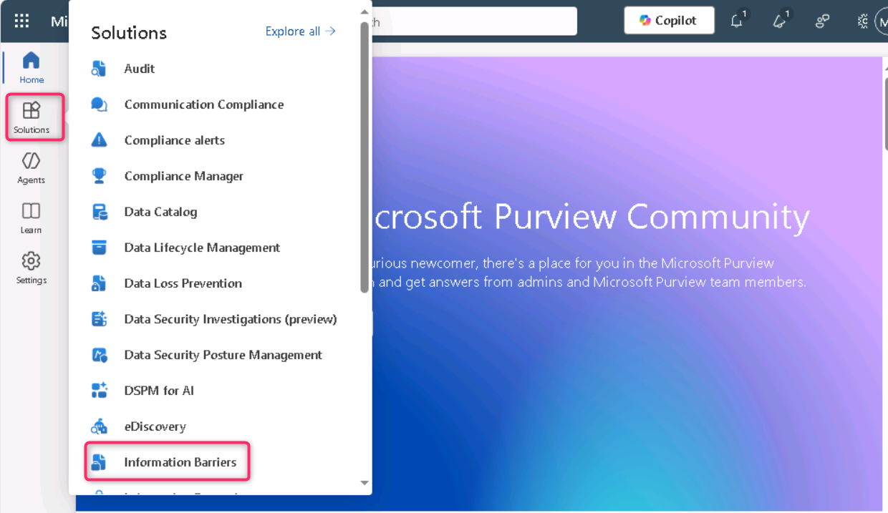
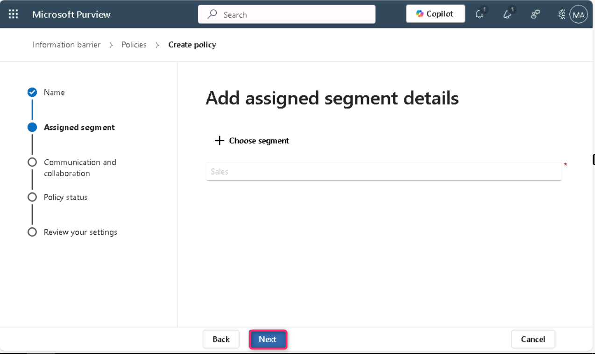
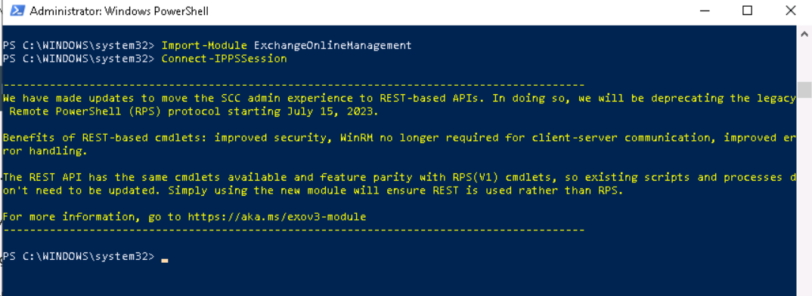

**Laboratório 8 - Configuração de Information Barriers**

**Introdução**

A Contoso tem cinco departamentos: *RH*, *Vendas*, *Marketing*, *Pesquisa* e *Manufatura*. Para manter a conformidade com os regulamentos do setor, os usuários de alguns departamentos não devem se comunicar com outros departamentos, conforme listado na tabela a seguir:

| **Segmento** | **Pode se comunicar com** | **Não é possível se comunicar com** |
|----|----|----|
| RH | Everyone | (sem restrições) |
| Vendas | RH, Marketing, Manufatura | Pesquisa |
| Marketing | Todos | (sem restrições) |
| Pesquisa | RH, Marketing, Manufatura | Vendas |
| Fabricação | RH, Marketing | Qualquer pessoa que não seja da área de RH ou Marketing |

Para essa estrutura, o plano da Contoso inclui três políticas de IB:

1.  Uma política de IB criada para impedir que Vendas se comunique com a Pesquisa

2.  Outra política do IB para impedir que a Pesquisa se comunique com Vendas.

3.  Uma política de IB criada para permitir que a Manufatura se comunique apenas com RH e Marketing.

**Objetivos**

- Configurar segmentos organizacionais usando PowerShell para a implementação de Information Barriers (IB).

- Habilitar a pesquisa de diretório com escopo no Microsoft Teams para impor a visibilidade de usuários baseada em segmentos.

- Criar políticas de Information Barriers (IB) por meio do portal do Microsoft Purview e do PowerShell para controlar a comunicação entre segmentos.

**Exercício 1 - Pré-requisitos**

**Tarefa 1 - Criar segmentos para usuários em sua organização**

1.  Clique com o botão direito no ícone do Windows e navegue até **Windows PowerShell (Admin)**. 

> 

2.  Na caixa de diálogo **User Account Control**, clique em **Yes**.

> 

3.  Execute o seguinte comando:

> Install-Module ExchangeOnlineManagement

4.  Se for solicitado ‘**Do you want PowerShellGet to install and import the NuGet provider now?**’ e ‘**Are you sure you want to install the modules from 'PSGallery'?**’ digite **y** e pressione Enter.

> 

5.  Execute o seguinte commando:

> Import-Module ExchangeOnlineManagement
>
> 

6.  Agora, execute o comando a seguir para se conectar ao Exchange Online:

> Connect-IPPSSession
>
> 

7.  Faça login usando as credenciais do **MOD Administrator** fornecidas na página inicial do ambiente do laboratório.

> **Observação**: Se a Caixa de diálogo, **Automatically sign in to all desktop apps and websites on this device?** for exibida, clique em **No, this app only**. **only** button.
>
> 
>
> 

8.  Execute o seguinte comando, um a um, no **PowerShell** para criar a estrutura organizacional:

> New-OrganizationSegment -Name "HR" -UserGroupFilter "Department -eq 'HR'"
>
> 
>
> New-OrganizationSegment -Name "Sales" -UserGroupFilter "Department -eq 'Sales'"
>
> New-OrganizationSegment -Name "Marketing" -UserGroupFilter "Department -eq 'Marketing'"
>
> New-OrganizationSegment -Name "Research" -UserGroupFilter "Department -eq 'Research'"
>
> New-OrganizationSegment -Name "Manufacturing" -UserGroupFilter "Department -eq 'Manufacturing'"

**Tarefa 2 - Habilitar a pesquisa de diretório com escopo no Microsoft Teams**

Para ativar a pesquisa por nome

1.  Vá para o centro de administração do Microsoft Teams acessando https://admin.teams.microsoft.com, selecione **Teams** \> **Teams settings**.

> 

2.  Em **Search by name**, ao lado de **Scope directory search using an Exchange address book policy**, **ative** o botão de alternância. Selecione **Save**.

> 

3.  Se a caixa de diálogo **Changes might take some time to take effect for** exibida, clique em **Confirm**.

> 

**Exercício 2 - Criar políticas de IB**

**Tarefa 1 - Bloquear comunicações entre segmentos**

1.  No portal do Microsoft Purview, clique em **Solutions** \> **Information barriers**.

> 

2.  No painel Information Barriers, clique em **Policies**. Na página **Policies**, selecione **+ Create policy** para criar e configurar uma nova política de IB.

> 

3.  Na página **Provide a policy name**, no campo **Name**, insira—Sales-Research. Em seguida, selecione **Next**.

> 

4.  Na página **Add assigned segment details**, selecione **Choose segment**. No painel **Select assigned segment for this policy**, selecione **Sales**. Em seguida, selecione **Add** para adicionar o segmento selecionado à política. Você pode selecionar apenas um segmento.

> 

5.  Selecione **Next**.

> 

6.  Na página **Configure Communication and collaboration details**, selecione **Block**. Selecione **Choose segment**, selecione **Research** e, em seguida, selecione **Add.**

> 
>
> 

7.  Em seguida, clique no botão **Next**.

> 

8.  Na página **Configure Policy status**, alterne o status da política ativa para **On**. Selecione **Next** para continuar.

> 

9.  Na página **Review your settings**, revise as configurações escolhidas para a política e quaisquer sugestões ou avisos relacionados às suas seleções. Selecione **Submit** para criar a política.

> 

10. Selecione **Done** quando a política for criada.

> 

11. A política de IB Sales-Research foi criada com sucesso.

> 

**Tarefa 2 - Criar políticas de IB por meio do PowerShell**

1.  Retorne ao **Administrator: Windows PowerShell** e execute o seguinte comando:

> Import-Module ExchangeOnlineManagement
>
> 

2.  Agora, execute o seguinte comando para se conectar ao Exchange Online.

> Connect-IPPSSession
>
> 

3.  Faça login usando as credenciais do **MOD Administrator** fornecidas na página inicial do ambiente do laboratório.

> **Observação**: caso a caixa de diálogo, **Automatically sign in to all desktop apps and websites on this device?** seja exibida, clique no botão **No, this app only**.
>
> 
>
> 

4.  Execute o seguinte comando para criar uma política de IB chamada **Research-Sales**. Quando essa política estiver ativa e aplicada, ela ajudará a impedir que os usuários do segmento **Research** se comuniquem com os usuários do segmento **Sales**.

> New-InformationBarrierPolicy -Name "Research-Sales" -AssignedSegment "Research" -SegmentsBlocked "Sales" -State Inactive
>
> 
>
> 

5.  Execute o comando a seguir para criar uma política de IB chamada **Manufacturing-HRMarketing**. Quando essa política estiver ativa e aplicada, a **Manufatura** poderá se comunicar somente com **RH** e **Marketing**. O RH e o Marketing não estão impedidos de se comunicar com outros segmentos.

> New-InformationBarrierPolicy -Name "Manufacturing-HRMarketing" -AssignedSegment "Manufacturing" -SegmentsAllowed "HR","Marketing","Manufacturing" -State Inactive
>
> 
>
> 

6.  Volte ao portal do Microsoft Purview, atualize a página Information Barriers – Policies e você poderá ver as políticas que criou usando o PowerShell.

> 

**Resumo**

Neste laboratório, você criou segmentos organizacionais (RH, Vendas, Marketing, Pesquisa e Manufatura) usando o PowerShell e habilitou a pesquisa de diretório com escopo no Microsoft Teams para alinhar a visibilidade do usuário com as restrições do segmento. Em seguida, você configurou políticas IB no Microsoft Purview para bloquear ou permitir a comunicação entre segmentos específicos (por exemplo, bloquear a comunicação entre Vendas e Pesquisa). Essas políticas foram criadas tanto pelo portal quanto pelo PowerShell para fins de experiência prática.
