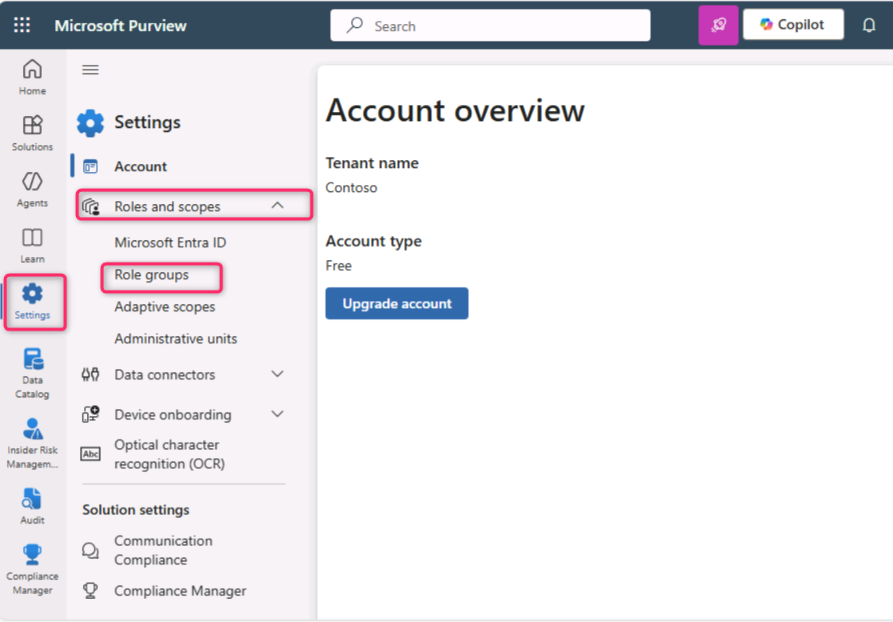
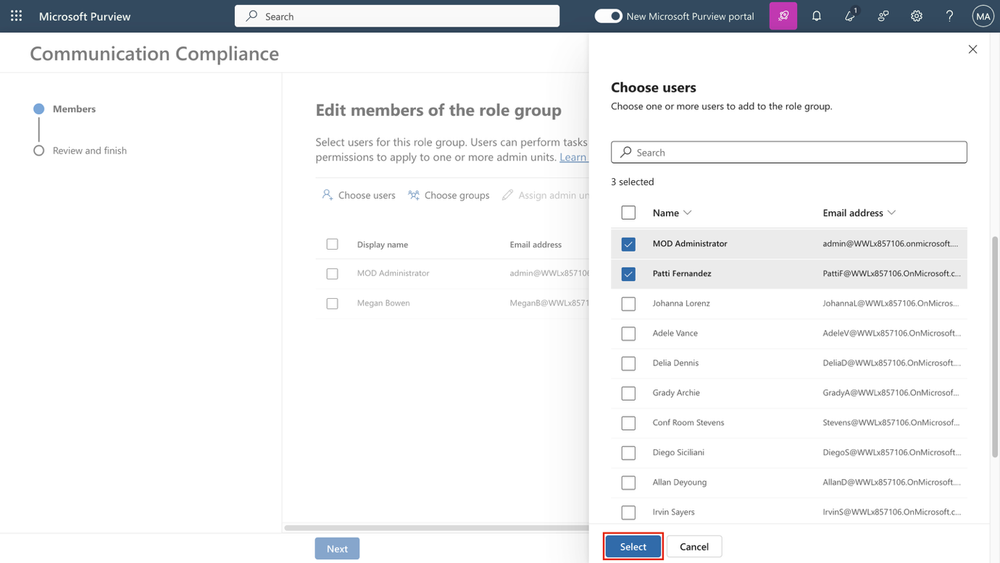
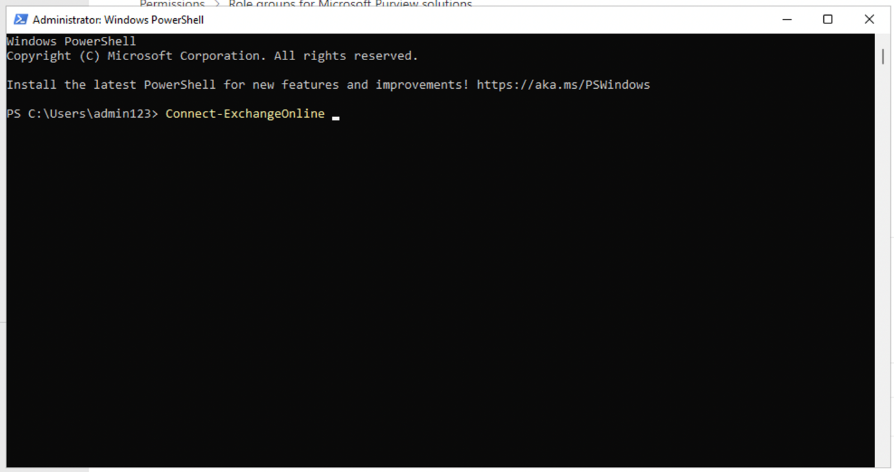
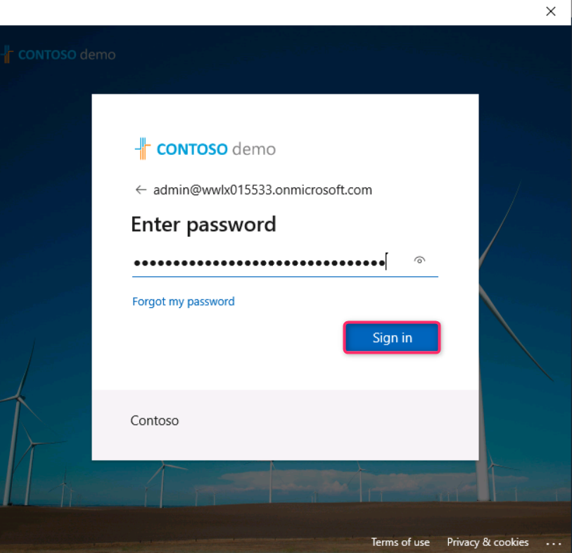
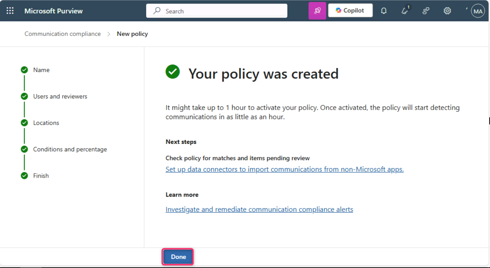
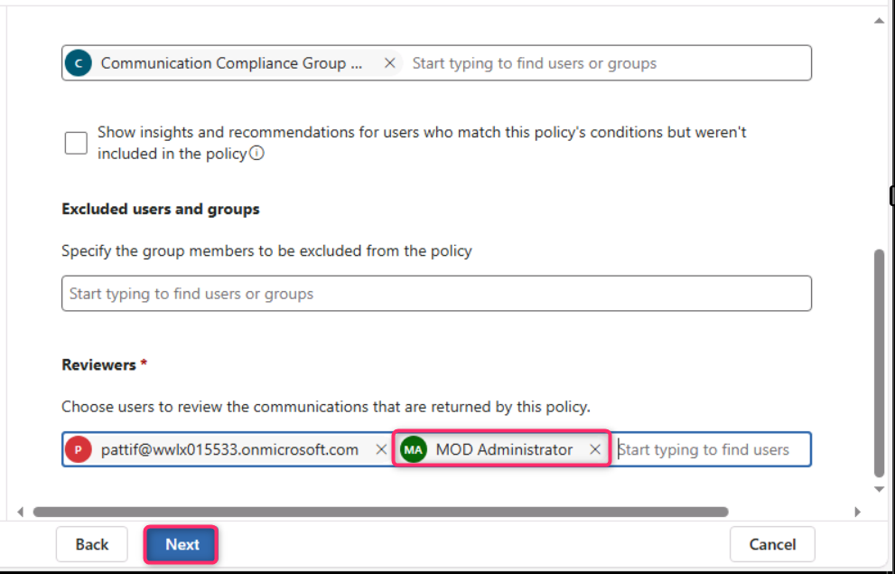
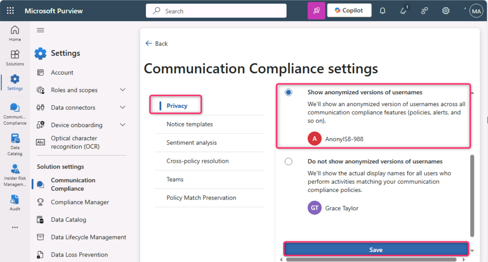

**Laboratório 9 – Configurando o Communication Compliance**

**Introdução**

Neste laboratório, você configurará uma política de conformidade para detectar qualquer informação confidencial que esteja sendo comunicada pelos usuários da sua organização. Você usará os sensitive info types criados no laboratório anterior para detectar os dados de saúde dos funcionários ou os IDs dos funcionários que estão sendo comunicados por e-mail.

**Objetivos**

- Atribuir funções para acesso à communication compliance.

- Criar grupos de distribuição usando o PowerShell.

- Configurar e editar políticas de communication compliance.

- Habilitar anonimização e notificações aos usuários.

- Compreender o processo de teste de políticas.

**Exercício 1 – Habilitar permissões para Communication Compliance**

Nesta tarefa, você atribuirá usuários a grupos de funções específicos para segmentar o acesso e as responsabilidades do Communication Compliance entre diferentes usuários da organização.

1.  No menu de navegação, selecione **Settings** e, em seguida, **Roles and scopes**. Navegue e clique em **Role groups.**

> 

2.  Role a página para baixo e marque a caixa de seleção ao lado de **Communication Compliance**. Em seguida, clique no ícone de lápis para **Edit**.

> 

3.  Na página **Edit members of the role group**, selecione **Choose Users**.

> 

4.  Certifique-se de selecionar **MOD Administrator**, **Megan Bowen** e **Patti Fernandez**. Em seguida, selecione **Select**.

> 

5.  Selecione **Next**.

> 

6.  Selecione **Save** para adicionar os usuários ao grupo de funções. Selecione **Done** para concluir as etapas.

> 
>
> 

**Exercício 2 – Configurar grupos para Communication Compliance**

Na política, você usará endereços de e-mail para identificar indivíduos ou grupos de pessoas. Para simplificar a configuração, você pode criar grupos para usuários cujas comunicações serão revisadas e grupos para usuários que revisarão essas comunicações.

Você pode usar PowerShell para configurar um grupo de distribuição para uma política global de Communication Compliance. Isso permite detectar mensagens de milhares de usuários com uma única política e manter a política atualizada conforme novos colaboradores ingressam na organização.

1.  Clique com o botão direito no ícone do Windows e selecione **Windows PowerShell (Admin)**

> 

2.  Na caixa de diálogo User Account Control, selecione **Yes**.

> 

3.  Execute o seguinte cmdlet para usar o módulo **Exchange Online PowerShell** e conectar-se ao seu locatário:

> Connect-ExchangeOnline
>
> 

4.  Quando a janela **Sign in** for exibida, entre como **MOD Administrator**.\
    Se a caixa **Automatically sign in to all desktop apps and websites on this device?** aparecer, selecione **No, this app only**.

> 
>
> 

5.  Crie um grupo de distribuição dedicado para a política global de Communication Compliance com as seguintes propriedades:

    - **MemberDepartRestriction = Closed**. impede que os usuários se removam do grupo.

    - **MemberJoinRestriction = Closed**. impede que os usuários se adicionem ao grupo.

    - **ModerationEnabled = True**. Garante que todas as mensagens enviadas para esse grupo estejam sujeitas à aprovação e que o grupo não seja utilizado para comunicação fora da configuração da política de Communication Compliance.

> New-DistributionGroup -Name "Communication Compliance Group Contoso" -Alias "CCG_Contoso" -MemberDepartRestriction 'Closed' -MemberJoinRestriction 'Closed' -ModerationEnabled \$true

6.  

7.  **Observação:** você pode adicionar um **Exchange Custom Attribute**, conforme mostrado no comando a seguir, para acompanhar os usuários adicionados à política de Communication Compliance na sua organização.

8.  Set-DistributionGroup -Identity "Communication Compliance Group Contoso" -CustomAttribute1 "MonitoredCommunication"

9.  

10. Execute o seguinte script do PowerShell de forma recorrente para adicionar usuários à política de Communication Compliance:

11. \$Mbx = (Get-Mailbox -RecipientTypeDetails UserMailbox -ResultSize Unlimited -Filter {CustomAttribute9 -eq \$Null})

12. \$i = 0

13. ForEach (\$M in \$Mbx)

14. {

15. Write-Host "Adding" \$M.DisplayName

16. Add-DistributionGroupMember -Identity "Communication Compliance Group Contoso" -Member \$M.DistinguishedName -ErrorAction SilentlyContinue

17. Set-Mailbox -Identity \$M.Alias -CustomAttribute1 "MonitoredCommunication"

18. \$i++

19. }

20. Write-Host \$i "Mailboxes added to supervisory review distribution group."

> 

21. Após a geração da saída do script, abra uma nova guia e insira a seguinte URL: https://admin.cloud.microsoft/ para acessar o Centro de administração do Microsoft 365.

> Se for solicitado configurar a **autenticação multifator**, selecione **Skip for now**.

22. Na página do Centro de administração do Microsoft 365, navegue e clique em **Teams & groups** \> **Active teams & groups** \> **Distribution list** \> **Communication** **Compliance Group Contoso**.\*\*

> 

23. No painel Communication Compliance exibido no lado direito, clique na guia **Members**, role a página para baixo e revise todos os membros do grupo de Distribution list.

\

\

**Exercício 3 – Criar uma política de Communication Compliance**

1.  No portal do Microsoft Purview, selecione **Solutions** \> **Communication Compliance**.

> 

2.  No painel **Communication Compliance**, navegue e clique em **Policies**. Em seguida, na página **Policies**, selecione **+ Create policy** e clique em **Custom policy**.

> 

3.  No campo **Name**, insira My first communication compliance policy. No campo **Description**, insira This is a policy to test communication compliance. Selecione **Next**.

> 

4.  Na página **Choose users and reviewers**, role até a seção **Reviewers**, digite e selecione **Patti Fernandez**. Em seguida, clique no botão **Next**.

> 

5.  Na página **Choose locations to detect communications**, certifique-se de que todas as caixas de seleção em **Microsoft 365 locations** estejam selecionadas e, em seguida, clique no botão **Next**.

> 

6.  Na página **Choose conditions and review percentage**, role a página para baixo, selecione **Add condition** e, em seguida, navegue e selecione **Content contains sensitive info types**.

> 

7.  Na caixa **Content contains any of these sensitive info types**, selecione **Add**, clique em **Sensitive info types** e procure por **contoso**. Marque as caixas de seleção de todos os **Sensitive Information Types** criados nos laboratórios anteriores. Em seguida, clique em **Add**.

> 

8.  Role a página para baixo e selecione a caixa de seleção ao lado de **Use OCR to extract text from images**, defina **Review percentage** como **100%** e clique no botão **Next**.

> 

9.  Na página **Review and finish**, selecione **Create policy**.

> 

10. A página **Your policy was created** será exibida com orientações sobre quando a política será ativada e quais comunicações serão capturadas. Em seguida, clique no botão **Done**.

> 

**Exercício 4 – Editar uma política de Communication Compliance**

1.  Na página **Communication Compliance – Policies**, clique nas reticências ao lado de **My first communication compliance policy**, navegue e clique em **Edit**.

> **Observação**: caso você não visualize My first communication compliance policy, atualize a página.
>
> 

2.  Mantenha o **Name and describe your policy** a política conforme definidos anteriormente e clique no botão **Next**.

> 

3.  Na página **Choose users and reviewers**, navegue e selecione o botão de opção ao lado de **Select users**.

> 

4.  No campo **Start typing to find users or groups**, procure por **Communication** e selecione **Communication Compliance Groups Contoso**.

> 

5.  Na seção **Reviewers**, digite e selecione MOD Administrator. Selecione **Next** até chegar à página **Review and finish**.

> 

6.  Em seguida, clique no botão **Save**.

> 

**Exercício 5 – Criar modelos de notificação e configurar a anonimização de usuários**

1.  No portal do Microsoft Purview, selecione **Settings** no canto superior direito e, em seguida, navegue e selecione **Communication Compliance**.

> 

2.  Na página **Communication Compliance settings – Privacy**, para habilitar a anonimização, certifique-se de que o botão de opção **Show anonymized versions of usernames** esteja selecionado. Em seguida, clique no botão **Save**.

> **Observação**: caso o botão **Save** não esteja habilitado, selecione outro botão de opção de recurso e, em seguida, selecione novamente **Show anonymized versions of usernames**.
>
> 

3.  Selecione **Notice templates** e, em seguida, clique no símbolo **+** para criar um modelo de notificação.

> 

4.  Na página **Create a notice template**, preencha os seguintes campos:

    - Template name: Sample Notice

    - Send from: selecione **Patti Fernandez** digitando **Patti** e escolhendo o nome na lista suspensa.

    - Cc: selecione **MOD Administrator** digitando **MOD** e escolhendo o nome na lista suspensa.

    - Subject: Your communication violates company Communication compliance policy.

    - Message body: Please note this for future reference and provide an acceptable justification for your current communication.

5.  Selecione **Create** para criar e salvar o modelo de notificação.

> 

**Exercício 6 – Testar a política de Communication Compliance**

Na conta para teste, você não terá a permissão para enviar e-mails, mas pode seguir as etapas a seguir para entender como testar a política quando tiver suas próprias licenças. Você pode realizar as etapas, mas seus e-mails não poderão chegar ao destinatário a partir do seu locatário atual.

1.  Em uma nova janela no modo privado, abra o Outlook digitando o seguinte URL na barra de endereço: https://outlook.office365.com/mail/. Em seguida, faça login com o nome de usuário adelev@WWLxXXXXXX.onmicrosoft.com e a senha de usuário fornecida na guia **Resources**.

2.  Envie um e-mail para sua conta de e-mail pessoal com o seguinte corpo de mensagem.

> Subject Line: Patti Fernandez (EMP123456) on Medical Leave Due to Flu
>
> Message body: Employee Patti Fernandez EMP123456 is on absence because of the flu/influenza
>
> 
>
> **Observação:** as mensagens de e-mail podem levar aproximadamente 24 horas para serem totalmente processadas em uma política. As comunicações no Microsoft Teams, Yammer e plataformas de terceiros podem levar aproximadamente 48 horas para serem totalmente processadas em uma política.

Faça login em https://purview.microsoft.com/ como **Patti Fernandez**. Navegue até **Communication compliance** \> **Alerts** para visualizar os alertas das suas políticas após 24 horas.

**Resumo:**

Neste laboratório, você aprendeu a configurar e gerenciar o Communication Compliance no Microsoft Purview. Você atribuiu funções, criou grupos de distribuição usando PowerShell, configurou políticas para monitorar comunicações internas, habilitou anonimização, criou modelos de notificação e compreendeu como testar políticas antes da implementação completa.
