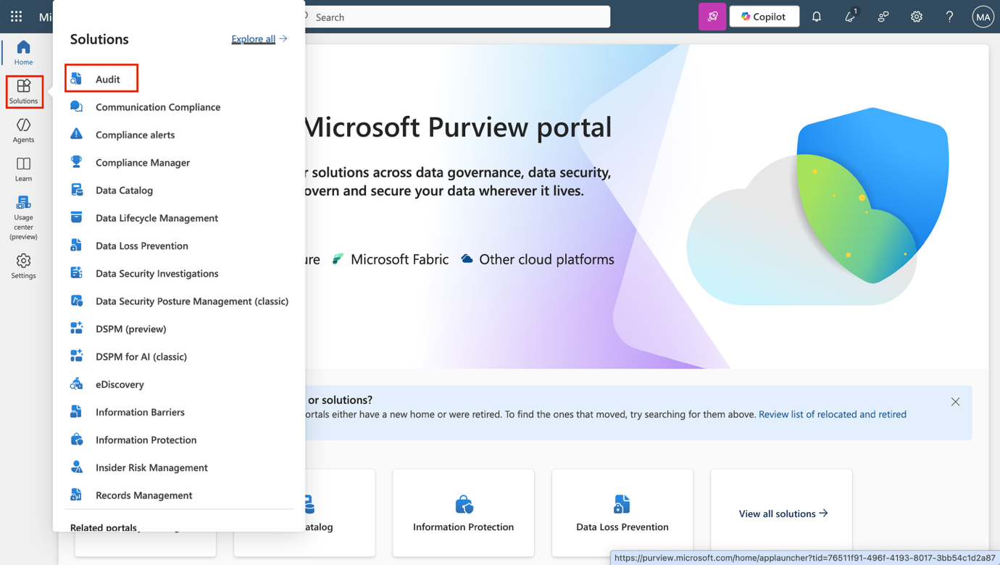
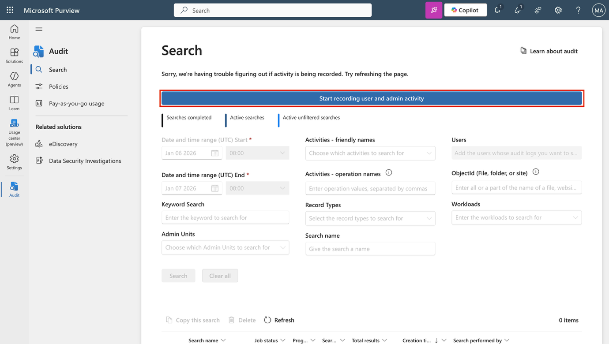
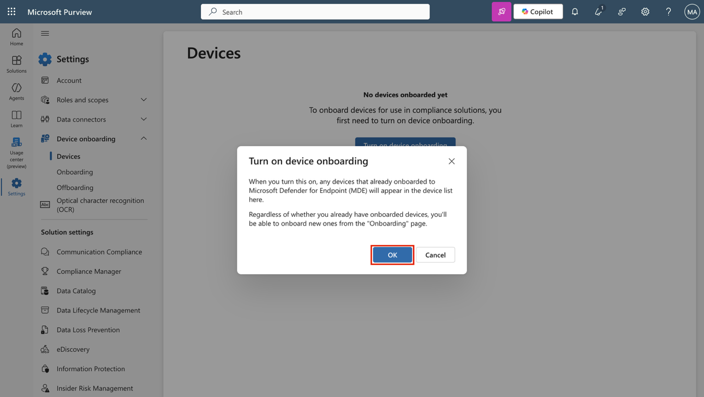
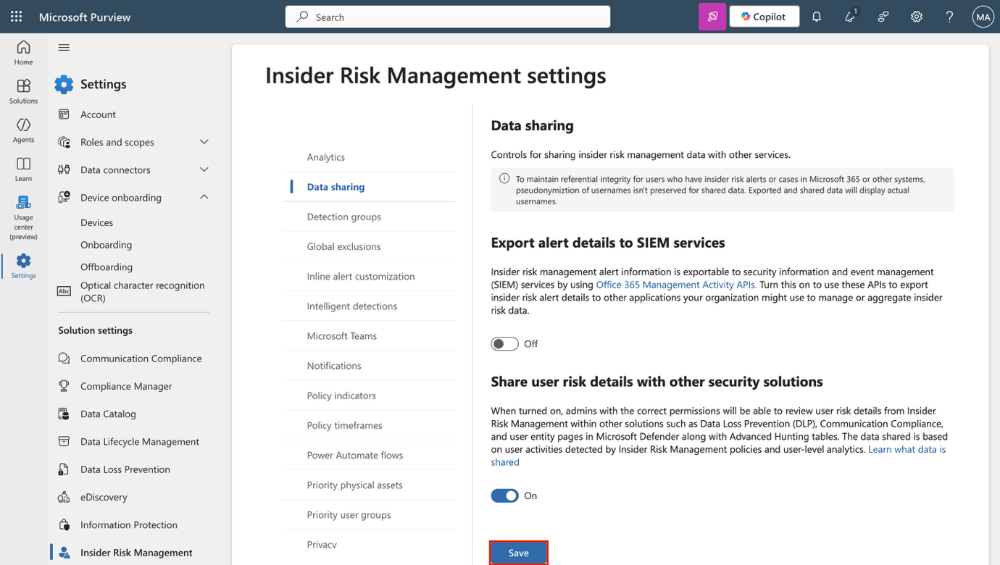
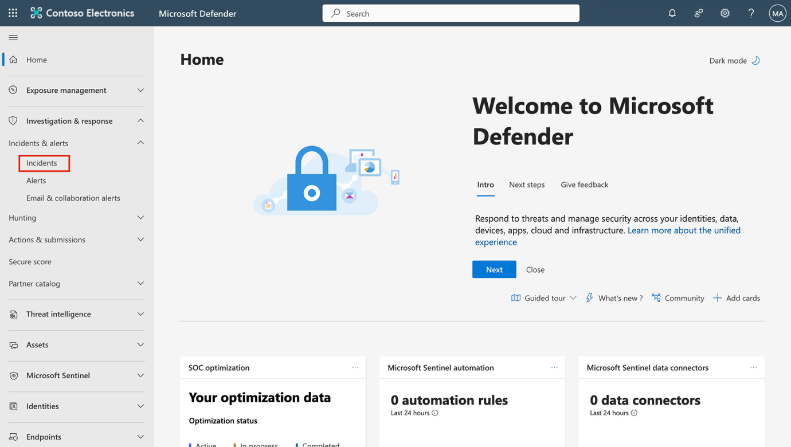
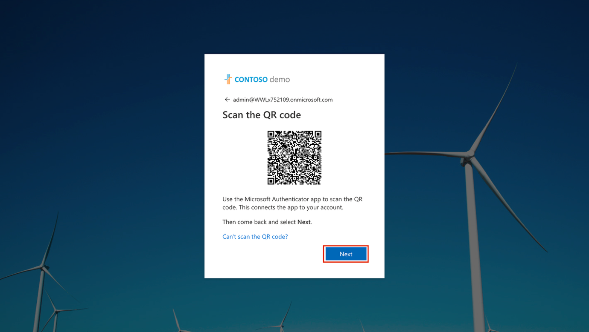
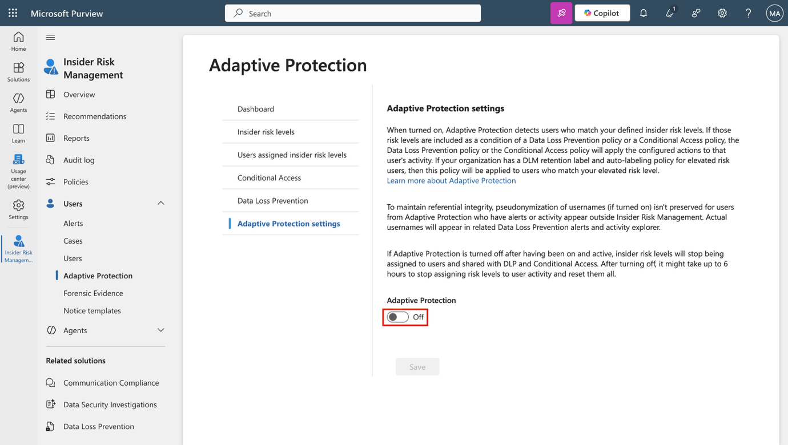

**Configuração do laboratório – Prepare seu ambiente para administração**

Neste laboratório, você configurará e preparará seu ambiente para tarefas de administração. Você habilitará os recursos necessários, configurará as permissões e preparará os serviços principais para administração.

**Tarefas:**

- Ativar auditoria no portal Microsoft Purview

- Ativar integração de dispositivos

- Habilitar análises de risco interno e compartilhamento de dados

- Inicializar o Microsoft Defender XDR

- Configurar a Multi-factor Authentication no Microsoft Entra

- Habilitar a proteção adaptativa

**Exercício 1 - Habilitar a auditoria no portal Microsoft Purview**

Nesta tarefa, você habilitará a auditoria no portal Microsoft Purview para monitorar as atividades do portal.

1.  Faça login na máquina virtual com as credenciais da conta de **Admin** fornecidas na aba **Resources** do seu ambiente de laboratório.

2.  No **Microsoft Edge**, acesse https://purview.microsoft.com e faça login como **MOD Administrator**, admin@TenantName (o nome do locatário e a senha do administrador devem estar disponíveis na aba Resources do seu ambiente de laboratório).

3.  Uma mensagem sobre o novo portal Microsoft Purview será exibida na tela. Selecione **Get started** para acessar o novo portal.

> 

4.  Selecione **Solutions** na barra lateral esquerda e, em seguida, selecione **Audit**.

> 

5.  Na página **Search**, selecione a barra **Start recording user and admin activity** para ativar o registro de auditoria.

> 

6.  Após selecionar esta opção, a barra azul deverá desaparecer desta página.

> 

Você habilitou com sucesso a auditoria no Microsoft 365.

**Exercício 2 – Habilitar a integração do dispositivo**

Nesta tarefa, você habilitará a integração de dispositivos para sua organização.

1.  Você ainda deve estar conectado à VM como a conta **admin** e como **MOD Administrator** no Microsoft Purview.

2.  Selecione **Settings** na barra lateral esquerda e, em seguida, expanda **Device onboarding**.

3.  Na página **Device onboarding**, selecione **Devices**.

> 

4.  Na página **Devices**, selecione **Turn on device onboarding** e, em seguida, selecione **OK** para confirmar.

> 

5.  Quando solicitado, selecione **OK** para confirmar que o monitoramento do dispositivo está sendo ativado.

> 

Você habilitou a integração de dispositivos e agora pode começar a integrá-los para serem protegidos com as políticas de DLP de endpoint. O processo de habilitação do recurso pode levar até 30 minutos.

**Exercício 3 – Habilitar a análise de riscos internos e o compartilhamento de dados**

Nesta tarefa, você habilitará a análise e o compartilhamento de dados para o Insider Risk Management.

1.  No Microsoft Purview, navegue até **Settings \> Insider Risk Management \> Analytics.**

> 

2.  Altere estas configurações para **On**:

    - **Show insights at tenant level**

    - **Show insights at user level**

3.  Selecione **Save** na parte inferior da página.

> 

4.  Selecione **Data sharing** no painel de navegação à esquerda.

> 

5.  Na seção **Data sharing**, altere a opção **Share user risk details with other security solutions** para **On**.

6.  Selecione **Save** na parte inferior da página.

> 

Você habilitou a análise e o compartilhamento de dados para o Insider Risk Management.

**Exercício 4 – Inicializar o Microsoft Defender XDR**

Nesta tarefa, você acessará o Microsoft Defender e aguardará a inicialização do Microsoft Defender XDR.

1.  No **Microsoft Edge**, acesse https://security.microsoft.com/ para abrir o Microsoft Defender.

2.  No painel de navegação, selecione **Investigation & response \> Incidents & alerts \> Incidents.**

> 
>
> \[!Observação\] **Observação: Inicialização do Microsoft Defender XDR**
>
> A tela de inicialização do Microsoft Defender XDR pode ou não aparecer, dependendo do seu locatário de laboratório.

3.  Você verá uma mensagem informando que o Microsoft Defender XDR está sendo preparado. Esse processo é executado automaticamente e pode levar alguns minutos.

> 

O Microsoft Defender XDR está sendo inicializado. Você pode continuar com outras tarefas enquanto a configuração é concluída.

**Exercício 5 – Configurar a Multi-factor Authentication no Microsoft Entra**

Nesta tarefa, você configurará a Multi-factor Authentication (MFA) para a conta de administrador, a fim de proteger o acesso ao Microsoft Entra e a outros serviços conectados do Microsoft 365.

1.  No **Microsoft Edge**, acesse https://entra.microsoft.com/ para abrir o Microsoft Entra e faça login usando as credenciais de administrador. No prompt " Vamos manter sua conta segura", selecione **Next**.

> 

2.  Na tela **Start by getting the app**, instale o aplicativo **Microsoft Authenticator** na loja de aplicativos do seu dispositivo ou abra-o, caso já esteja instalado. Selecione **Next**.

> 

- Se preferir usar um aplicativo diferente, selecione **I want to use a different authenticator app** e siga as instruções na tela.

3.  Na tela **Set up your account**, siga as instruções no seu telefone para permitir notificações e selecione **Next**.

> 

- Se você já tiver o aplicativo Microsoft Authenticator instalado e configurado, talvez não veja esta tela. Nesse caso, continue para a próxima etapa.

4.  Na tela **Scan the QR code**, use o aplicativo Microsoft Authenticator no seu dispositivo para escanear o código QR exibido na tela e selecione **Next**.

> 

5.  No seu celular, aprove a solicitação de login digitando o número exibido no seu navegador.

6.  Após aprovar a solicitação, a tela **Notification approved** será exibida. Selecione **Next**.

7.  Na tela de **Success!,** verifique se o seu **Default sign-in method** mostra o **Microsoft Authenticator** e selecione **Done**.

8.  Quando solicitado a fazer login novamente, aprove o pedido de início de sessão no seu celular para verificar a sua identidade.

9.  Após a aprovação ser concluída, você será redirecionado para o **Microsoft Entra admin center**.

Você configurou e verificou com sucesso a Multi-factor Authentication para a conta de administrador no Microsoft Entra.

**Exercício 6 – Habilitar a proteção adaptativa**

1.  No Microsoft Edge, acesse https://purview.microsoft.com e faça login no portal do **Perview** como **MOD Administrator.**

2.  No painel de navegação à esquerda, selecione **Solutions \> Insider risk management \> User \> Adaptive Protection**. Em seguida, selecione **Dashboard**. Selecione **Quick setup**.

> 

3.  Será exibida uma mensagem informando que as configurações estão sendo realizadas. A habilitação levará até 72 horas. Usaremos esse recurso no 8º laboratório, quando exploraremos a funcionalidade de proteção adaptativa.

> 

4.  Selecione a aba **Adaptive Protection settings** e ative o botão de alternância **Adaptive Protection**. Selecione **Save**.

> 

Você habilitou com sucesso a proteção adaptativa no Microsoft Purview.
